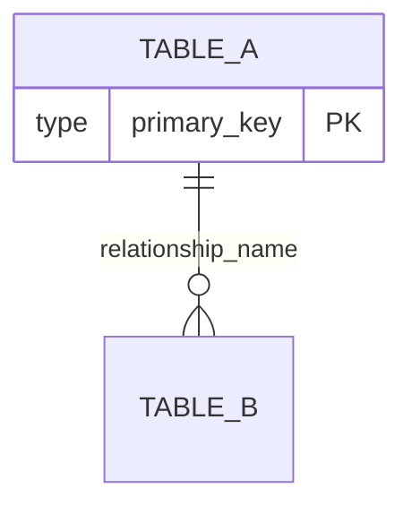
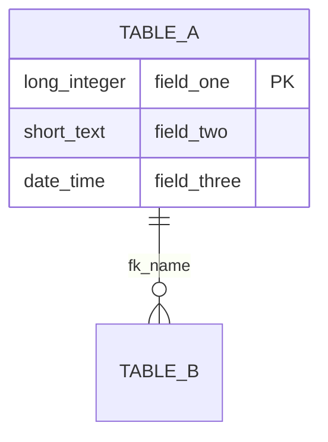
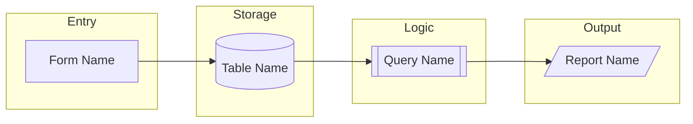

# Phase 4: Translation and Synthesis - Research

**Researched:** 2026-02-16
**Domain:** Thai-to-English translation of Access database components; cross-referenced rebuild blueprint synthesis
**Confidence:** HIGH

## Summary

Phase 4 consumes all outputs from Phases 1-3 (10 table schemas, 62 queries with SQL, 7 exported forms, 11 exported reports, dependency graphs, business logic documentation, and data profiles) and produces a single comprehensive rebuild blueprint in English. The work is entirely document synthesis -- no new extraction, no code, no scripts. Claude translates all Thai terms using business domain context, builds a three-view glossary, writes cross-reference maps with Mermaid diagrams, and produces a rebuild feasibility assessment.

The primary challenge is **consistency and completeness** across ~200+ unique Thai terms that appear in table names, column names, query names, form labels, report headers, calculated field aliases, and UI text. The glossary must serve as the single source of truth that both the blueprint and any future rebuild reference. The secondary challenge is **document size** -- a single-document blueprint covering 84 database objects, 11 business formulas, 4 process flows, and a rebuild assessment will be substantial (estimated 3,000-5,000 lines of markdown).

**Primary recommendation:** Split the phase into 3 plans: (1) glossary construction and translation mapping, (2) translated cross-reference blueprint with ER diagrams and workflow documentation, (3) rebuild assessment with effort estimates and technology recommendations.

<user_constraints>
## User Constraints (from CONTEXT.md)

### Locked Decisions
- Translate Thai names to **business equivalents** (not literal) -- e.g., สินค้า = "products", not "goods"
- Maintain **Thai-to-English mapping** for every translated term -- the rebuild target is a bilingual app (English + Thai UI)
- Proper nouns (company name ริปรอย, brand names, person names): **transliterate** to romanized spelling only
- Already-English names in the database (frm_salesorder_fishingshop, qry stck subform2): **keep as-is**, do not normalize
- All translated names use **snake_case** convention everywhere
- Buddhist Era dates: **keep BE values as-is**, add a single explanation note (BE 2567 = CE 2024)
- Claude translates all terms using context and business domain knowledge -- no pre-locked term mappings
- Three views of the same glossary in the document:
  1. **Domain-grouped sections** (Orders, Products, Inventory, Customers, Financial)
  2. **English alphabetical index**
  3. **Thai alphabetical index**
- Glossary scope includes **everything**: database object names + UI labels + form captions + report headers + button text
- Single comprehensive document with table of contents (not multi-file)
- Primary organization by **business domain**, with a component-type index/appendix for quick lookup
- Written for **both audiences**: executive summary and business process overview at top, technical detail (field types, SQL logic, form behavior) throughout
- Corrupt forms (frm_salesorder_fishingshop, frm_salesorder_retail, frm_stck_fishingshop, qry stck subform2): **document what can be inferred** from their subqueries and table relationships, flag as incomplete
- Effort estimates use **T-shirt sizes with hour ranges** (S = 2-4h, M = 4-8h, L = 1-2d, XL = 3-5d)
- **Include technology recommendations** for the rebuild stack
- Include a **phased rebuild plan** suggesting build sequence (foundation tables first, then core workflows, then reports)
- **Dedicated risk section** listing all risks, anti-patterns, and improvement opportunities found in the original system (not per-component)
- **Both** Mermaid diagrams and markdown tables for component connections
- ER diagram: **layered approach** -- high-level overview diagram (tables + relationships) plus detailed per-domain diagrams showing fields
- **Named workflow documents** for each business process showing full component chains (e.g., "Shop Order Flow: form -> query -> tables -> report")
- No special treatment for hub nodes -- all components shown equally

### Claude's Discretion
- Exact domain groupings for the business domain sections
- Which business processes warrant named workflow documentation
- How much can be inferred for the 4 corrupt forms
- Technology stack recommendations
- Internal document structure and section ordering
- Mermaid diagram styling and layout

### Deferred Ideas (OUT OF SCOPE)
None -- discussion stayed within phase scope
</user_constraints>

## Standard Stack

This phase is pure documentation synthesis. No libraries or code are needed. All work is Claude reading existing assessment files and writing a single markdown document.

### Core
| Tool | Purpose | Why Standard |
|------|---------|--------------|
| Markdown | Blueprint document format | Human-readable, version-controllable, renders in any viewer |
| Mermaid | ER diagrams and workflow diagrams | Renders in GitHub, VS Code, most markdown viewers; text-based so diffable |

### No Code Required
This phase produces a single markdown document. No Python scripts, no database access, no new extraction tools. Claude reads existing assessment artifacts and writes the blueprint directly.

## Architecture Patterns

### Recommended Document Structure

Based on the locked decisions (single document, business domain primary organization, component-type appendix, dual audience), the blueprint should follow this structure:

```
BLUEPRINT.md
├── Title & Metadata
├── Table of Contents (auto-generated from headers)
├── Executive Summary (non-technical, 1-2 pages)
│   ├── System Overview
│   ├── Key Statistics
│   └── Rebuild Recommendation Summary
├── Buddhist Era Date Note
├── Thai-English Glossary
│   ├── Domain-Grouped Glossary
│   │   ├── Products Domain
│   │   ├── Orders Domain
│   │   ├── Inventory Domain
│   │   ├── Customers Domain
│   │   └── Financial Domain
│   ├── English Alphabetical Index
│   └── Thai Alphabetical Index
├── Data Model
│   ├── High-Level ER Diagram (Mermaid)
│   ├── Per-Domain ER Diagrams (Mermaid, with fields)
│   └── Relationship Details Table
├── Business Domain Sections (the core)
│   ├── Products Domain
│   │   ├── Tables (schema, translated)
│   │   ├── Queries (SQL translated, purpose)
│   │   ├── Forms (controls, data bindings)
│   │   └── Reports
│   ├── Orders Domain
│   │   ├── Shop Order Workflow (named)
│   │   ├── Retail Order Workflow (named)
│   │   ├── Tables
│   │   ├── Queries with formula documentation
│   │   ├── Forms (including corrupt form inferences)
│   │   └── Reports
│   ├── Inventory Domain
│   │   ├── Goods Receipt Workflow (named)
│   │   ├── Goods Issue Workflow (named)
│   │   ├── Stock Calculation Logic
│   │   ├── Tables
│   │   ├── Queries
│   │   ├── Forms
│   │   └── Reports
│   ├── Customers Domain
│   │   ├── Shop Customer Management
│   │   ├── Retail Member Management
│   │   ├── Loyalty Points Workflow (named)
│   │   ├── Tables
│   │   ├── Queries
│   │   └── Forms
│   └── Financial Domain
│       ├── Payment Tracking Workflow (named)
│       ├── Tax Invoice Workflow (named)
│       ├── Tables (shared with Orders)
│       ├── Queries
│       └── Reports
├── Cross-Reference Maps
│   ├── Component Connection Diagram (Mermaid)
│   ├── Table-to-Query Matrix
│   ├── Query-to-Form Matrix
│   ├── Query-to-Report Matrix
│   └── Form-to-Report Matrix
├── Risks, Anti-Patterns, and Improvement Opportunities
├── Rebuild Assessment
│   ├── Technology Recommendations
│   ├── Per-Component Effort Estimates
│   ├── Phased Rebuild Plan
│   └── Total Effort Summary
└── Component-Type Index (appendix)
    ├── All Tables
    ├── All Queries
    ├── All Forms
    └── All Reports
```

### Pattern 1: Glossary-First Translation

**What:** Build the complete glossary FIRST as a standalone artifact, then use it consistently throughout the blueprint.
**When to use:** Always -- glossary consistency is the foundation of the entire document.
**Why:** If translation is done ad-hoc while writing each section, terms will be translated inconsistently. Building the glossary first creates a lookup table that subsequent sections reference.

### Pattern 2: Domain-Grouped With Cross-Reference Overlay

**What:** Organize content by business domain (what the user cares about) but add cross-reference tables/diagrams that let readers find components by type (what developers care about).
**When to use:** For the main body of the blueprint.
**Why:** The user decision specifies both domain-first organization AND a component-type index. This pattern satisfies both: narrative flows by business domain, appendix indexes by component type.

### Pattern 3: Layered ER Diagrams

**What:** One high-level overview diagram showing only table names and relationship lines, plus per-domain detail diagrams showing all fields with types.
**When to use:** For the Data Model section.
**Why:** A single ER diagram with all 10 tables and all ~130 columns would be unreadable. The layered approach gives both the big picture and the detail.

### Anti-Patterns to Avoid
- **Inconsistent translation:** Using "products" in one place and "goods" in another for สินค้า. The glossary prevents this.
- **Translating already-English names:** `frm_salesorder_fishingshop` stays as-is per user decision. Do not rename it to `form_shop_sales_order`.
- **Literal translation without business context:** ส่วนลดท้ายบิล literally means "discount end bill" but the business equivalent is "bill_end_discount_percent" or similar.
- **Over-translating SQL:** The SQL itself should be shown in original form with Thai identifiers, but annotated/explained in English. Do not rewrite the SQL with translated identifiers (the rebuild will need new SQL anyway).
- **Monolithic writing:** Writing the entire 3,000+ line document in a single plan/task. This should be split into glossary-first, then blueprint, then assessment.

## Don't Hand-Roll

| Problem | Don't Build | Use Instead | Why |
|---------|-------------|-------------|-----|
| Thai sorting | Custom Thai sort function | Claude's built-in Thai language knowledge | Thai alphabetical ordering follows a well-defined standard (ก-ฮ) |
| Mermaid diagram validation | Custom diagram checker | Visual inspection in markdown preview | Mermaid syntax is simple enough to verify by reading |
| Cross-reference consistency | Manual cross-checking | Systematic document structure with glossary as source of truth | The glossary IS the consistency mechanism |
| T-shirt size calculations | Effort estimation formulas | Domain expertise + comparison with known similar systems | Access-to-web-app conversion effort is well-understood |

## Common Pitfalls

### Pitfall 1: Translation Inconsistency Across Sections
**What goes wrong:** The same Thai term gets different English translations in different sections (e.g., เบิก as "issue" in one place and "withdraw" in another).
**Why it happens:** Large documents written over multiple tasks without a central glossary reference.
**How to avoid:** Build the glossary FIRST as the definitive mapping. Every subsequent section looks up terms from the glossary, never translates ad-hoc.
**Warning signs:** Finding two different English terms for the same Thai term during review.

### Pitfall 2: Missing Terms in Glossary
**What goes wrong:** The glossary covers table and column names but misses calculated field aliases, form control labels, report headers, and UI text values like payment status strings.
**Why it happens:** Focusing only on schema-level terms and forgetting the query/form/report layer.
**How to avoid:** The glossary scope is explicitly "everything" per user decision. Systematically sweep through:
1. Table names (10)
2. Column names (~130 across all tables)
3. Query names (33 user + key system queries)
4. Calculated field aliases in queries (e.g., ราคารวมหลังหักส่วนลดร้านค้า)
5. Form control labels and captions
6. Report field labels and headers
7. UI text values (payment statuses, order channels, unit types, staff names pattern)
**Warning signs:** Finding an untranslated Thai term in the blueprint body that isn't in the glossary.

### Pitfall 3: Mermaid Diagram Size Limits
**What goes wrong:** A single Mermaid ER diagram with all 10 tables, all columns, and all relationships becomes unrenderable or unreadable.
**Why it happens:** Mermaid has practical rendering limits around 20-30 entities with attributes.
**How to avoid:** Use the layered approach (locked decision): high-level diagram with just table names + relationships, then per-domain detail diagrams with fields. The high-level diagram has only 10 nodes (well within limits). Per-domain diagrams have 2-4 tables each.
**Warning signs:** Mermaid diagram source exceeding ~100 lines.

### Pitfall 4: Document Size Management
**What goes wrong:** The single blueprint document becomes so large that Claude cannot write it in one pass, leading to truncation or incomplete sections.
**Why it happens:** 84 database objects, each needing translated schema + purpose + cross-references, plus glossary, ER diagrams, workflows, and rebuild assessment.
**How to avoid:** Split into multiple plans that each append to the same document. Plan 1 writes the glossary. Plan 2 writes the domain sections and cross-references. Plan 3 writes the rebuild assessment. Each plan can read/append without needing the full document in context.
**Warning signs:** Estimated output exceeding 4,000 lines per plan.

### Pitfall 5: Confusing "Translated Names" with "Blueprint Recommendations"
**What goes wrong:** The blueprint uses snake_case translated names as if they are the new schema, but some terms could lead to confusion about what's a translation versus what's a recommended new name.
**Why it happens:** The user wants snake_case translated names for the bilingual app, which blurs the line between documentation and design.
**How to avoid:** Clearly label the glossary as "translation mapping" and note that these translated names are the starting point for the rebuild schema, not necessarily the final column names. The rebuild assessment section is where schema design recommendations belong.
**Warning signs:** Readers treating the glossary as the new database schema definition.

### Pitfall 6: Underestimating Corrupt Form Documentation
**What goes wrong:** The 4 corrupt forms get a single line saying "could not be exported" instead of documenting everything that CAN be inferred.
**Why it happens:** It's easier to mark them as gaps than to synthesize partial information from subqueries, report references, and table relationships.
**How to avoid:** Per user decision, document what can be inferred. The existing Phase 3 documentation already does significant inference (process_flows.md has step-by-step flows for both corrupt order forms). The blueprint should carry this forward and consolidate it.
**Warning signs:** Corrupt form sections being shorter than 10 lines.

## Corpus Analysis: What Needs Translation

### Volume Assessment (HIGH confidence)

Based on thorough review of all Phase 1-3 artifacts:

| Category | Count | Source Files |
|----------|-------|-------------|
| Table names | 10 | assessment/inventory.md |
| Column names (unique) | ~130 | assessment/tables/*.md (10 files) |
| Query names (user-visible) | 33 | assessment/queries/_overview.md |
| Query names (system/hidden) | 29 | assessment/queries/_overview.md |
| Calculated field aliases | ~40 | assessment/queries/_overview.md, pricing_discounts.md |
| Form names | 17 | assessment/forms/_overview.md |
| Form control labels | ~58 | assessment/forms/_overview.md |
| Report names | 25 | assessment/reports/_overview.md |
| Report field labels | ~135 | assessment/reports/_overview.md |
| UI text values (enums) | ~25 | data_profile.md (payment statuses, channels, carriers, bill types) |
| Staff name patterns | ~6 | data_profile.md (not translated, but noted as proper nouns) |
| **Total unique Thai terms** | **~200-250** | Estimated after deduplication |

### Input Files for Translation (all in assessment/)

| File | Content | Size |
|------|---------|------|
| `inventory.md` | Complete object inventory (84 objects) | ~180 lines |
| `relationships.md` | 14 relationships with column mappings | ~60 lines |
| `data_profile.md` | Per-table column profiles with sample data | ~215 lines |
| `tables/*.md` (10 files) | Column definitions, indexes, sample data per table | ~50-70 lines each |
| `queries/_overview.md` | 62 queries with types, tables, purposes | ~142 lines |
| `queries/dependency_graph.md` | Mermaid dependency graph + dependency table | ~210 lines |
| `queries/_raw_queries.json` | All 62 query SQL statements | Large JSON |
| `forms/_overview.md` | 7 exported forms with controls and data bindings + 4 corrupt form documentation | ~270 lines |
| `forms/navigation.md` | Form navigation tree and Mermaid diagram | ~97 lines |
| `reports/_overview.md` | 11 exported reports with controls and data bindings | ~255 lines |
| `business_logic/process_flows.md` | 4 business process flows with component maps | ~406 lines |
| `business_logic/pricing_discounts.md` | 11 formulas with SQL expressions | ~286 lines |

### Thai Terms Classification

Based on review of all artifacts, terms fall into these translation categories:

**1. Business entity names (table/object names):**
- สินค้า → products
- รายละเอียดออเดอร์ → order_details
- ข้อมูลร้านค้า → shop_info
- ข้อมูลสมาชิก → member_info
- สินค้าในแต่ละออเดอร์ → order_line_items
- สินค้าในแต่ละใบเบิก → issue_line_items
- สินค้าในแต่ละใบรับเข้า → receipt_line_items
- หัวใบเบิก → issue_headers
- หัวใบรับเข้า → receipt_headers
- คะแนนที่ลูกค้าใช้ไป → customer_points_used (abandoned)

**2. Field/column names -- these need context-aware business translation, not literal:**
- เลขที่ออเดอร์ → order_number (not "number that is order")
- ส่วนลดท้ายบิล(%) → bill_end_discount_percent
- ราคารวมก่อนแวทหลังหักส่วนลดท้ายบิล → total_pre_vat_after_bill_end_discount
- ภาษีมูลค่าเพิ่ม → vat (value added tax)
- คะแนนคีย์มือเพิ่มให้ → manual_bonus_points

**3. Already-English names (keep as-is per user decision):**
- frm_salesorder_fishingshop
- frm_salesorder_retail
- frm_stck_fishingshop
- qry stck subform2
- ID, id (column names)
- RT### (shop codes)
- Product names (BOOM WHITE, POLLY LI'L, etc.)

**4. Proper nouns (transliterate only):**
- ริปรอย → RipRoy (already used in English in data)
- Staff names: รัตนาพร, จันทกานต์, อรุณี, วันเพ็ญ → Rattanaporn, Chantakan, Arunee, Wanpen
- Company name: ริปรอย → RipRoy / Epic Gear

**5. UI enum values (translate with business meaning):**
- ธนาคาร values: กสิกร → Kasikorn Bank, รอโอน → awaiting_transfer, ส่งของให้ก่อน → ship_before_payment, เงินสด → cash
- ช่องทางสั่งซื้อ: LINE, FACEBOOK (already English), อื่นๆ → other
- หน่วยนับ: ซองใหญ่ → large_pack, ครั้ง → per_shipment, KG (already English)

## Domain Groupings (Claude's Discretion)

Based on analysis of the database structure and business processes, these 5 domain groupings capture the entire system:

### 1. Products Domain
- **Tables:** สินค้า (products)
- **Queries:** "ซอง";"ตัว";"เม็ด" (unit value list), qryรายงานสินค้าและวัตุดิบ (inventory movements UNION)
- **Scope:** Product master data, pricing structure, unit types
- **Complexity:** Low (single table, simple queries)

### 2. Orders Domain
- **Tables:** รายละเอียดออเดอร์ (order_details), สินค้าในแต่ละออเดอร์ (order_line_items)
- **Queries:** qry สินค้าในแต่ละออเดอร์ร้านค้า, qry สินค้าในแต่ละออเดอร์ปลีก, qry ยอดขายร้านค้า, qry ยอดขายลูกค้าปลีก, qry เจาะจงหมายเลขออเดอร์ร้านค้า, qry เจาะจงหมายเลขออเดอร์ปลีก, qry_ร้านค้ารอโอน, qry_ร้านค้าส่งของให้ก่อน, qry_สินค้าที่ขายดีย้อนหลัง 3 เดือน, qry ดูยอดซื้อร้านค้าแต่ละเจ้า, qry ยอดซื้อร้านค้าทั้งปี, qryยอดเงินร้านค้า, ดูจำนวนรวมสินค้าที่สั่งหลายออเดอร์รวมกัน, จำนวนที่ขายของสินค้าแต่ละตัว(ระบุวันที่)
- **Forms:** frm_salesorder_fishingshop (CORRUPT), frm_salesorder_retail (CORRUPT), qry สินค้าในแต่ละออเดอร์ Subform, qry สินค้าในแต่ละออเดอร์ร้านค้า subform, qry สินค้าในแต่ละออเดอร์ Subform1, หาเลขที่ออเดอร์ถ้ารู้ชื่อร้าน
- **Reports:** Various bills and tax invoices
- **Named Workflows:** Shop Order Flow, Retail Order Flow
- **Complexity:** HIGH (hub of the system, 2-tier pricing, corrupt main forms)

### 3. Inventory Domain
- **Tables:** หัวใบรับเข้า (receipt_headers), สินค้าในแต่ละใบรับเข้า (receipt_line_items), หัวใบเบิก (issue_headers), สินค้าในแต่ละใบเบิก (issue_line_items)
- **Queries:** qry จำนวนรับเข้ารวม ของสินค้าทุกตัว, qry จำนวนเบิกรวม ของสินค้าทุกตัว, qry จำนวนที่ขายของสินค้าแต่ละตัว, qry สต็อคสินค้า, qry สต็อคสินค้าในแต่ละออเดอร์ปลีก, qry เจาะจงเลขที่ใบเบิก, qry เจาะจงเลขที่ใบรับเข้า
- **Forms:** frm รับเข้าสินค้า, frm เบิกสินค้า, frm_สต็อคสินค้า, frm_stck_fishingshop (CORRUPT), qry stck subform2 (CORRUPT), สินค้าในแต่ละใบรับเข้า Subform, สินค้าในแต่ละใบเบิก Subform
- **Reports:** ปรินท์ใบเบิกสินค้า, rptดูเลขทีใบเบิก, rptทำที่อยู่เบิกสินค้า, รายละเอียดใบรับเข้าสินค้า
- **Named Workflows:** Goods Receipt Flow, Goods Issue Flow, Stock Calculation
- **Complexity:** MEDIUM (calculated stock formula, header/line item pattern)

### 4. Customers Domain
- **Tables:** ข้อมูลร้านค้า (shop_info), ข้อมูลสมาชิก (member_info), คะแนนที่ลูกค้าใช้ไป (customer_points_used -- abandoned)
- **Queries:** qry คะแนนรวมลูกค้าแต่ละคน, qry คะแนนคงเหลือหลังจากใช้แล้ว, qry ที่อยู่เจาะจงโดยวันที่ (ปลีก), qry ที่อยู่เจาะจงโดยวันที่ (ร้านค้า)
- **Forms:** frmข้อมูลสมาชิก (not exported), คะแนนคงเหลือหลังจากใช้แล้ว, qry คะแนนรวมลูกค้าแต่ละคน subform
- **Reports:** ข้อมูลสำหรับแจ้งเลขพัสดุร้านค้า, ข้อมูลสำหรับแจ้งเลขพัสดุลูกค้าปลีก, ปริ้นท์ที่อยู่ลูกค้าปลีก
- **Named Workflows:** Loyalty Points Flow
- **Complexity:** MEDIUM (dual customer types, points system with 3-redemption limit)

### 5. Financial Domain
- **Tables:** (shared: รายละเอียดออเดอร์, ข้อมูลร้านค้า, ข้อมูลสมาชิก)
- **Queries:** qry รายละเอียดการโอนเงินร้านค้า, qry รายละเอียดการโอนแต่ละออเดอร์ปลีก, qry วันที่และเวลาโอนเงินเรียงตามใบกำกับ, qryใส่เลขที่ใบกำกับ, qryกำหนดเลขที่inv, qryลงยอดร้านค้า
- **Forms:** (none dedicated -- financial data managed through order forms)
- **Reports:** รายงานภาษีขาย, ตรวจภาษีขายเรียงตามเลขinv, rptรายละเอียดการโอนเงินของแต่ละเลขที่ออเดอร์, tax invoices (shop + retail, original + copy)
- **Named Workflows:** Payment Tracking Flow, Tax Invoice Flow
- **Complexity:** MEDIUM (payment status tracking via text field, invoice number management)

## Business Process Workflows (Claude's Discretion)

Based on the process flows already documented in Phase 3, these 7 named workflows warrant full documentation:

1. **Shop Order Flow** -- frm_salesorder_fishingshop (CORRUPT) -> order entry -> 2-tier pricing -> payment tracking -> bill/invoice printing
2. **Retail Order Flow** -- frm_salesorder_retail (CORRUPT) -> order entry -> retail pricing -> points calculation -> bill/invoice printing
3. **Goods Receipt Flow** -- frm รับเข้าสินค้า -> header + line items -> verification query -> receipt report
4. **Goods Issue Flow** -- frm เบิกสินค้า -> header + line items -> verification query -> issue report + address labels
5. **Stock Calculation** -- three sub-queries (received, sold, issued) -> Nz() null handling -> calculated stock level -> display on order forms
6. **Loyalty Points Flow** -- retail order pricing -> points earned -> accumulation query -> redemption (3 fixed slots) -> remaining balance display
7. **Payment Tracking Flow** -- ธนาคาร field as status enum -> pending/awaiting/shipped/paid queries -> bank transfer reports

## Corrupt Form Inference Assessment (Claude's Discretion)

Based on Phase 3 artifacts, here is what CAN be inferred for each corrupt form:

### frm_salesorder_fishingshop
**Inference level: HIGH** -- This form is well-documented through:
- Subquery SQL: `~sq_cfrm_salesorder_fishingshop~sq_cfrm_stck_fishingshop` shows it joins order details, shop order line items, and stock data
- 5 report record sources reference `[Forms]![frm_salesorder_fishingshop]![เลขที่ออเดอร์]`
- Process flow fully documented in process_flows.md (order creation, line item entry, pricing, payment tracking, invoice generation, report printing)
- Related query `qry เจาะจงหมายเลขออเดอร์ร้านค้า` references it

### frm_salesorder_retail
**Inference level: HIGH** -- Similarly well-documented:
- Two subquery SQL files: retail line items and retail stock display
- Related query references from `qry คะแนนคงเหลือหลังจากใช้แล้ว` and `qry เจาะจงหมายเลขออเดอร์ปลีก`
- Known subforms: frm_stck_retail, qry สินค้าในแต่ละออเดอร์ Subform1
- Process flow fully documented

### frm_stck_fishingshop
**Inference level: MEDIUM** -- Partial:
- Subquery SQL shows it displays stock data filtered by order number
- Known to be a subform of frm_salesorder_fishingshop
- Similar to the exported frm_สต็อคสินค้า but filtered to current order's products

### qry stck subform2
**Inference level: LOW** -- Minimal:
- No related subquery SQL found
- Name suggests a stock display subform variant
- May be an unused/orphaned form

## Technology Stack Recommendations (Claude's Discretion)

For the rebuild assessment section, recommendations should consider:

**Context:** Small fishing tackle business, 1-3 users, 10-50 orders/day, bilingual (Thai + English), currently single Access file.

**Recommended approach for the blueprint:**
- Present 2-3 technology options with tradeoffs rather than a single prescription
- Focus on simplicity (the current system was built by a non-programmer)
- Prioritize bilingual support (i18n) as a first-class requirement
- Note that the current system has zero VBA business logic -- all logic is in SQL queries, which maps well to any SQL-based backend

## Mermaid Diagram Patterns

### High-Level ER Diagram Pattern

Keep to table names + PK/FK only. No field details. All 10 tables fit in one diagram.

### Per-Domain Detail ER Diagram Pattern

Show all fields with translated names and data types. 2-4 tables per diagram.

### Workflow Diagram Pattern

Use subgraphs for component types. Show data flow direction.

## Plan Decomposition Recommendation

Based on document size estimates and the dependency between glossary and blueprint:

### Plan 1: Glossary Construction (~2,000-2,500 lines output)
- Sweep ALL assessment artifacts for Thai terms
- Build complete Thai-English mapping with snake_case names
- Produce all 3 glossary views (domain-grouped, English alpha, Thai alpha)
- Include Buddhist Era date note
- **Output:** First section of BLUEPRINT.md (through glossary)

### Plan 2: Translated Blueprint and Cross-References (~2,500-3,500 lines output)
- Executive summary and business overview
- Data model with layered ER diagrams
- All 5 domain sections with translated schemas, queries, forms, reports
- 7 named workflow diagrams
- Cross-reference maps (component connection diagrams + matrices)
- Risks, anti-patterns, improvement opportunities section
- Component-type index (appendix)
- **Output:** Main body of BLUEPRINT.md (appended to glossary)

### Plan 3: Rebuild Assessment (~500-800 lines output)
- Technology stack recommendations (2-3 options)
- Per-component effort estimates (T-shirt sizes)
- Phased rebuild plan
- Total effort summary
- **Output:** Final section of BLUEPRINT.md (appended)

**Alternative:** Plans 2 and 3 could be combined if the document doesn't exceed practical writing limits. The glossary MUST be separate (Plan 1) because it's the foundation everything else references.

## State of the Art

| Aspect | Current System | Blueprint Target |
|--------|---------------|-----------------|
| Data storage | Single Access .accdb file | Document all schemas for rebuild |
| Business logic | 100% in query SQL (zero VBA) | Document all 11 formulas |
| UI | Access forms (4 corrupt) | Document what's known + infer the rest |
| Language | Thai-only | Bilingual Thai-English mapping |
| Integrity | NO_INTEGRITY on all FKs | Document as risk/improvement opportunity |
| Stock tracking | Calculated (never stored) | Document formula and recommend stored balance |
| Points system | 3 fixed columns | Document as anti-pattern, recommend transaction log |

## Open Questions

1. **Blueprint file location**
   - What we know: Output should be a single .md file
   - What's unclear: Whether it goes in `assessment/`, `docs/`, or project root
   - Recommendation: Place at `docs/BLUEPRINT.md` -- the `docs/` directory already exists with `overview.md`

2. **Glossary term count precision**
   - What we know: Estimated 200-250 unique Thai terms
   - What's unclear: Exact count after deduplication (many column names repeat across tables)
   - Recommendation: The glossary plan will produce the exact count; estimate is sufficient for planning

3. **Reports not exported (14 of 25)**
   - What we know: 11 reports were exported, 14 were not present in the Windows export set
   - What's unclear: Whether these 14 reports exist but weren't exported, or are system references
   - Recommendation: Document the 11 exported + list the 14 names with "not exported" status. Some have subquery SQL that reveals their record sources (7 `~sq_r*` system queries provide partial info for reports like บิลร้านค้า, ใบกำกับภาษีร้านค้า, etc.)

## Sources

### Primary (HIGH confidence)
- All assessment artifacts in `/Users/jb/Dev/epic_gear/epic-db/assessment/` -- read directly
- All planning artifacts in `/Users/jb/Dev/epic_gear/epic-db/.planning/` -- read directly
- All Windows export files in `/Users/jb/Dev/epic_gear/epic-db/windows/export/` -- sampled directly
- Phase 3 summaries and business logic documentation -- read in full

### Secondary (MEDIUM confidence)
- Thai language translation knowledge -- Claude's built-in Thai language capabilities (verified against visible Thai text in the database)
- Mermaid diagram syntax -- well-known, stable specification

### Tertiary (LOW confidence)
- Rebuild effort estimates -- based on general Access-to-web-app migration experience, will need validation against actual rebuild scope

## Metadata

**Confidence breakdown:**
- Corpus analysis: HIGH -- all input files read directly, counts verified
- Translation approach: HIGH -- user decisions are specific and clear, Thai terms visible in artifacts
- Domain groupings: HIGH -- derived directly from database structure and process flows
- Document structure: HIGH -- follows directly from locked decisions
- Rebuild estimates: LOW -- will require domain expertise during Plan 3

**Research date:** 2026-02-16
**Valid until:** No expiration (this is project-specific research, not library-version dependent)
