# Form Navigation Workflow

**Generated:** 2026-02-16
**Source:** windows/export/forms/ via SaveAsText exports

## Overview

This document maps the navigation relationships between forms, showing
which forms embed which subforms. Since no main navigation form (menu)
was found in the exported set, relationships are derived from subform
references and query data source connections.

**Note:** The 4 corrupt VBA forms (frm_salesorder_fishingshop,
frm_salesorder_retail, frm_stck_fishingshop, qry stck subform2) would
likely have been the primary data entry forms. Their subform SQL
references are documented from the exported subquery files.

## Subform Relationships

No subform relationships found in the 7 exported forms.

## Inferred Navigation from Corrupt Forms

The subquery naming convention `~sq_c{parent}~sq_c{child}` reveals the
subform nesting structure of the corrupt forms:

| Parent Form/Query                | Child Subform                     |
|:---------------------------------|:----------------------------------|
| frm รับเข้าสินค้า                | สินค้าในแต่ละใบรับเข้า Subform    |
| frm เบิกสินค้า                   | สินค้าในแต่ละใบเบิก Subform       |
| frm_salesorder_fishingshop       | frm_stck_fishingshop              |
| frm_salesorder_retail            | frm_stck_retail                   |
| frm_salesorder_retail            | qry สินค้าในแต่ละออเดอร์ Subform1 |
| qry สินค้าในแต่ละออเดอร์ Subform | สินค้า                            |
| รายละเอียดออเดอร์1               | Child24                           |
| รายละเอียดออเดอร์                | qry คะแนนรวมลูกค้าแต่ละคน subform |

## Combined Navigation Tree

Based on both exported subform references and subquery naming analysis:

```
frm รับเข้าสินค้า
  |- สินค้าในแต่ละใบรับเข้า Subform
frm เบิกสินค้า
  |- สินค้าในแต่ละใบเบิก Subform
frm_salesorder_fishingshop
  |- frm_stck_fishingshop
frm_salesorder_retail
  |- frm_stck_retail
  |- qry สินค้าในแต่ละออเดอร์ Subform1
qry สินค้าในแต่ละออเดอร์ Subform
  |- สินค้า
รายละเอียดออเดอร์
  |- qry คะแนนรวมลูกค้าแต่ละคน subform
รายละเอียดออเดอร์1
  |- Child24

(standalone forms -- not embedded in any navigation):
  frm_สต็อคสินค้า
  คะแนนคงเหลือหลังจากใช้แล้ว
  หาเลขที่ออเดอร์ถ้ารู้ชื่อร้าน
```

## Navigation Diagram

```mermaid
graph TD
    N0["frm รับเข้าสินค้า"]
    N1["สินค้าในแต่ละใบรับเข้า Subform"]
    N10["สินค้า"]
    N11["รายละเอียดออเดอร์1"]
    N12["Child24"]
    N13["รายละเอียดออเดอร์"]
    N14["qry คะแนนรวมลูกค้าแต่ละคน subform"]
    N15["คะแนนคงเหลือหลังจากใช้แล้ว<br/>(standalone)"]
    N16["frm_สต็อคสินค้า<br/>(standalone)"]
    N17["หาเลขที่ออเดอร์ถ้ารู้ชื่อร้าน<br/>(standalone)"]
    N2["frm เบิกสินค้า"]
    N3["สินค้าในแต่ละใบเบิก Subform"]
    N4["frm_salesorder_fishingshop<br/>(CORRUPT)"]
    N5["frm_stck_fishingshop<br/>(CORRUPT)"]
    N6["frm_salesorder_retail<br/>(CORRUPT)"]
    N7["frm_stck_retail"]
    N8["qry สินค้าในแต่ละออเดอร์ Subform1"]
    N9["qry สินค้าในแต่ละออเดอร์ Subform"]
    N0 --> N1
    N2 --> N3
    N4 --> N5
    N6 --> N7
    N6 --> N8
    N9 --> N10
    N11 --> N12
    N13 --> N14
    style N4,N5,N6 fill:#ff9999,stroke:#cc0000
```


