# Query Dependency Graph

**Generated:** 2026-02-15
**Source:** data/epic_db.accdb via Jackcess 4.0.8 / JPype1
**Generator:** scripts/analyze_queries.py (rerun to regenerate)

## Dependency Diagram

> Tables shown as rectangles, queries as rounded boxes.
> Arrows show data flow: source -> consumer.

```mermaid
graph LR

    %% Tables (rectangles)
    n10c6dbdc["ข้อมูลร้านค้า"]
    n3965ecdc["ข้อมูลสมาชิก"]
    n3a12485e["หัวใบเบิก"]
    n3e032468["สินค้าในแต่ละใบเบิก"]
    n50d73e3c["สินค้าในแต่ละออเดอร์"]
    n62d8b797["รายละเอียดออเดอร์"]
    n75cb8be2["สินค้า"]
    nb6929ae2["สินค้าในแต่ละใบรับเข้า"]
    nfd994e4c["หัวใบรับเข้า"]

    %% Queries (rounded)
    n041d7e58("qry_ร้านค้าส่งของให้ก่อน")
    n1eddc55e("qry เจาะจงหมายเลขออเดอร์ปลีก")
    n270bdfda("qryลงยอดร้านค้า")
    n27980127("qry จำนวนที่ขายของสินค้าแต่ละตัว")
    n383d657a("qry ยอดขายร้านค้า")
    n4c0b936b("qry สินค้าในแต่ละออเดอร์ปลีก")
    n51b7a2d5("qryยอดเงินร้านค้า")
    n54738ed7("qry_ร้านค้ารอโอน")
    n5cf5281b("qry จำนวนเบิกรวม ของสินค้าทุกตัว")
    n5e0ebc5e("'ซอง';'ตัว';'เม็ด'")
    n6a0e8b62("qry จำนวนรับเข้ารวม ของสินค้าทุกตัว")
    n7e349a86("qry เจาะจงเลขที่ใบรับเข้า")
    n82684b9c("qry สต็อคสินค้าในแต่ละออเดอร์ปลีก")
    n8977cacf("qry วันที่และเวลาโอนเงินเรียงตามใบกำกับ")
    n8b6a94b0("qry เจาะจงเลขที่ใบเบิก")
    n8f911cf8("qry ดูยอดซื้อร้านค้าแต่ละเจ้า")
    n93e6ed29("qry รายละเอียดการโอนแต่ละออเดอร์ปลีก")
    n994aeb2a("qry เจาะจงหมายเลขออเดอร์ร้านค้า")
    n9bbce9a2("qry_สินค้าที่ขายดีย้อนหลัง 3 เดือน")
    na4b8bf0c("qry คะแนนคงเหลือหลังจากใช้แล้ว")
    na8ca36bf("qryใส่เลขที่ใบกำกับ")
    na9fb37d4("qryรายงานสินค้าและวัตุดิบ")
    naa6ad5bf("qryกำหนดเลขที่inv")
    nc1e8b4e7("qry ยอดซื้อร้านค้าทั้งปี")
    ncae2feef("qry สินค้าในแต่ละออเดอร์ร้านค้า")
    ncb8e1d5c("qry ยอดขายลูกค้าปลีก")
    nda5a3e45("qry คะแนนรวมลูกค้าแต่ละคน")
    ndbf94613("qry ที่อยู่เจาะจงโดยวันที่ (ปลีก)")
    ndf6e91f2("qry ที่อยู่เจาะจงโดยวันที่ (ร้านค้า)")
    ne500d8c7("จำนวนที่ขายของสินค้าแต่ละตัว(ระบุวันที่)")
    nf1658d25("qry สต็อคสินค้า")
    nf28d7520("ดูจำนวนรวมสินค้าที่สั่งหลายออเดอร์รวมกัน")
    nf467eb92("qry รายละเอียดการโอนเงินร้านค้า")

    %% Edges
    n10c6dbdc --> n270bdfda
    n10c6dbdc --> ncae2feef
    n10c6dbdc --> ne500d8c7
    n3965ecdc --> n1eddc55e
    n3965ecdc --> na4b8bf0c
    n3965ecdc --> na8ca36bf
    n3965ecdc --> ndbf94613
    n3965ecdc --> ndf6e91f2
    n3965ecdc --> nf467eb92
    n3a12485e --> n8b6a94b0
    n3e032468 --> n5cf5281b
    n3e032468 --> n8b6a94b0
    n3e032468 --> na9fb37d4
    n4c0b936b --> n82684b9c
    n4c0b936b --> ncb8e1d5c
    n4c0b936b --> nda5a3e45
    n4c0b936b --> nf467eb92
    n50d73e3c --> n1eddc55e
    n50d73e3c --> n27980127
    n50d73e3c --> n4c0b936b
    n50d73e3c --> n994aeb2a
    n50d73e3c --> n9bbce9a2
    n50d73e3c --> na9fb37d4
    n50d73e3c --> ncae2feef
    n50d73e3c --> ne500d8c7
    n50d73e3c --> nf28d7520
    n5cf5281b --> nf1658d25
    n62d8b797 --> n041d7e58
    n62d8b797 --> n270bdfda
    n62d8b797 --> n27980127
    n62d8b797 --> n4c0b936b
    n62d8b797 --> n51b7a2d5
    n62d8b797 --> n54738ed7
    n62d8b797 --> n8977cacf
    n62d8b797 --> n8f911cf8
    n62d8b797 --> n93e6ed29
    n62d8b797 --> n994aeb2a
    n62d8b797 --> n9bbce9a2
    n62d8b797 --> na8ca36bf
    n62d8b797 --> na9fb37d4
    n62d8b797 --> naa6ad5bf
    n62d8b797 --> nc1e8b4e7
    n62d8b797 --> ncb8e1d5c
    n62d8b797 --> ndbf94613
    n62d8b797 --> ndf6e91f2
    n6a0e8b62 --> nf1658d25
    n75cb8be2 --> n5cf5281b
    n75cb8be2 --> n5e0ebc5e
    n75cb8be2 --> n6a0e8b62
    n75cb8be2 --> n994aeb2a
    n75cb8be2 --> na9fb37d4
    n75cb8be2 --> nf1658d25
    nb6929ae2 --> n6a0e8b62
    nb6929ae2 --> n7e349a86
    nb6929ae2 --> na9fb37d4
    ncae2feef --> n041d7e58
    ncae2feef --> n383d657a
    ncae2feef --> n51b7a2d5
    ncae2feef --> n54738ed7
    ncae2feef --> n8f911cf8
    ncae2feef --> n93e6ed29
    ncae2feef --> nc1e8b4e7
    ncae2feef --> nf467eb92
    nda5a3e45 --> na4b8bf0c
    nf1658d25 --> n82684b9c
    nfd994e4c --> n7e349a86

    %% Styling
    classDef tableStyle fill:#e1f5fe,stroke:#01579b
    classDef queryStyle fill:#f3e5f5,stroke:#4a148c
    class n10c6dbdc,n3965ecdc,n3a12485e,n3e032468,n50d73e3c,n62d8b797,n75cb8be2,nb6929ae2,nfd994e4c tableStyle
    class n041d7e58,n1eddc55e,n270bdfda,n27980127,n383d657a,n4c0b936b,n51b7a2d5,n54738ed7,n5cf5281b,n5e0ebc5e,n6a0e8b62,n7e349a86,n82684b9c,n8977cacf,n8b6a94b0,n8f911cf8,n93e6ed29,n994aeb2a,n9bbce9a2,na4b8bf0c,na8ca36bf,na9fb37d4,naa6ad5bf,nc1e8b4e7,ncae2feef,ncb8e1d5c,nda5a3e45,ndbf94613,ndf6e91f2,ne500d8c7,nf1658d25,nf28d7520,nf467eb92 queryStyle
```

## Dependency Table

| Query Name                               | Depends On (Tables)                                                                          | Depends On (Queries)                                                  | Depended On By (Queries)                                                                                                                                                                                         |
|:-----------------------------------------|:---------------------------------------------------------------------------------------------|:----------------------------------------------------------------------|:-----------------------------------------------------------------------------------------------------------------------------------------------------------------------------------------------------------------|
| "ซอง";"ตัว";"เม็ด"                       | สินค้า                                                                                       | -                                                                     | -                                                                                                                                                                                                                |
| qry คะแนนคงเหลือหลังจากใช้แล้ว           | ข้อมูลสมาชิก                                                                                 | qry คะแนนรวมลูกค้าแต่ละคน                                             | -                                                                                                                                                                                                                |
| qry คะแนนรวมลูกค้าแต่ละคน                | -                                                                                            | qry สินค้าในแต่ละออเดอร์ปลีก                                          | qry คะแนนคงเหลือหลังจากใช้แล้ว                                                                                                                                                                                   |
| qry จำนวนที่ขายของสินค้าแต่ละตัว         | รายละเอียดออเดอร์, สินค้าในแต่ละออเดอร์                                                      | -                                                                     | -                                                                                                                                                                                                                |
| qry จำนวนเบิกรวม ของสินค้าทุกตัว         | สินค้า, สินค้าในแต่ละใบเบิก                                                                  | -                                                                     | qry สต็อคสินค้า                                                                                                                                                                                                  |
| qry จำนวนรับเข้ารวม ของสินค้าทุกตัว      | สินค้า, สินค้าในแต่ละใบรับเข้า                                                               | -                                                                     | qry สต็อคสินค้า                                                                                                                                                                                                  |
| qry เจาะจงเลขที่ใบเบิก                   | สินค้าในแต่ละใบเบิก, หัวใบเบิก                                                               | -                                                                     | -                                                                                                                                                                                                                |
| qry เจาะจงเลขที่ใบรับเข้า                | สินค้าในแต่ละใบรับเข้า, หัวใบรับเข้า                                                         | -                                                                     | -                                                                                                                                                                                                                |
| qry เจาะจงหมายเลขออเดอร์ปลีก             | ข้อมูลสมาชิก, สินค้าในแต่ละออเดอร์                                                           | -                                                                     | -                                                                                                                                                                                                                |
| qry เจาะจงหมายเลขออเดอร์ร้านค้า          | รายละเอียดออเดอร์, สินค้า, สินค้าในแต่ละออเดอร์                                              | -                                                                     | -                                                                                                                                                                                                                |
| qry ดูยอดซื้อร้านค้าแต่ละเจ้า            | รายละเอียดออเดอร์                                                                            | qry สินค้าในแต่ละออเดอร์ร้านค้า                                       | -                                                                                                                                                                                                                |
| qry ที่อยู่เจาะจงโดยวันที่ (ปลีก)        | ข้อมูลสมาชิก, รายละเอียดออเดอร์                                                              | -                                                                     | -                                                                                                                                                                                                                |
| qry ที่อยู่เจาะจงโดยวันที่ (ร้านค้า)     | ข้อมูลสมาชิก, รายละเอียดออเดอร์                                                              | -                                                                     | -                                                                                                                                                                                                                |
| qry ยอดขายร้านค้า                        | -                                                                                            | qry สินค้าในแต่ละออเดอร์ร้านค้า                                       | -                                                                                                                                                                                                                |
| qry ยอดขายลูกค้าปลีก                     | รายละเอียดออเดอร์                                                                            | qry สินค้าในแต่ละออเดอร์ปลีก                                          | -                                                                                                                                                                                                                |
| qry ยอดซื้อร้านค้าทั้งปี                 | รายละเอียดออเดอร์                                                                            | qry สินค้าในแต่ละออเดอร์ร้านค้า                                       | -                                                                                                                                                                                                                |
| qry รายละเอียดการโอนเงินร้านค้า          | ข้อมูลสมาชิก                                                                                 | qry สินค้าในแต่ละออเดอร์ปลีก, qry สินค้าในแต่ละออเดอร์ร้านค้า         | -                                                                                                                                                                                                                |
| qry รายละเอียดการโอนแต่ละออเดอร์ปลีก     | รายละเอียดออเดอร์                                                                            | qry สินค้าในแต่ละออเดอร์ร้านค้า                                       | -                                                                                                                                                                                                                |
| qry วันที่และเวลาโอนเงินเรียงตามใบกำกับ  | รายละเอียดออเดอร์                                                                            | -                                                                     | -                                                                                                                                                                                                                |
| qry สต็อคสินค้า                          | สินค้า                                                                                       | qry จำนวนรับเข้ารวม ของสินค้าทุกตัว, qry จำนวนเบิกรวม ของสินค้าทุกตัว | qry สต็อคสินค้าในแต่ละออเดอร์ปลีก                                                                                                                                                                                |
| qry สต็อคสินค้าในแต่ละออเดอร์ปลีก        | -                                                                                            | qry สต็อคสินค้า, qry สินค้าในแต่ละออเดอร์ปลีก                         | -                                                                                                                                                                                                                |
| qry สินค้าในแต่ละออเดอร์ปลีก             | รายละเอียดออเดอร์, สินค้าในแต่ละออเดอร์                                                      | -                                                                     | qry คะแนนรวมลูกค้าแต่ละคน, qry ยอดขายลูกค้าปลีก, qry รายละเอียดการโอนเงินร้านค้า, qry สต็อคสินค้าในแต่ละออเดอร์ปลีก                                                                                              |
| qry สินค้าในแต่ละออเดอร์ร้านค้า          | ข้อมูลร้านค้า, สินค้าในแต่ละออเดอร์                                                          | -                                                                     | qry ดูยอดซื้อร้านค้าแต่ละเจ้า, qry ยอดขายร้านค้า, qry ยอดซื้อร้านค้าทั้งปี, qry รายละเอียดการโอนเงินร้านค้า, qry รายละเอียดการโอนแต่ละออเดอร์ปลีก, qry_ร้านค้ารอโอน, qry_ร้านค้าส่งของให้ก่อน, qryยอดเงินร้านค้า |
| qry_ร้านค้ารอโอน                         | รายละเอียดออเดอร์                                                                            | qry สินค้าในแต่ละออเดอร์ร้านค้า                                       | -                                                                                                                                                                                                                |
| qry_ร้านค้าส่งของให้ก่อน                 | รายละเอียดออเดอร์                                                                            | qry สินค้าในแต่ละออเดอร์ร้านค้า                                       | -                                                                                                                                                                                                                |
| qry_สินค้าที่ขายดีย้อนหลัง 3 เดือน       | รายละเอียดออเดอร์, สินค้าในแต่ละออเดอร์                                                      | -                                                                     | -                                                                                                                                                                                                                |
| qryกำหนดเลขที่inv                        | รายละเอียดออเดอร์                                                                            | -                                                                     | -                                                                                                                                                                                                                |
| qryยอดเงินร้านค้า                        | รายละเอียดออเดอร์                                                                            | qry สินค้าในแต่ละออเดอร์ร้านค้า                                       | -                                                                                                                                                                                                                |
| qryรายงานสินค้าและวัตุดิบ                | รายละเอียดออเดอร์, สินค้า, สินค้าในแต่ละออเดอร์, สินค้าในแต่ละใบรับเข้า, สินค้าในแต่ละใบเบิก | -                                                                     | -                                                                                                                                                                                                                |
| qryลงยอดร้านค้า                          | ข้อมูลร้านค้า, รายละเอียดออเดอร์                                                             | -                                                                     | -                                                                                                                                                                                                                |
| qryใส่เลขที่ใบกำกับ                      | ข้อมูลสมาชิก, รายละเอียดออเดอร์                                                              | -                                                                     | -                                                                                                                                                                                                                |
| จำนวนที่ขายของสินค้าแต่ละตัว(ระบุวันที่) | ข้อมูลร้านค้า, สินค้าในแต่ละออเดอร์                                                          | -                                                                     | -                                                                                                                                                                                                                |
| ดูจำนวนรวมสินค้าที่สั่งหลายออเดอร์รวมกัน | สินค้าในแต่ละออเดอร์                                                                         | -                                                                     | -                                                                                                                                                                                                                |

## Orphan Queries

> Queries that reference no known table or query. May be parameter-only or value-list queries.

None -- all user queries reference at least one known table or query.

## Hub Tables

> Tables referenced by the most queries (core data tables).

| Table                  |   Referenced By N Queries |
|:-----------------------|--------------------------:|
| สินค้า                 |                        26 |
| รายละเอียดออเดอร์      |                        23 |
| สินค้าในแต่ละออเดอร์   |                        15 |
| ข้อมูลสมาชิก           |                         8 |
| ข้อมูลร้านค้า          |                         5 |
| สินค้าในแต่ละใบเบิก    |                         4 |
| สินค้าในแต่ละใบรับเข้า |                         4 |
| หัวใบเบิก              |                         1 |
| หัวใบรับเข้า           |                         1 |

## Hub Queries

> Queries referenced by the most other queries (data pipeline nodes).

| Query                               |   Referenced By N Queries |
|:------------------------------------|--------------------------:|
| qry สินค้าในแต่ละออเดอร์ร้านค้า     |                        11 |
| qry สินค้าในแต่ละออเดอร์ปลีก        |                         7 |
| qry คะแนนคงเหลือหลังจากใช้แล้ว      |                         2 |
| qry คะแนนรวมลูกค้าแต่ละคน           |                         2 |
| qry สต็อคสินค้า                     |                         2 |
| qry จำนวนเบิกรวม ของสินค้าทุกตัว    |                         1 |
| qry จำนวนรับเข้ารวม ของสินค้าทุกตัว |                         1 |
| qry สต็อคสินค้าในแต่ละออเดอร์ปลีก   |                         1 |
