# Epic Gear (RipRoy) Database Rebuild Blueprint

> Complete specification for rebuilding the Access database as a modern application.
> Generated from epic_db.accdb assessment -- no need to reference the original file.

## Table of Contents

[Placeholder -- will be finalized in Plan 03]

## Executive Summary

Epic Gear (RipRoy) is a fishing lure manufacturing and distribution business based in Samut Prakan, Thailand. Their operations are managed through a single Microsoft Access 2010 database (`epic_db.accdb`) that has been in use for approximately 10 years.

**What the system does:**

The database manages the complete order-to-cash cycle for two sales channels -- wholesale (shop/fishing store) and retail (individual customers). It tracks products, orders with dual-channel pricing, inventory movements (goods receipt and goods issue), customer/member information with a loyalty points program, payment status, and tax invoicing. The system serves 1-3 concurrent users processing 10-50 orders per day.

**Scale:**

| Metric | Count |
|--------|-------|
| Tables | 10 |
| User queries | 33 |
| Hidden system queries | 29 |
| Forms | 17 (4 corrupt) |
| Reports | 25 (11 exported) |
| Products | 186 |
| Shop customers | 735 |
| Retail members | 2,150 |
| Orders | 509 |
| Order line items | 7,073 |
| Goods issue records | 15,293 |
| Total rows | ~30,000 |

**Key findings:**

- **Zero VBA code** -- all business logic is implemented in SQL query calculated columns (11 distinct formulas identified)
- **4 corrupt forms** -- the two main order entry forms (`frm_salesorder_fishingshop`, `frm_salesorder_retail`) and two stock subforms cannot be exported but are well-documented through their subquery SQL and report references
- **Calculated stock** -- inventory levels are never stored; stock is recalculated on every query as `received - sold - issued`
- **No referential integrity** -- all foreign key relationships use `NO_INTEGRITY`, allowing orphaned records
- **Bilingual requirement** -- all Thai terms have been mapped to English equivalents with Thai preserved for the bilingual UI rebuild
- **1 abandoned table** -- `customer_points_used` (0 rows, no relationships) can be excluded from rebuild

**Rebuild recommendation summary:**

The system's simplicity (zero VBA, all SQL logic, 10 tables) makes it an excellent candidate for a modern web application rebuild. The complete absence of VBA code means all business logic can be directly translated to application-layer SQL or ORM queries. Detailed rebuild assessment with technology recommendations and effort estimates is provided in a later section.

## Buddhist Era (BE) Date Convention

The Thai calendar uses Buddhist Era (BE), which is 543 years ahead of the Common Era (CE).

**Formula:** CE = BE - 543

**Example:** BE 2567 = CE 2024

All date values stored in the database use the standard `Date/Time` data type, which Access stores internally as CE. However, the Access UI displays dates in BE format per the system's Thai locale settings. Date values shown in this blueprint (from sample data extraction) are already converted to CE format. The rebuild should support both BE display (for Thai UI) and CE storage.

## Thai-English Glossary

This glossary is the single source of truth for all Thai-to-English translations used throughout this blueprint. Every subsequent section references these translations for consistency.

**Translation rules applied:**
- Business-equivalent translations (not literal)
- All translated names use `snake_case`
- Proper nouns transliterated only (e.g., RipRoy, Rattanaporn)
- Already-English names kept as-is (e.g., `frm_salesorder_fishingshop`, `ID`)
- Buddhist Era date values preserved as-is

### By Business Domain

#### Products

| Thai | English | Category | Notes |
|------|---------|----------|-------|
| สินค้า | products | table_name | Product master table; also used as column name (product name/FK) |
| รหัสสินค้า | product_code | column_name | Unique product identifier (e.g., POLLYLI'LRR30) |
| ราคา | price | column_name | Retail price, VAT-inclusive (baht) |
| ราคาก่อนแวท | pre_vat_price | column_name | Price before 7% VAT |
| ส่วนลดร้านค้า | shop_discount | column_name | Per-product shop discount amount (fixed baht, not %) |
| ส่วนลดร้านค้าก่อนแวท | shop_discount_pre_vat | column_name | Shop discount amount before VAT |
| ราคาร้านค้ารวมแวท | shop_price_incl_vat | column_name | Shop price including VAT (stored as Decimal) |
| หน่วยนับ | unit | column_name | Unit of measure (e.g., large_pack, KG, per_shipment) |
| ลำดับที่ | sequence_number | column_name | AutoNumber sort order |
| "ซอง";"ตัว";"เม็ด" | unit_value_list | query_name | Value list query for product unit types |
| qryรายงานสินค้าและวัตุดิบ | product_and_material_report | query_name | UNION query combining all inventory movements |
| ซองใหญ่ | large_pack | enum_value | Unit type: large pack/bag |
| ครั้ง | per_shipment | enum_value | Unit type: per shipment/occurrence |
| ตัว | piece | enum_value | Unit type: individual piece |
| เม็ด | bead | enum_value | Unit type: bead/pellet |
| ซอง | pack | enum_value | Unit type: pack/sachet |

#### Orders

| Thai | English | Category | Notes |
|------|---------|----------|-------|
| รายละเอียดออเดอร์ | order_details | table_name | Order header table (509 rows) |
| สินค้าในแต่ละออเดอร์ | order_line_items | table_name | Order line items (7,073 rows) |
| เลขที่ออเดอร์ | order_number | column_name | PK of order_details (AutoNumber) |
| เลขที่invoiceของแต่ละเดือน | monthly_invoice_number | column_name | Monthly sequential invoice number |
| เลขที่invoiceของปี | yearly_invoice_number | column_name | Yearly invoice code (e.g., 6612-010) |
| วันที่ | date | column_name | Order date |
| วันที่โอนเงิน | transfer_date | column_name | Bank transfer payment date |
| วันที่inv | invoice_date | column_name | Invoice issue date |
| เวลาโอนเงิน | transfer_time | column_name | Bank transfer time (stored as text, e.g., 14.35) |
| ช่องทางสั่งซื้อ | order_channel | column_name | How order was placed (LINE, FACEBOOK, etc.) |
| ธนาคาร | bank | column_name | Payment method / status enum field |
| พนักงานรับออเดอร์ | order_staff | column_name | Staff member who took the order |
| คะแนนคีย์เอง | manual_points_entry | column_name | Manually keyed points (order level) |
| หมายเหตุอื่นๆ | other_notes | column_name | Order-level miscellaneous notes |
| รหัสร้านค้า | shop_code | column_name | FK to shop_info (e.g., RT789) |
| ส่วนลดท้ายบิล(%) | bill_end_discount_percent | column_name | Bill-end discount as percentage (0-34%) |
| จำนวน | quantity | column_name | Order line item quantity |
| id | id | column_name | Already English -- AutoNumber PK of order_line_items |
| qry สินค้าในแต่ละออเดอร์ร้านค้า | shop_order_line_items | query_name | Shop order pricing with 2-tier discounts |
| qry สินค้าในแต่ละออเดอร์ปลีก | retail_order_line_items | query_name | Retail order pricing with points calculation |
| qry ยอดขายร้านค้า | shop_sales_totals | query_name | Shop sales totals by date range |
| qry ยอดขายลูกค้าปลีก | retail_sales_totals | query_name | Retail customer sales totals |
| qry เจาะจงหมายเลขออเดอร์ร้านค้า | shop_order_lookup | query_name | Look up specific shop order by number |
| qry เจาะจงหมายเลขออเดอร์ปลีก | retail_order_lookup | query_name | Look up specific retail order by number |
| qry_ร้านค้ารอโอน | shops_awaiting_transfer | query_name | Shops with pending bank transfers |
| qry_ร้านค้าส่งของให้ก่อน | shops_ship_before_payment | query_name | Shops receiving goods before payment |
| qry_สินค้าที่ขายดีย้อนหลัง 3 เดือน | best_sellers_last_3_months | query_name | Best-selling products over last 3 months |
| qry ดูยอดซื้อร้านค้าแต่ละเจ้า | shop_purchase_totals_per_vendor | query_name | Purchase totals per shop vendor |
| qry ยอดซื้อร้านค้าทั้งปี | shop_annual_purchase_totals | query_name | Annual shop purchase totals |
| qryยอดเงินร้านค้า | shop_payment_amounts | query_name | Shop payment amounts per order |
| ดูจำนวนรวมสินค้าที่สั่งหลายออเดอร์รวมกัน | combined_multi_order_quantities | query_name | Combined product quantities across multiple orders |
| จำนวนที่ขายของสินค้าแต่ละตัว(ระบุวันที่) | product_sales_by_date | query_name | Quantity sold per product filtered by date range |
| ราคาหลังหักส่วนลดร้านค้า | price_after_shop_discount | calculated_field | Unit price minus per-product shop discount |
| ราคารวมหลังหักส่วนลดร้านค้า | total_after_shop_discount | calculated_field | Line total after shop discount |
| ราคารวมหลังหักส่วนลดท้ายบิล | total_after_bill_end_discount | calculated_field | Line total after bill-end discount (VAT-inclusive) |
| ราคาก่อนแวทหลังหักส่วนลดร้านค้า | pre_vat_after_shop_discount | calculated_field | Pre-VAT unit price after shop discount |
| ราคารวมก่อนแวทหลังหักส่วนลดร้านค้า | total_pre_vat_after_shop_discount | calculated_field | Pre-VAT line total after shop discount |
| ราคารวมก่อนแวทหลังหักส่วนลดท้ายบิล | total_pre_vat_after_bill_end_discount | calculated_field | Pre-VAT total after all discounts |
| ภาษีมูลค่าเพิ่ม | vat | calculated_field | Value Added Tax amount (7%) -- shop channel |
| ราคาสุทธิรวมภาษีมูลค่าเพิ่ม | net_total_incl_vat | calculated_field | Net total including VAT -- shop channel |
| ราคารวม | line_total | calculated_field | Line total (price x quantity) -- retail |
| ราคารวมก่อนแวท | total_pre_vat | calculated_field | Pre-VAT line total -- retail |
| ภาษีมูลค่าเพิ่มปลีก | retail_vat | calculated_field | VAT amount -- retail channel |
| ราคาสุทธิปลีกรวมภาษีมูลค่าเพิ่ม | retail_net_total_incl_vat | calculated_field | Net total including VAT -- retail |
| คะแนน | points | calculated_field | Loyalty points earned (line_total / 100) |
| SumOfราคารวมหลังหักส่วนลดร้านค้า | sum_total_after_shop_discount | calculated_field | Aggregate: sum of totals after shop discount |
| SumOfราคารวมก่อนแวทหลังหักส่วนลดท้ายบิล | sum_pre_vat_after_bill_end_discount | calculated_field | Aggregate: sum of pre-VAT after all discounts |
| SumOfภาษีมูลค่าเพิ่ม | sum_vat | calculated_field | Aggregate: sum of shop VAT |
| SumOfราคาสุทธิรวมภาษีมูลค่าเพิ่ม | sum_net_total_incl_vat | calculated_field | Aggregate: sum of shop net total |
| SumOfราคารวม | sum_line_total | calculated_field | Aggregate: sum of retail line totals |
| SumOfราคารวมก่อนแวท | sum_pre_vat_total | calculated_field | Aggregate: sum of retail pre-VAT |
| SumOfภาษีมูลค่าเพิ่มปลีก | sum_retail_vat | calculated_field | Aggregate: sum of retail VAT |
| SumOfราคาสุทธิปลีกรวมภาษีมูลค่าเพิ่ม | sum_retail_net_total_incl_vat | calculated_field | Aggregate: sum of retail net total |
| SumOfราคารวมหลังหักส่วนลดท้ายบิล | sum_total_after_bill_end_discount | calculated_field | Aggregate: sum of totals after bill-end discount |
| SumOfจำนวน | sum_quantity | calculated_field | Aggregate: total quantity sold |
| frm_salesorder_fishingshop | frm_salesorder_fishingshop | form_name | Already English -- Shop order entry form (CORRUPT) |
| frm_salesorder_retail | frm_salesorder_retail | form_name | Already English -- Retail order entry form (CORRUPT) |
| qry สินค้าในแต่ละออเดอร์ Subform | order_line_items_subform | form_name | Retail order line items subform |
| qry สินค้าในแต่ละออเดอร์ร้านค้า subform | shop_order_line_items_subform | form_name | Shop order line items subform |
| qry สินค้าในแต่ละออเดอร์ Subform1 | order_line_items_subform_1 | form_name | Retail order line items subform variant |
| หาเลขที่ออเดอร์ถ้ารู้ชื่อร้าน | order_lookup_by_shop_name | form_name | Order search by shop name |
| กสิกร | kasikorn_bank | enum_value | Payment: Kasikorn Bank transfer |
| รอโอน | awaiting_transfer | enum_value | Payment status: awaiting bank transfer |
| ส่งของให้ก่อน | ship_before_payment | enum_value | Payment status: goods shipped on credit |
| เงินสด | cash | enum_value | Payment: cash |
| LINE | LINE | enum_value | Already English -- order channel |
| FACEBOOK | FACEBOOK | enum_value | Already English -- order channel |
| อื่นๆ | other | enum_value | Order channel: other |
| บิลร้านค้า | shop_bill | report_name | Shop order bill |
| บิลลูกค้าปลีก | retail_customer_bill | report_name | Retail customer bill |
| ใบกำกับภาษีร้านค้า | shop_tax_invoice | report_name | Shop tax invoice (original) |
| ใบกำกับภาษีร้านค้า(สำเนา) | shop_tax_invoice_copy | report_name | Shop tax invoice (copy) |
| Copy of ใบกำกับภาษีร้านค้า | shop_tax_invoice_duplicate | report_name | Additional copy of shop tax invoice |
| ใบกำกับภาษีลูกค้าปลีก | retail_tax_invoice | report_name | Retail customer tax invoice (original) |
| ใบกำกับภาษีลูกค้าปลีก(สำเนา) | retail_tax_invoice_copy | report_name | Retail customer tax invoice (copy) |
| ใบส่งของร้านค้า | shop_delivery_note | report_name | Shop delivery/packing slip |
| ใบจัดสินค้าร้านค้า | shop_packing_list | report_name | Shop order packing list |
| ใบตรวจบิลร้านค้า | shop_bill_verification | report_name | Shop bill verification document |
| pdf แจ้งยอด | balance_notification_pdf | report_name | Balance notification (PDF format) |
| qry เจาะจงหมายเลขออเดอร์ subreport | order_detail_subreport | report_name | Order-specific detail subreport |
| วันที่เริ่มต้น | start_date | form_label | Parameter prompt: start date for date range filter |
| วันที่สุดท้าย | end_date | form_label | Parameter prompt: end date for date range filter |
| เลขที่ออเดอร์แรก | first_order_number | form_label | Parameter prompt: first order number in range |
| เลขที่ออเดอร์สุดท้าย | last_order_number | form_label | Parameter prompt: last order number in range |
| กรุณาระบุรหัสร้านค้า | please_enter_shop_code | form_label | Parameter prompt: enter shop code for lookup |
| invเริ่มต้น | inv_start | form_label | Parameter prompt: starting invoice number |
| invสุดท้าย | inv_end | form_label | Parameter prompt: ending invoice number |
| วันที่เปิดบิลเริ่มต้น | bill_start_date | form_label | Parameter prompt: bill opening start date |
| วันที่เปิดบิลสุดท้าย | bill_end_date | form_label | Parameter prompt: bill opening end date |
| วันที่ต้นเดือน | month_start_date | form_label | Parameter prompt: month start date |
| วันที่ท้ายเดือน | month_end_date | form_label | Parameter prompt: month end date |
| วันที่เริ่ม | date_start | form_label | Parameter prompt: date range start |
| วันที่จบ | date_end | form_label | Parameter prompt: date range end |

#### Inventory

| Thai | English | Category | Notes |
|------|---------|----------|-------|
| หัวใบรับเข้า | receipt_headers | table_name | Goods receipt header (165 rows) |
| สินค้าในแต่ละใบรับเข้า | receipt_line_items | table_name | Goods receipt line items (514 rows) |
| หัวใบเบิก | issue_headers | table_name | Goods issue/withdrawal header (3,391 rows) |
| สินค้าในแต่ละใบเบิก | issue_line_items | table_name | Goods issue line items (15,293 rows) |
| เลขที่ใบรับเข้า | receipt_number | column_name | PK of receipt_headers (AutoNumber) |
| เลขที่ใบรับเข้าของแต่ละเดือน | monthly_receipt_number | column_name | Monthly sequential receipt number |
| เลขที่ใบรับเข้าของปี | yearly_receipt_number | column_name | Yearly receipt identifier |
| วันที่รับเข้า | receipt_date | column_name | Date goods were received |
| ผู้ผลิต หรือ พนักงานแพ็ค | producer_or_packer | column_name | Producer name or packing staff |
| เลขที่ใบเบิก | issue_number | column_name | PK of issue_headers (AutoNumber) |
| วันที่เบิก | issue_date | column_name | Date goods were issued/withdrawn |
| เหตุผลการเบิก | issue_reason | column_name | Reason for goods withdrawal |
| พนักงานเบิก | issuing_staff | column_name | Staff who performed the issue |
| หมายเลขสมาชิกที่เบิก | issue_member_number | column_name | Member receiving issued goods |
| รหัสร้านค้าที่เบิก | issue_shop_code | column_name | Shop receiving issued goods |
| จำนวนรับเข้า | quantity_received | column_name | Quantity received in receipt line |
| หมายเลขกล่อง | box_number | column_name | Box/carton identifier |
| จำนวนเบิก | quantity_issued | column_name | Quantity issued/withdrawn |
| ID | ID | column_name | Already English -- AutoNumber PK of line item tables |
| หมายเหตุ | notes | column_name | General notes field (used in multiple tables) |
| SumOfจำนวนรับเข้า | sum_quantity_received | calculated_field | Aggregate: total quantity received per product |
| SumOfจำนวนเบิก | sum_quantity_issued | calculated_field | Aggregate: total quantity issued per product |
| จำนวนขาย | quantity_sold | calculated_field | Alias used in UNION query for sales quantity |
| เลขที่ใบสำคัญ | document_number | calculated_field | Alias used in UNION query for receipt/issue/order number |
| qry สต็อคสินค้า | product_stock | query_name | Current stock levels (received - sold - issued) |
| qry สต็อคสินค้าในแต่ละออเดอร์ปลีก | retail_order_stock | query_name | Stock levels for products in retail orders |
| qry จำนวนรับเข้ารวม ของสินค้าทุกตัว | total_received_all_products | query_name | Total quantity received per product |
| qry จำนวนเบิกรวม ของสินค้าทุกตัว | total_issued_all_products | query_name | Total quantity issued per product |
| qry จำนวนที่ขายของสินค้าแต่ละตัว | total_sold_per_product | query_name | Total quantity sold per product |
| qry เจาะจงเลขที่ใบรับเข้า | receipt_lookup | query_name | Look up specific goods receipt |
| qry เจาะจงเลขที่ใบเบิก | issue_lookup | query_name | Look up specific goods issue |
| frm รับเข้าสินค้า | goods_receipt_form | form_name | Goods receipt entry form |
| frm เบิกสินค้า | goods_issue_form | form_name | Goods issue/withdrawal form |
| frm_สต็อคสินค้า | product_stock_form | form_name | Stock level display form |
| frm_stck_fishingshop | frm_stck_fishingshop | form_name | Already English -- Shop stock subform (CORRUPT) |
| qry stck subform2 | qry stck subform2 | form_name | Already English -- Stock subform variant (CORRUPT) |
| สินค้าในแต่ละใบรับเข้า Subform | receipt_line_items_subform | form_name | Receipt line items subform |
| สินค้าในแต่ละใบเบิก Subform | issue_line_items_subform | form_name | Issue line items subform |
| ปรินท์ใบเบิกสินค้า | print_goods_issue | report_name | Print goods issue document |
| rptดูเลขทีใบเบิก | view_issue_numbers | report_name | View goods issue number listing |
| rptทำที่อยู่เบิกสินค้า | issue_address_labels | report_name | Address labels for goods issue shipments |
| รายละเอียดใบรับเข้าสินค้า | goods_receipt_details | report_name | Goods receipt detail report |

#### Customers

| Thai | English | Category | Notes |
|------|---------|----------|-------|
| ข้อมูลร้านค้า | shop_info | table_name | Shop/wholesale customer master (735 rows) |
| ข้อมูลสมาชิก | member_info | table_name | Retail customer/member master (2,150 rows) |
| คะแนนที่ลูกค้าใช้ไป | customer_points_used | table_name | Abandoned points usage table (0 rows) |
| รหัสร้านค้าออโต้ | shop_auto_id | column_name | AutoNumber surrogate key for shops |
| ชื่อร้าน | shop_name | column_name | Shop/store name |
| เบอร์โทรศัพท์ร้านค้า | shop_phone | column_name | Shop primary phone number |
| เบอร์โทรศัพท์2(มือถือ) | mobile_phone_2 | column_name | Shop secondary mobile phone |
| เบอร์ร้าน | store_phone | column_name | Shop landline phone |
| ช่องทางติดต่อที่สะดวก | preferred_contact_channel | column_name | Preferred method of contact |
| ชื่อเฟส | facebook_name | column_name | Facebook profile name |
| เฟซบุค แมสเซนเจอร์ | facebook_messenger | column_name | Facebook Messenger contact |
| ชื่อไลน์ | line_name | column_name | LINE messaging app name |
| วันหยุด | holidays | column_name | Shop closed days (for delivery planning) |
| ขนส่งที่สะดวก | preferred_carrier | column_name | Preferred shipping carrier |
| ที่อยู่ | address | column_name | Shipping address |
| หมายเหตุเฉพาะร้าน | shop_specific_notes | column_name | Notes specific to this shop |
| ชื่อร้านสำหรับออกใบกำกับ | invoice_shop_name | column_name | Shop name for tax invoice |
| ที่อยู่สำหรับออกใบกำกับ | invoice_address | column_name | Address for tax invoice |
| เลขประจำตัวผู้เสียภาษีร้านค้า | shop_tax_id | column_name | Shop tax identification number |
| สาขาสำนักงานใหญ่ | head_office_branch | column_name | Head office branch number |
| สาขาสถานประกอบการ | business_branch | column_name | Business establishment branch |
| ได้สติกเกอร์ใหญ่แล้ว | received_large_sticker | column_name | Whether shop received promotional large sticker |
| วันที่สร้างข้อมูล | record_created_date | column_name | Date the shop record was created |
| เอาบิลอะไร | bill_type_preference | column_name | Which bill type the shop wants |
| ถามเรื่องบิลแวทยัง | vat_bill_asked | column_name | Whether shop has been asked about VAT billing |
| ส่งของก่อนหรือโอนเงินก่อน | ship_or_pay_first | column_name | Shop's payment terms preference |
| หมายเลขออโต้ | member_auto_id | column_name | AutoNumber surrogate key for members |
| หมายเลขสมาชิก | member_number | column_name | Member number (manually assigned) |
| ชื่อ | first_name | column_name | Customer first name |
| นามสกุล | last_name | column_name | Customer last name |
| เบอร์โทรศัพท์ | phone_number | column_name | Phone number (PK for members, FK in orders) |
| ชื่อไลน์หรือเฟซ | line_or_facebook_name | column_name | LINE or Facebook contact name |
| ที่อยู่ล่าสุด | latest_address | column_name | Most recent shipping address |
| เลขประจำตัวผู้เสียภาษีปลีก | retail_tax_id | column_name | Retail customer tax ID |
| ได้สติกเกอร์หรือยัง | received_sticker | column_name | Whether member received promotional sticker |
| คะแนนรวม | total_points | column_name | Total accumulated points (stored, possibly redundant) |
| คะแนนคีย์มือเพิ่มให้ | manual_bonus_points | column_name | Points manually added by staff |
| คะแนนที่ใช้ครั้งที่1 | points_redeemed_1 | column_name | First redemption amount |
| คะแนนที่ใช้ครั้งที่2 | points_redeemed_2 | column_name | Second redemption amount |
| คะแนนที่ใช้ครั้งที่3 | points_redeemed_3 | column_name | Third redemption amount |
| ชื่อออกใบกำกับปลีก | retail_invoice_name | column_name | Name for retail tax invoice |
| คะแนนที่ใช้ครั้งที่ 1 | points_used_1 | column_name | Abandoned table: first redemption slot |
| คะแนนที่ใช้ครั้งที่ 2 | points_used_2 | column_name | Abandoned table: second redemption slot |
| คะแนนที่ใช้ครั้งที่ 3 | points_used_3 | column_name | Abandoned table: third redemption slot |
| คะแนนที่ใช้ครั้งที่ 4 | points_used_4 | column_name | Abandoned table: fourth redemption slot |
| คะแนนที่ใช้ครั้งที่ 5 | points_used_5 | column_name | Abandoned table: fifth redemption slot |
| SumOfคะแนน | sum_points | calculated_field | Aggregate: total points earned per member |
| qry คะแนนรวมลูกค้าแต่ละคน | customer_total_points | query_name | Sum total loyalty points per customer |
| qry คะแนนคงเหลือหลังจากใช้แล้ว | remaining_points_after_use | query_name | Remaining points after redemptions |
| qry ที่อยู่เจาะจงโดยวันที่ (ปลีก) | retail_addresses_by_date | query_name | Retail addresses filtered by order date range |
| qry ที่อยู่เจาะจงโดยวันที่ (ร้านค้า) | shop_addresses_by_date | query_name | Shop addresses filtered by order date range |
| frmข้อมูลสมาชิก | member_info_form | form_name | Member registration form (not exported) |
| คะแนนคงเหลือหลังจากใช้แล้ว | remaining_points_form | form_name | Remaining points display form |
| qry คะแนนรวมลูกค้าแต่ละคน subform | customer_points_subform | form_name | Points display subform |
| หน้าหลัก | main_menu | form_name | Main navigation menu form (not exported) |
| ข้อมูลสำหรับแจ้งเลขพัสดุร้านค้า | shop_tracking_notification | report_name | Shop shipping tracking notification |
| ข้อมูลสำหรับแจ้งเลขพัสดุลูกค้าปลีก | retail_tracking_notification | report_name | Retail shipping tracking notification |
| ปริ้นท์ที่อยู่ลูกค้าปลีก | print_retail_addresses | report_name | Print retail customer address labels |
| ปริ้นท์ที่อยู่ | print_addresses | report_name | Print addresses (general) |
| โทรศัพท์ | telephone | enum_value | Preferred contact: telephone |
| เปิดทุกวัน | open_every_day | enum_value | Shop holiday: open daily |
| ปิดวันอาทิตย์ | closed_sunday | enum_value | Shop holiday: closed Sundays |
| เคอรี่และไปรษณีย์ไทย | kerry_and_thailand_post | enum_value | Carrier: Kerry Express and Thailand Post |
| ใบกำกับภาษี | tax_invoice | enum_value | Bill type: tax invoice |
| บิลธรรมดา | regular_bill | enum_value | Bill type: regular bill |
| ถามแล้ว | already_asked | enum_value | VAT billing: already asked |
| โอนเงินก่อนเท่านั้น | transfer_first_only | enum_value | Payment terms: transfer before shipping only |
| สด | cash_or_individual | enum_value | Invoice name value: cash sale / individual |
| ใส่เลขที่ออเดอร์คนแรกที่จะดู | enter_first_order_to_view | form_label | Parameter prompt for retail address query |
| ใส่เลขที่ออเดอร์คนสุดท้ายที่จะดู | enter_last_order_to_view | form_label | Parameter prompt for retail address query |
| ใส่เลขที่ออเดอร์ร้านแรก | enter_first_shop_order | form_label | Parameter prompt for shop address query |
| ใส่เลขที่ออเดอร์ร้านสุดท้าย | enter_last_shop_order | form_label | Parameter prompt for shop address query |

#### Financial

| Thai | English | Category | Notes |
|------|---------|----------|-------|
| qry รายละเอียดการโอนเงินร้านค้า | shop_transfer_details | query_name | Shop bank transfer details with amounts |
| qry รายละเอียดการโอนแต่ละออเดอร์ปลีก | retail_order_transfer_details | query_name | Retail order bank transfer details |
| qry วันที่และเวลาโอนเงินเรียงตามใบกำกับ | transfer_datetime_by_invoice | query_name | Transfer date/time sorted by invoice number |
| qryกำหนดเลขที่inv | assign_invoice_number | query_name | Assign invoice number sequence |
| qryใส่เลขที่ใบกำกับ | enter_tax_invoice_number | query_name | Enter tax invoice numbers for orders |
| qryลงยอดร้านค้า | post_shop_payments | query_name | Post shop payment records |
| รายงานภาษีขาย | sales_tax_report | report_name | Sales tax summary report |
| ตรวจภาษีขาย | sales_tax_verification | report_name | Sales tax verification report |
| ตรวจภาษีขายเรียงตามเลขinv | sales_tax_verification_by_inv | report_name | Sales tax verification sorted by invoice number |
| รายละเอียดการโอน | transfer_details | report_name | Bank transfer details report |
| rptรายละเอียดการโอนเงินของแต่ละเลขที่ออเดอร์ | transfer_details_per_order | report_name | Bank transfer details per order number |
| พนักงานตรวจเช็ค | inspection_staff | column_name | Staff who performed inspection/verification |
| พนักงานบันทึกข้อมูล | data_entry_staff | column_name | Staff who entered data into the system |
| พนักงานตรวจการบันทึกข้อมูล | data_entry_reviewer | column_name | Staff who reviewed the data entry |
| รายละเอียดเพิ่มเติม | additional_details | column_name | Additional details / supplementary notes |

#### Proper Nouns (Transliterations)

| Thai | English | Category | Notes |
|------|---------|----------|-------|
| ริปรอย | RipRoy | proper_noun | Company brand name (Epic Gear) |
| รัตนาพร | Rattanaporn | proper_noun | Staff name -- appears as order_staff, issuing_staff, etc. |
| จันทกานต์ | Chantakan | proper_noun | Staff name |
| อรุณี | Arunee | proper_noun | Staff name |
| วันเพ็ญ | Wanpen | proper_noun | Staff name |
| คุณต้าร์ทองเหลือง | Khun Tar Thonglueang | proper_noun | Producer/packer name |

### English Alphabetical Index

| English | Thai | Domain | Category |
|---------|------|--------|----------|
| additional_details | รายละเอียดเพิ่มเติม | Financial | column_name |
| address | ที่อยู่ | Customers | column_name |
| already_asked | ถามแล้ว | Customers | enum_value |
| Arunee | อรุณี | Proper Nouns | proper_noun |
| assign_invoice_number | qryกำหนดเลขที่inv | Financial | query_name |
| awaiting_transfer | รอโอน | Orders | enum_value |
| balance_notification_pdf | pdf แจ้งยอด | Orders | report_name |
| bank | ธนาคาร | Orders | column_name |
| bead | เม็ด | Products | enum_value |
| best_sellers_last_3_months | qry_สินค้าที่ขายดีย้อนหลัง 3 เดือน | Orders | query_name |
| bill_end_date | วันที่เปิดบิลสุดท้าย | Orders | form_label |
| bill_end_discount_percent | ส่วนลดท้ายบิล(%) | Orders | column_name |
| bill_start_date | วันที่เปิดบิลเริ่มต้น | Orders | form_label |
| bill_type_preference | เอาบิลอะไร | Customers | column_name |
| box_number | หมายเลขกล่อง | Inventory | column_name |
| business_branch | สาขาสถานประกอบการ | Customers | column_name |
| cash | เงินสด | Orders | enum_value |
| cash_or_individual | สด | Customers | enum_value |
| Chantakan | จันทกานต์ | Proper Nouns | proper_noun |
| closed_sunday | ปิดวันอาทิตย์ | Customers | enum_value |
| combined_multi_order_quantities | ดูจำนวนรวมสินค้าที่สั่งหลายออเดอร์รวมกัน | Orders | query_name |
| customer_points_subform | qry คะแนนรวมลูกค้าแต่ละคน subform | Customers | form_name |
| customer_points_used | คะแนนที่ลูกค้าใช้ไป | Customers | table_name |
| customer_total_points | qry คะแนนรวมลูกค้าแต่ละคน | Customers | query_name |
| data_entry_reviewer | พนักงานตรวจการบันทึกข้อมูล | Financial | column_name |
| data_entry_staff | พนักงานบันทึกข้อมูล | Financial | column_name |
| date | วันที่ | Orders | column_name |
| date_end | วันที่จบ | Orders | form_label |
| date_start | วันที่เริ่ม | Orders | form_label |
| document_number | เลขที่ใบสำคัญ | Inventory | calculated_field |
| end_date | วันที่สุดท้าย | Orders | form_label |
| enter_first_order_to_view | ใส่เลขที่ออเดอร์คนแรกที่จะดู | Customers | form_label |
| enter_first_shop_order | ใส่เลขที่ออเดอร์ร้านแรก | Customers | form_label |
| enter_last_order_to_view | ใส่เลขที่ออเดอร์คนสุดท้ายที่จะดู | Customers | form_label |
| enter_last_shop_order | ใส่เลขที่ออเดอร์ร้านสุดท้าย | Customers | form_label |
| enter_tax_invoice_number | qryใส่เลขที่ใบกำกับ | Financial | query_name |
| FACEBOOK | FACEBOOK | Orders | enum_value |
| facebook_messenger | เฟซบุค แมสเซนเจอร์ | Customers | column_name |
| facebook_name | ชื่อเฟส | Customers | column_name |
| first_name | ชื่อ | Customers | column_name |
| first_order_number | เลขที่ออเดอร์แรก | Orders | form_label |
| frm_salesorder_fishingshop | frm_salesorder_fishingshop | Orders | form_name |
| frm_salesorder_retail | frm_salesorder_retail | Orders | form_name |
| frm_stck_fishingshop | frm_stck_fishingshop | Inventory | form_name |
| goods_issue_form | frm เบิกสินค้า | Inventory | form_name |
| goods_receipt_details | รายละเอียดใบรับเข้าสินค้า | Inventory | report_name |
| goods_receipt_form | frm รับเข้าสินค้า | Inventory | form_name |
| head_office_branch | สาขาสำนักงานใหญ่ | Customers | column_name |
| holidays | วันหยุด | Customers | column_name |
| id | id | Orders | column_name |
| ID | ID | Inventory | column_name |
| inspection_staff | พนักงานตรวจเช็ค | Financial | column_name |
| inv_end | invสุดท้าย | Orders | form_label |
| inv_start | invเริ่มต้น | Orders | form_label |
| invoice_address | ที่อยู่สำหรับออกใบกำกับ | Customers | column_name |
| invoice_date | วันที่inv | Orders | column_name |
| invoice_shop_name | ชื่อร้านสำหรับออกใบกำกับ | Customers | column_name |
| issue_address_labels | rptทำที่อยู่เบิกสินค้า | Inventory | report_name |
| issue_date | วันที่เบิก | Inventory | column_name |
| issue_headers | หัวใบเบิก | Inventory | table_name |
| issue_line_items | สินค้าในแต่ละใบเบิก | Inventory | table_name |
| issue_line_items_subform | สินค้าในแต่ละใบเบิก Subform | Inventory | form_name |
| issue_lookup | qry เจาะจงเลขที่ใบเบิก | Inventory | query_name |
| issue_member_number | หมายเลขสมาชิกที่เบิก | Inventory | column_name |
| issue_number | เลขที่ใบเบิก | Inventory | column_name |
| issue_reason | เหตุผลการเบิก | Inventory | column_name |
| issue_shop_code | รหัสร้านค้าที่เบิก | Inventory | column_name |
| issuing_staff | พนักงานเบิก | Inventory | column_name |
| kasikorn_bank | กสิกร | Orders | enum_value |
| kerry_and_thailand_post | เคอรี่และไปรษณีย์ไทย | Customers | enum_value |
| Khun Tar Thonglueang | คุณต้าร์ทองเหลือง | Proper Nouns | proper_noun |
| large_pack | ซองใหญ่ | Products | enum_value |
| last_name | นามสกุล | Customers | column_name |
| last_order_number | เลขที่ออเดอร์สุดท้าย | Orders | form_label |
| latest_address | ที่อยู่ล่าสุด | Customers | column_name |
| LINE | LINE | Orders | enum_value |
| line_name | ชื่อไลน์ | Customers | column_name |
| line_or_facebook_name | ชื่อไลน์หรือเฟซ | Customers | column_name |
| line_total | ราคารวม | Orders | calculated_field |
| main_menu | หน้าหลัก | Customers | form_name |
| manual_bonus_points | คะแนนคีย์มือเพิ่มให้ | Customers | column_name |
| manual_points_entry | คะแนนคีย์เอง | Orders | column_name |
| member_auto_id | หมายเลขออโต้ | Customers | column_name |
| member_info | ข้อมูลสมาชิก | Customers | table_name |
| member_info_form | frmข้อมูลสมาชิก | Customers | form_name |
| member_number | หมายเลขสมาชิก | Customers | column_name |
| mobile_phone_2 | เบอร์โทรศัพท์2(มือถือ) | Customers | column_name |
| month_end_date | วันที่ท้ายเดือน | Orders | form_label |
| month_start_date | วันที่ต้นเดือน | Orders | form_label |
| monthly_invoice_number | เลขที่invoiceของแต่ละเดือน | Orders | column_name |
| monthly_receipt_number | เลขที่ใบรับเข้าของแต่ละเดือน | Inventory | column_name |
| net_total_incl_vat | ราคาสุทธิรวมภาษีมูลค่าเพิ่ม | Orders | calculated_field |
| notes | หมายเหตุ | Inventory | column_name |
| open_every_day | เปิดทุกวัน | Customers | enum_value |
| order_channel | ช่องทางสั่งซื้อ | Orders | column_name |
| order_detail_subreport | qry เจาะจงหมายเลขออเดอร์ subreport | Orders | report_name |
| order_details | รายละเอียดออเดอร์ | Orders | table_name |
| order_line_items | สินค้าในแต่ละออเดอร์ | Orders | table_name |
| order_line_items_subform | qry สินค้าในแต่ละออเดอร์ Subform | Orders | form_name |
| order_line_items_subform_1 | qry สินค้าในแต่ละออเดอร์ Subform1 | Orders | form_name |
| order_lookup_by_shop_name | หาเลขที่ออเดอร์ถ้ารู้ชื่อร้าน | Orders | form_name |
| order_number | เลขที่ออเดอร์ | Orders | column_name |
| order_staff | พนักงานรับออเดอร์ | Orders | column_name |
| other | อื่นๆ | Orders | enum_value |
| other_notes | หมายเหตุอื่นๆ | Orders | column_name |
| pack | ซอง | Products | enum_value |
| per_shipment | ครั้ง | Products | enum_value |
| phone_number | เบอร์โทรศัพท์ | Customers | column_name |
| piece | ตัว | Products | enum_value |
| please_enter_shop_code | กรุณาระบุรหัสร้านค้า | Orders | form_label |
| points | คะแนน | Orders | calculated_field |
| points_redeemed_1 | คะแนนที่ใช้ครั้งที่1 | Customers | column_name |
| points_redeemed_2 | คะแนนที่ใช้ครั้งที่2 | Customers | column_name |
| points_redeemed_3 | คะแนนที่ใช้ครั้งที่3 | Customers | column_name |
| points_used_1 | คะแนนที่ใช้ครั้งที่ 1 | Customers | column_name |
| points_used_2 | คะแนนที่ใช้ครั้งที่ 2 | Customers | column_name |
| points_used_3 | คะแนนที่ใช้ครั้งที่ 3 | Customers | column_name |
| points_used_4 | คะแนนที่ใช้ครั้งที่ 4 | Customers | column_name |
| points_used_5 | คะแนนที่ใช้ครั้งที่ 5 | Customers | column_name |
| post_shop_payments | qryลงยอดร้านค้า | Financial | query_name |
| pre_vat_after_shop_discount | ราคาก่อนแวทหลังหักส่วนลดร้านค้า | Orders | calculated_field |
| pre_vat_price | ราคาก่อนแวท | Products | column_name |
| preferred_carrier | ขนส่งที่สะดวก | Customers | column_name |
| preferred_contact_channel | ช่องทางติดต่อที่สะดวก | Customers | column_name |
| price | ราคา | Products | column_name |
| price_after_shop_discount | ราคาหลังหักส่วนลดร้านค้า | Orders | calculated_field |
| print_addresses | ปริ้นท์ที่อยู่ | Customers | report_name |
| print_goods_issue | ปรินท์ใบเบิกสินค้า | Inventory | report_name |
| print_retail_addresses | ปริ้นท์ที่อยู่ลูกค้าปลีก | Customers | report_name |
| producer_or_packer | ผู้ผลิต หรือ พนักงานแพ็ค | Inventory | column_name |
| product_and_material_report | qryรายงานสินค้าและวัตุดิบ | Products | query_name |
| product_code | รหัสสินค้า | Products | column_name |
| product_sales_by_date | จำนวนที่ขายของสินค้าแต่ละตัว(ระบุวันที่) | Orders | query_name |
| product_stock | qry สต็อคสินค้า | Inventory | query_name |
| product_stock_form | frm_สต็อคสินค้า | Inventory | form_name |
| products | สินค้า | Products | table_name |
| qry stck subform2 | qry stck subform2 | Inventory | form_name |
| quantity | จำนวน | Orders | column_name |
| quantity_issued | จำนวนเบิก | Inventory | column_name |
| quantity_received | จำนวนรับเข้า | Inventory | column_name |
| quantity_sold | จำนวนขาย | Inventory | calculated_field |
| Rattanaporn | รัตนาพร | Proper Nouns | proper_noun |
| receipt_date | วันที่รับเข้า | Inventory | column_name |
| receipt_headers | หัวใบรับเข้า | Inventory | table_name |
| receipt_line_items | สินค้าในแต่ละใบรับเข้า | Inventory | table_name |
| receipt_line_items_subform | สินค้าในแต่ละใบรับเข้า Subform | Inventory | form_name |
| receipt_lookup | qry เจาะจงเลขที่ใบรับเข้า | Inventory | query_name |
| receipt_number | เลขที่ใบรับเข้า | Inventory | column_name |
| received_large_sticker | ได้สติกเกอร์ใหญ่แล้ว | Customers | column_name |
| received_sticker | ได้สติกเกอร์หรือยัง | Customers | column_name |
| record_created_date | วันที่สร้างข้อมูล | Customers | column_name |
| regular_bill | บิลธรรมดา | Customers | enum_value |
| remaining_points_after_use | qry คะแนนคงเหลือหลังจากใช้แล้ว | Customers | query_name |
| remaining_points_form | คะแนนคงเหลือหลังจากใช้แล้ว | Customers | form_name |
| retail_addresses_by_date | qry ที่อยู่เจาะจงโดยวันที่ (ปลีก) | Customers | query_name |
| retail_customer_bill | บิลลูกค้าปลีก | Orders | report_name |
| retail_invoice_name | ชื่อออกใบกำกับปลีก | Customers | column_name |
| retail_net_total_incl_vat | ราคาสุทธิปลีกรวมภาษีมูลค่าเพิ่ม | Orders | calculated_field |
| retail_order_line_items | qry สินค้าในแต่ละออเดอร์ปลีก | Orders | query_name |
| retail_order_lookup | qry เจาะจงหมายเลขออเดอร์ปลีก | Orders | query_name |
| retail_order_stock | qry สต็อคสินค้าในแต่ละออเดอร์ปลีก | Inventory | query_name |
| retail_order_transfer_details | qry รายละเอียดการโอนแต่ละออเดอร์ปลีก | Financial | query_name |
| retail_sales_totals | qry ยอดขายลูกค้าปลีก | Orders | query_name |
| retail_tax_id | เลขประจำตัวผู้เสียภาษีปลีก | Customers | column_name |
| retail_tax_invoice | ใบกำกับภาษีลูกค้าปลีก | Orders | report_name |
| retail_tax_invoice_copy | ใบกำกับภาษีลูกค้าปลีก(สำเนา) | Orders | report_name |
| retail_tracking_notification | ข้อมูลสำหรับแจ้งเลขพัสดุลูกค้าปลีก | Customers | report_name |
| retail_vat | ภาษีมูลค่าเพิ่มปลีก | Orders | calculated_field |
| RipRoy | ริปรอย | Proper Nouns | proper_noun |
| sales_tax_report | รายงานภาษีขาย | Financial | report_name |
| sales_tax_verification | ตรวจภาษีขาย | Financial | report_name |
| sales_tax_verification_by_inv | ตรวจภาษีขายเรียงตามเลขinv | Financial | report_name |
| sequence_number | ลำดับที่ | Products | column_name |
| ship_before_payment | ส่งของให้ก่อน | Orders | enum_value |
| ship_or_pay_first | ส่งของก่อนหรือโอนเงินก่อน | Customers | column_name |
| shop_addresses_by_date | qry ที่อยู่เจาะจงโดยวันที่ (ร้านค้า) | Customers | query_name |
| shop_annual_purchase_totals | qry ยอดซื้อร้านค้าทั้งปี | Orders | query_name |
| shop_auto_id | รหัสร้านค้าออโต้ | Customers | column_name |
| shop_bill | บิลร้านค้า | Orders | report_name |
| shop_bill_verification | ใบตรวจบิลร้านค้า | Orders | report_name |
| shop_code | รหัสร้านค้า | Orders | column_name |
| shop_delivery_note | ใบส่งของร้านค้า | Orders | report_name |
| shop_discount | ส่วนลดร้านค้า | Products | column_name |
| shop_discount_pre_vat | ส่วนลดร้านค้าก่อนแวท | Products | column_name |
| shop_info | ข้อมูลร้านค้า | Customers | table_name |
| shop_name | ชื่อร้าน | Customers | column_name |
| shop_order_line_items | qry สินค้าในแต่ละออเดอร์ร้านค้า | Orders | query_name |
| shop_order_line_items_subform | qry สินค้าในแต่ละออเดอร์ร้านค้า subform | Orders | form_name |
| shop_order_lookup | qry เจาะจงหมายเลขออเดอร์ร้านค้า | Orders | query_name |
| shop_packing_list | ใบจัดสินค้าร้านค้า | Orders | report_name |
| shop_payment_amounts | qryยอดเงินร้านค้า | Orders | query_name |
| shop_phone | เบอร์โทรศัพท์ร้านค้า | Customers | column_name |
| shop_price_incl_vat | ราคาร้านค้ารวมแวท | Products | column_name |
| shop_purchase_totals_per_vendor | qry ดูยอดซื้อร้านค้าแต่ละเจ้า | Orders | query_name |
| shop_sales_totals | qry ยอดขายร้านค้า | Orders | query_name |
| shop_specific_notes | หมายเหตุเฉพาะร้าน | Customers | column_name |
| shop_tax_id | เลขประจำตัวผู้เสียภาษีร้านค้า | Customers | column_name |
| shop_tax_invoice | ใบกำกับภาษีร้านค้า | Orders | report_name |
| shop_tax_invoice_copy | ใบกำกับภาษีร้านค้า(สำเนา) | Orders | report_name |
| shop_tax_invoice_duplicate | Copy of ใบกำกับภาษีร้านค้า | Orders | report_name |
| shop_tracking_notification | ข้อมูลสำหรับแจ้งเลขพัสดุร้านค้า | Customers | report_name |
| shop_transfer_details | qry รายละเอียดการโอนเงินร้านค้า | Financial | query_name |
| shops_awaiting_transfer | qry_ร้านค้ารอโอน | Orders | query_name |
| shops_ship_before_payment | qry_ร้านค้าส่งของให้ก่อน | Orders | query_name |
| start_date | วันที่เริ่มต้น | Orders | form_label |
| store_phone | เบอร์ร้าน | Customers | column_name |
| sum_line_total | SumOfราคารวม | Orders | calculated_field |
| sum_net_total_incl_vat | SumOfราคาสุทธิรวมภาษีมูลค่าเพิ่ม | Orders | calculated_field |
| sum_points | SumOfคะแนน | Customers | calculated_field |
| sum_pre_vat_after_bill_end_discount | SumOfราคารวมก่อนแวทหลังหักส่วนลดท้ายบิล | Orders | calculated_field |
| sum_pre_vat_total | SumOfราคารวมก่อนแวท | Orders | calculated_field |
| sum_quantity | SumOfจำนวน | Orders | calculated_field |
| sum_quantity_issued | SumOfจำนวนเบิก | Inventory | calculated_field |
| sum_quantity_received | SumOfจำนวนรับเข้า | Inventory | calculated_field |
| sum_retail_net_total_incl_vat | SumOfราคาสุทธิปลีกรวมภาษีมูลค่าเพิ่ม | Orders | calculated_field |
| sum_retail_vat | SumOfภาษีมูลค่าเพิ่มปลีก | Orders | calculated_field |
| sum_total_after_bill_end_discount | SumOfราคารวมหลังหักส่วนลดท้ายบิล | Orders | calculated_field |
| sum_total_after_shop_discount | SumOfราคารวมหลังหักส่วนลดร้านค้า | Orders | calculated_field |
| sum_vat | SumOfภาษีมูลค่าเพิ่ม | Orders | calculated_field |
| tax_invoice | ใบกำกับภาษี | Customers | enum_value |
| telephone | โทรศัพท์ | Customers | enum_value |
| total_after_bill_end_discount | ราคารวมหลังหักส่วนลดท้ายบิล | Orders | calculated_field |
| total_after_shop_discount | ราคารวมหลังหักส่วนลดร้านค้า | Orders | calculated_field |
| total_issued_all_products | qry จำนวนเบิกรวม ของสินค้าทุกตัว | Inventory | query_name |
| total_points | คะแนนรวม | Customers | column_name |
| total_pre_vat | ราคารวมก่อนแวท | Orders | calculated_field |
| total_pre_vat_after_bill_end_discount | ราคารวมก่อนแวทหลังหักส่วนลดท้ายบิล | Orders | calculated_field |
| total_pre_vat_after_shop_discount | ราคารวมก่อนแวทหลังหักส่วนลดร้านค้า | Orders | calculated_field |
| total_received_all_products | qry จำนวนรับเข้ารวม ของสินค้าทุกตัว | Inventory | query_name |
| total_sold_per_product | qry จำนวนที่ขายของสินค้าแต่ละตัว | Inventory | query_name |
| transfer_date | วันที่โอนเงิน | Orders | column_name |
| transfer_datetime_by_invoice | qry วันที่และเวลาโอนเงินเรียงตามใบกำกับ | Financial | query_name |
| transfer_details | รายละเอียดการโอน | Financial | report_name |
| transfer_details_per_order | rptรายละเอียดการโอนเงินของแต่ละเลขที่ออเดอร์ | Financial | report_name |
| transfer_first_only | โอนเงินก่อนเท่านั้น | Customers | enum_value |
| transfer_time | เวลาโอนเงิน | Orders | column_name |
| unit | หน่วยนับ | Products | column_name |
| unit_value_list | "ซอง";"ตัว";"เม็ด" | Products | query_name |
| vat | ภาษีมูลค่าเพิ่ม | Orders | calculated_field |
| vat_bill_asked | ถามเรื่องบิลแวทยัง | Customers | column_name |
| view_issue_numbers | rptดูเลขทีใบเบิก | Inventory | report_name |
| Wanpen | วันเพ็ญ | Proper Nouns | proper_noun |
| yearly_invoice_number | เลขที่invoiceของปี | Orders | column_name |
| yearly_receipt_number | เลขที่ใบรับเข้าของปี | Inventory | column_name |

### Thai Alphabetical Index

| Thai | English | Domain | Category |
|------|---------|--------|----------|
| "ซอง";"ตัว";"เม็ด" | unit_value_list | Products | query_name |
| Copy of ใบกำกับภาษีร้านค้า | shop_tax_invoice_duplicate | Orders | report_name |
| FACEBOOK | FACEBOOK | Orders | enum_value |
| ID | ID | Inventory | column_name |
| LINE | LINE | Orders | enum_value |
| SumOfคะแนน | sum_points | Customers | calculated_field |
| SumOfจำนวน | sum_quantity | Orders | calculated_field |
| SumOfจำนวนรับเข้า | sum_quantity_received | Inventory | calculated_field |
| SumOfจำนวนเบิก | sum_quantity_issued | Inventory | calculated_field |
| SumOfภาษีมูลค่าเพิ่ม | sum_vat | Orders | calculated_field |
| SumOfภาษีมูลค่าเพิ่มปลีก | sum_retail_vat | Orders | calculated_field |
| SumOfราคารวม | sum_line_total | Orders | calculated_field |
| SumOfราคารวมก่อนแวท | sum_pre_vat_total | Orders | calculated_field |
| SumOfราคารวมก่อนแวทหลังหักส่วนลดท้ายบิล | sum_pre_vat_after_bill_end_discount | Orders | calculated_field |
| SumOfราคารวมหลังหักส่วนลดท้ายบิล | sum_total_after_bill_end_discount | Orders | calculated_field |
| SumOfราคารวมหลังหักส่วนลดร้านค้า | sum_total_after_shop_discount | Orders | calculated_field |
| SumOfราคาสุทธิปลีกรวมภาษีมูลค่าเพิ่ม | sum_retail_net_total_incl_vat | Orders | calculated_field |
| SumOfราคาสุทธิรวมภาษีมูลค่าเพิ่ม | sum_net_total_incl_vat | Orders | calculated_field |
| frm รับเข้าสินค้า | goods_receipt_form | Inventory | form_name |
| frm เบิกสินค้า | goods_issue_form | Inventory | form_name |
| frm_salesorder_fishingshop | frm_salesorder_fishingshop | Orders | form_name |
| frm_salesorder_retail | frm_salesorder_retail | Orders | form_name |
| frm_stck_fishingshop | frm_stck_fishingshop | Inventory | form_name |
| frm_สต็อคสินค้า | product_stock_form | Inventory | form_name |
| frmข้อมูลสมาชิก | member_info_form | Customers | form_name |
| id | id | Orders | column_name |
| invสุดท้าย | inv_end | Orders | form_label |
| invเริ่มต้น | inv_start | Orders | form_label |
| pdf แจ้งยอด | balance_notification_pdf | Orders | report_name |
| qry stck subform2 | qry stck subform2 | Inventory | form_name |
| qry คะแนนคงเหลือหลังจากใช้แล้ว | remaining_points_after_use | Customers | query_name |
| qry คะแนนรวมลูกค้าแต่ละคน | customer_total_points | Customers | query_name |
| qry คะแนนรวมลูกค้าแต่ละคน subform | customer_points_subform | Customers | form_name |
| qry จำนวนที่ขายของสินค้าแต่ละตัว | total_sold_per_product | Inventory | query_name |
| qry จำนวนรับเข้ารวม ของสินค้าทุกตัว | total_received_all_products | Inventory | query_name |
| qry จำนวนเบิกรวม ของสินค้าทุกตัว | total_issued_all_products | Inventory | query_name |
| qry ดูยอดซื้อร้านค้าแต่ละเจ้า | shop_purchase_totals_per_vendor | Orders | query_name |
| qry ที่อยู่เจาะจงโดยวันที่ (ปลีก) | retail_addresses_by_date | Customers | query_name |
| qry ที่อยู่เจาะจงโดยวันที่ (ร้านค้า) | shop_addresses_by_date | Customers | query_name |
| qry ยอดขายร้านค้า | shop_sales_totals | Orders | query_name |
| qry ยอดขายลูกค้าปลีก | retail_sales_totals | Orders | query_name |
| qry ยอดซื้อร้านค้าทั้งปี | shop_annual_purchase_totals | Orders | query_name |
| qry รายละเอียดการโอนเงินร้านค้า | shop_transfer_details | Financial | query_name |
| qry รายละเอียดการโอนแต่ละออเดอร์ปลีก | retail_order_transfer_details | Financial | query_name |
| qry วันที่และเวลาโอนเงินเรียงตามใบกำกับ | transfer_datetime_by_invoice | Financial | query_name |
| qry สต็อคสินค้า | product_stock | Inventory | query_name |
| qry สต็อคสินค้าในแต่ละออเดอร์ปลีก | retail_order_stock | Inventory | query_name |
| qry สินค้าในแต่ละออเดอร์ Subform | order_line_items_subform | Orders | form_name |
| qry สินค้าในแต่ละออเดอร์ Subform1 | order_line_items_subform_1 | Orders | form_name |
| qry สินค้าในแต่ละออเดอร์ปลีก | retail_order_line_items | Orders | query_name |
| qry สินค้าในแต่ละออเดอร์ร้านค้า | shop_order_line_items | Orders | query_name |
| qry สินค้าในแต่ละออเดอร์ร้านค้า subform | shop_order_line_items_subform | Orders | form_name |
| qry เจาะจงหมายเลขออเดอร์ subreport | order_detail_subreport | Orders | report_name |
| qry เจาะจงหมายเลขออเดอร์ปลีก | retail_order_lookup | Orders | query_name |
| qry เจาะจงหมายเลขออเดอร์ร้านค้า | shop_order_lookup | Orders | query_name |
| qry เจาะจงเลขที่ใบรับเข้า | receipt_lookup | Inventory | query_name |
| qry เจาะจงเลขที่ใบเบิก | issue_lookup | Inventory | query_name |
| qry_ร้านค้ารอโอน | shops_awaiting_transfer | Orders | query_name |
| qry_ร้านค้าส่งของให้ก่อน | shops_ship_before_payment | Orders | query_name |
| qry_สินค้าที่ขายดีย้อนหลัง 3 เดือน | best_sellers_last_3_months | Orders | query_name |
| qryกำหนดเลขที่inv | assign_invoice_number | Financial | query_name |
| qryยอดเงินร้านค้า | shop_payment_amounts | Orders | query_name |
| qryรายงานสินค้าและวัตุดิบ | product_and_material_report | Products | query_name |
| qryลงยอดร้านค้า | post_shop_payments | Financial | query_name |
| qryใส่เลขที่ใบกำกับ | enter_tax_invoice_number | Financial | query_name |
| rptดูเลขทีใบเบิก | view_issue_numbers | Inventory | report_name |
| rptทำที่อยู่เบิกสินค้า | issue_address_labels | Inventory | report_name |
| rptรายละเอียดการโอนเงินของแต่ละเลขที่ออเดอร์ | transfer_details_per_order | Financial | report_name |
| กรุณาระบุรหัสร้านค้า | please_enter_shop_code | Orders | form_label |
| กสิกร | kasikorn_bank | Orders | enum_value |
| ขนส่งที่สะดวก | preferred_carrier | Customers | column_name |
| ข้อมูลร้านค้า | shop_info | Customers | table_name |
| ข้อมูลสมาชิก | member_info | Customers | table_name |
| ข้อมูลสำหรับแจ้งเลขพัสดุร้านค้า | shop_tracking_notification | Customers | report_name |
| ข้อมูลสำหรับแจ้งเลขพัสดุลูกค้าปลีก | retail_tracking_notification | Customers | report_name |
| ครั้ง | per_shipment | Products | enum_value |
| คะแนน | points | Orders | calculated_field |
| คะแนนคงเหลือหลังจากใช้แล้ว | remaining_points_form | Customers | form_name |
| คะแนนคีย์มือเพิ่มให้ | manual_bonus_points | Customers | column_name |
| คะแนนคีย์เอง | manual_points_entry | Orders | column_name |
| คะแนนที่ลูกค้าใช้ไป | customer_points_used | Customers | table_name |
| คะแนนที่ใช้ครั้งที่ 1 | points_used_1 | Customers | column_name |
| คะแนนที่ใช้ครั้งที่ 2 | points_used_2 | Customers | column_name |
| คะแนนที่ใช้ครั้งที่ 3 | points_used_3 | Customers | column_name |
| คะแนนที่ใช้ครั้งที่ 4 | points_used_4 | Customers | column_name |
| คะแนนที่ใช้ครั้งที่ 5 | points_used_5 | Customers | column_name |
| คะแนนที่ใช้ครั้งที่1 | points_redeemed_1 | Customers | column_name |
| คะแนนที่ใช้ครั้งที่2 | points_redeemed_2 | Customers | column_name |
| คะแนนที่ใช้ครั้งที่3 | points_redeemed_3 | Customers | column_name |
| คะแนนรวม | total_points | Customers | column_name |
| คุณต้าร์ทองเหลือง | Khun Tar Thonglueang | Proper Nouns | proper_noun |
| จันทกานต์ | Chantakan | Proper Nouns | proper_noun |
| จำนวน | quantity | Orders | column_name |
| จำนวนขาย | quantity_sold | Inventory | calculated_field |
| จำนวนที่ขายของสินค้าแต่ละตัว(ระบุวันที่) | product_sales_by_date | Orders | query_name |
| จำนวนรับเข้า | quantity_received | Inventory | column_name |
| จำนวนเบิก | quantity_issued | Inventory | column_name |
| ชื่อ | first_name | Customers | column_name |
| ชื่อร้าน | shop_name | Customers | column_name |
| ชื่อร้านสำหรับออกใบกำกับ | invoice_shop_name | Customers | column_name |
| ชื่อออกใบกำกับปลีก | retail_invoice_name | Customers | column_name |
| ชื่อเฟส | facebook_name | Customers | column_name |
| ชื่อไลน์ | line_name | Customers | column_name |
| ชื่อไลน์หรือเฟซ | line_or_facebook_name | Customers | column_name |
| ช่องทางติดต่อที่สะดวก | preferred_contact_channel | Customers | column_name |
| ช่องทางสั่งซื้อ | order_channel | Orders | column_name |
| ซอง | pack | Products | enum_value |
| ซองใหญ่ | large_pack | Products | enum_value |
| ดูจำนวนรวมสินค้าที่สั่งหลายออเดอร์รวมกัน | combined_multi_order_quantities | Orders | query_name |
| ตรวจภาษีขาย | sales_tax_verification | Financial | report_name |
| ตรวจภาษีขายเรียงตามเลขinv | sales_tax_verification_by_inv | Financial | report_name |
| ตัว | piece | Products | enum_value |
| ถามเรื่องบิลแวทยัง | vat_bill_asked | Customers | column_name |
| ถามแล้ว | already_asked | Customers | enum_value |
| ที่อยู่ | address | Customers | column_name |
| ที่อยู่ล่าสุด | latest_address | Customers | column_name |
| ที่อยู่สำหรับออกใบกำกับ | invoice_address | Customers | column_name |
| ธนาคาร | bank | Orders | column_name |
| นามสกุล | last_name | Customers | column_name |
| บิลธรรมดา | regular_bill | Customers | enum_value |
| บิลร้านค้า | shop_bill | Orders | report_name |
| บิลลูกค้าปลีก | retail_customer_bill | Orders | report_name |
| ปรินท์ใบเบิกสินค้า | print_goods_issue | Inventory | report_name |
| ปริ้นท์ที่อยู่ | print_addresses | Customers | report_name |
| ปริ้นท์ที่อยู่ลูกค้าปลีก | print_retail_addresses | Customers | report_name |
| ปิดวันอาทิตย์ | closed_sunday | Customers | enum_value |
| ผู้ผลิต หรือ พนักงานแพ็ค | producer_or_packer | Inventory | column_name |
| พนักงานตรวจการบันทึกข้อมูล | data_entry_reviewer | Financial | column_name |
| พนักงานตรวจเช็ค | inspection_staff | Financial | column_name |
| พนักงานบันทึกข้อมูล | data_entry_staff | Financial | column_name |
| พนักงานรับออเดอร์ | order_staff | Orders | column_name |
| พนักงานเบิก | issuing_staff | Inventory | column_name |
| ภาษีมูลค่าเพิ่ม | vat | Orders | calculated_field |
| ภาษีมูลค่าเพิ่มปลีก | retail_vat | Orders | calculated_field |
| รหัสร้านค้า | shop_code | Orders | column_name |
| รหัสร้านค้าที่เบิก | issue_shop_code | Inventory | column_name |
| รหัสร้านค้าออโต้ | shop_auto_id | Customers | column_name |
| รหัสสินค้า | product_code | Products | column_name |
| รอโอน | awaiting_transfer | Orders | enum_value |
| รัตนาพร | Rattanaporn | Proper Nouns | proper_noun |
| ราคา | price | Products | column_name |
| ราคาก่อนแวท | pre_vat_price | Products | column_name |
| ราคาก่อนแวทหลังหักส่วนลดร้านค้า | pre_vat_after_shop_discount | Orders | calculated_field |
| ราคารวม | line_total | Orders | calculated_field |
| ราคารวมก่อนแวท | total_pre_vat | Orders | calculated_field |
| ราคารวมก่อนแวทหลังหักส่วนลดท้ายบิล | total_pre_vat_after_bill_end_discount | Orders | calculated_field |
| ราคารวมก่อนแวทหลังหักส่วนลดร้านค้า | total_pre_vat_after_shop_discount | Orders | calculated_field |
| ราคารวมหลังหักส่วนลดท้ายบิล | total_after_bill_end_discount | Orders | calculated_field |
| ราคารวมหลังหักส่วนลดร้านค้า | total_after_shop_discount | Orders | calculated_field |
| ราคาร้านค้ารวมแวท | shop_price_incl_vat | Products | column_name |
| ราคาสุทธิปลีกรวมภาษีมูลค่าเพิ่ม | retail_net_total_incl_vat | Orders | calculated_field |
| ราคาสุทธิรวมภาษีมูลค่าเพิ่ม | net_total_incl_vat | Orders | calculated_field |
| ราคาหลังหักส่วนลดร้านค้า | price_after_shop_discount | Orders | calculated_field |
| รายงานภาษีขาย | sales_tax_report | Financial | report_name |
| รายละเอียดการโอน | transfer_details | Financial | report_name |
| รายละเอียดออเดอร์ | order_details | Orders | table_name |
| รายละเอียดเพิ่มเติม | additional_details | Financial | column_name |
| รายละเอียดใบรับเข้าสินค้า | goods_receipt_details | Inventory | report_name |
| ริปรอย | RipRoy | Proper Nouns | proper_noun |
| ลำดับที่ | sequence_number | Products | column_name |
| วันที่ | date | Orders | column_name |
| วันที่inv | invoice_date | Orders | column_name |
| วันที่จบ | date_end | Orders | form_label |
| วันที่ต้นเดือน | month_start_date | Orders | form_label |
| วันที่ท้ายเดือน | month_end_date | Orders | form_label |
| วันที่รับเข้า | receipt_date | Inventory | column_name |
| วันที่สร้างข้อมูล | record_created_date | Customers | column_name |
| วันที่สุดท้าย | end_date | Orders | form_label |
| วันที่เบิก | issue_date | Inventory | column_name |
| วันที่เปิดบิลสุดท้าย | bill_end_date | Orders | form_label |
| วันที่เปิดบิลเริ่มต้น | bill_start_date | Orders | form_label |
| วันที่เริ่ม | date_start | Orders | form_label |
| วันที่เริ่มต้น | start_date | Orders | form_label |
| วันที่โอนเงิน | transfer_date | Orders | column_name |
| วันหยุด | holidays | Customers | column_name |
| วันเพ็ญ | Wanpen | Proper Nouns | proper_noun |
| สด | cash_or_individual | Customers | enum_value |
| สาขาสถานประกอบการ | business_branch | Customers | column_name |
| สาขาสำนักงานใหญ่ | head_office_branch | Customers | column_name |
| สินค้า | products | Products | table_name |
| สินค้าในแต่ละออเดอร์ | order_line_items | Orders | table_name |
| สินค้าในแต่ละใบรับเข้า | receipt_line_items | Inventory | table_name |
| สินค้าในแต่ละใบรับเข้า Subform | receipt_line_items_subform | Inventory | form_name |
| สินค้าในแต่ละใบเบิก | issue_line_items | Inventory | table_name |
| สินค้าในแต่ละใบเบิก Subform | issue_line_items_subform | Inventory | form_name |
| ส่งของก่อนหรือโอนเงินก่อน | ship_or_pay_first | Customers | column_name |
| ส่งของให้ก่อน | ship_before_payment | Orders | enum_value |
| ส่วนลดท้ายบิล(%) | bill_end_discount_percent | Orders | column_name |
| ส่วนลดร้านค้า | shop_discount | Products | column_name |
| ส่วนลดร้านค้าก่อนแวท | shop_discount_pre_vat | Products | column_name |
| หน่วยนับ | unit | Products | column_name |
| หน้าหลัก | main_menu | Customers | form_name |
| หมายเลขกล่อง | box_number | Inventory | column_name |
| หมายเลขสมาชิก | member_number | Customers | column_name |
| หมายเลขสมาชิกที่เบิก | issue_member_number | Inventory | column_name |
| หมายเลขออโต้ | member_auto_id | Customers | column_name |
| หมายเหตุ | notes | Inventory | column_name |
| หมายเหตุอื่นๆ | other_notes | Orders | column_name |
| หมายเหตุเฉพาะร้าน | shop_specific_notes | Customers | column_name |
| หัวใบรับเข้า | receipt_headers | Inventory | table_name |
| หัวใบเบิก | issue_headers | Inventory | table_name |
| หาเลขที่ออเดอร์ถ้ารู้ชื่อร้าน | order_lookup_by_shop_name | Orders | form_name |
| อรุณี | Arunee | Proper Nouns | proper_noun |
| อื่นๆ | other | Orders | enum_value |
| เคอรี่และไปรษณีย์ไทย | kerry_and_thailand_post | Customers | enum_value |
| เงินสด | cash | Orders | enum_value |
| เบอร์ร้าน | store_phone | Customers | column_name |
| เบอร์โทรศัพท์ | phone_number | Customers | column_name |
| เบอร์โทรศัพท์2(มือถือ) | mobile_phone_2 | Customers | column_name |
| เบอร์โทรศัพท์ร้านค้า | shop_phone | Customers | column_name |
| เปิดทุกวัน | open_every_day | Customers | enum_value |
| เฟซบุค แมสเซนเจอร์ | facebook_messenger | Customers | column_name |
| เม็ด | bead | Products | enum_value |
| เลขที่invoiceของปี | yearly_invoice_number | Orders | column_name |
| เลขที่invoiceของแต่ละเดือน | monthly_invoice_number | Orders | column_name |
| เลขที่ออเดอร์ | order_number | Orders | column_name |
| เลขที่ออเดอร์สุดท้าย | last_order_number | Orders | form_label |
| เลขที่ออเดอร์แรก | first_order_number | Orders | form_label |
| เลขที่ใบรับเข้า | receipt_number | Inventory | column_name |
| เลขที่ใบรับเข้าของปี | yearly_receipt_number | Inventory | column_name |
| เลขที่ใบรับเข้าของแต่ละเดือน | monthly_receipt_number | Inventory | column_name |
| เลขที่ใบสำคัญ | document_number | Inventory | calculated_field |
| เลขที่ใบเบิก | issue_number | Inventory | column_name |
| เลขประจำตัวผู้เสียภาษีปลีก | retail_tax_id | Customers | column_name |
| เลขประจำตัวผู้เสียภาษีร้านค้า | shop_tax_id | Customers | column_name |
| เวลาโอนเงิน | transfer_time | Orders | column_name |
| เหตุผลการเบิก | issue_reason | Inventory | column_name |
| เอาบิลอะไร | bill_type_preference | Customers | column_name |
| โทรศัพท์ | telephone | Customers | enum_value |
| โอนเงินก่อนเท่านั้น | transfer_first_only | Customers | enum_value |
| ใบกำกับภาษี | tax_invoice | Customers | enum_value |
| ใบกำกับภาษีร้านค้า | shop_tax_invoice | Orders | report_name |
| ใบกำกับภาษีร้านค้า(สำเนา) | shop_tax_invoice_copy | Orders | report_name |
| ใบกำกับภาษีลูกค้าปลีก | retail_tax_invoice | Orders | report_name |
| ใบกำกับภาษีลูกค้าปลีก(สำเนา) | retail_tax_invoice_copy | Orders | report_name |
| ใบจัดสินค้าร้านค้า | shop_packing_list | Orders | report_name |
| ใบตรวจบิลร้านค้า | shop_bill_verification | Orders | report_name |
| ใบส่งของร้านค้า | shop_delivery_note | Orders | report_name |
| ใส่เลขที่ออเดอร์คนสุดท้ายที่จะดู | enter_last_order_to_view | Customers | form_label |
| ใส่เลขที่ออเดอร์คนแรกที่จะดู | enter_first_order_to_view | Customers | form_label |
| ใส่เลขที่ออเดอร์ร้านสุดท้าย | enter_last_shop_order | Customers | form_label |
| ใส่เลขที่ออเดอร์ร้านแรก | enter_first_shop_order | Customers | form_label |
| ได้สติกเกอร์หรือยัง | received_sticker | Customers | column_name |
| ได้สติกเกอร์ใหญ่แล้ว | received_large_sticker | Customers | column_name |

**Total unique terms: 244**

---

## Data Model

### High-Level Entity-Relationship Diagram

All 10 tables with their foreign key relationships. English translated names used throughout; Thai originals shown in parentheses on first reference.

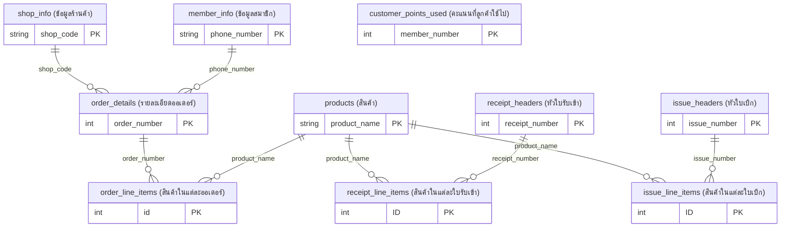

> **Note:** `customer_points_used` has no relationships (abandoned table, 0 rows). The 4 table-to-query relationships (to `product_stock`, `remaining_points_after_use`, `total_sold_per_product`, `customer_total_points`) and 2 system relationships (MSysNavPane) are omitted from this diagram as they represent query-level dependencies, not table-to-table foreign keys.

### Products Domain ER Detail

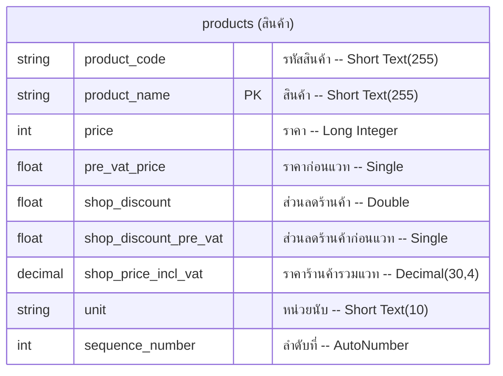

### Orders Domain ER Detail

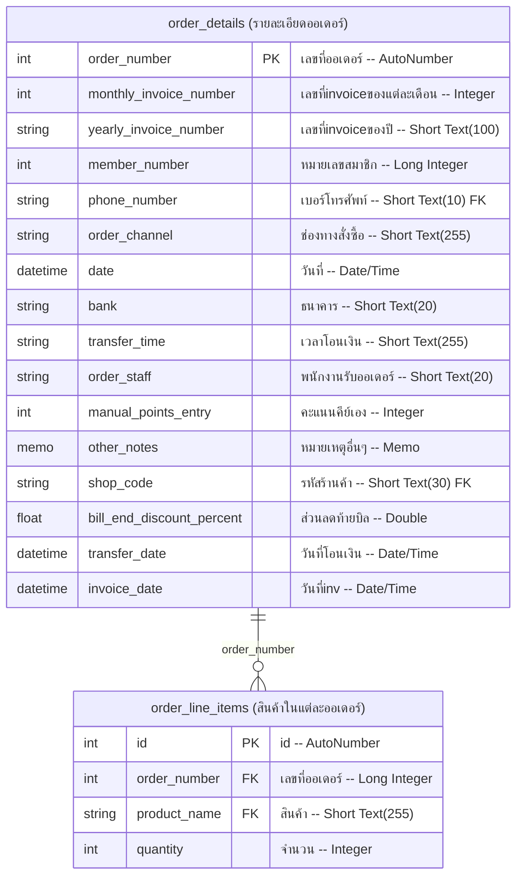

### Inventory Domain ER Detail

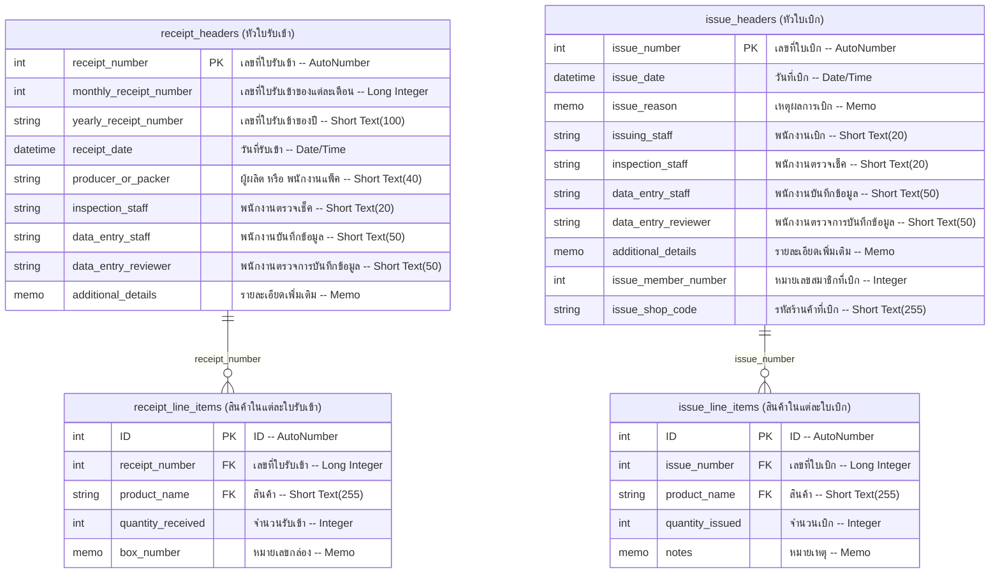

### Customers Domain ER Detail

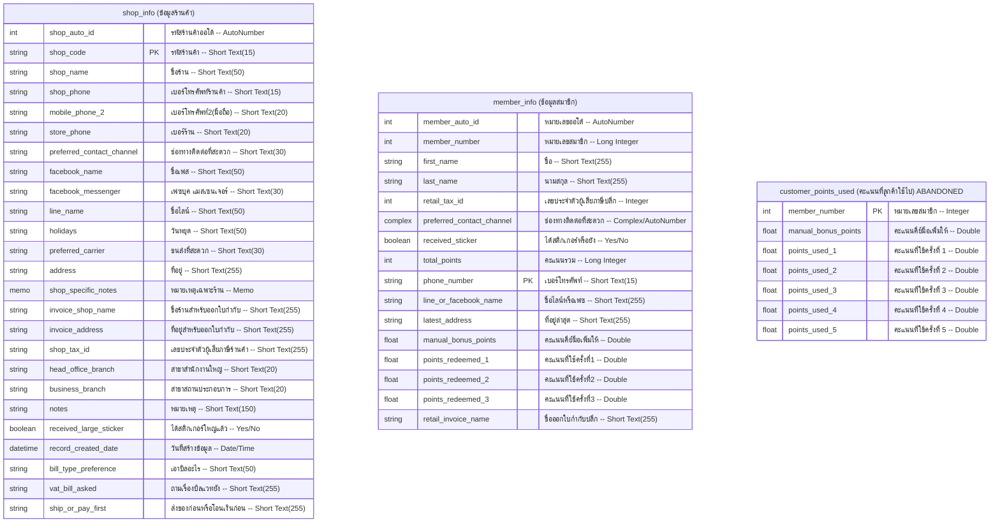

> **Note:** `customer_points_used` has 0 rows and no relationships -- it is an abandoned table. Points are tracked in fixed columns on `member_info` instead.

### Relationship Details Table

| # | Parent (English) | Child (English) | Parent Column | Child Column | Integrity | Notes |
|---|---|---|---|---|---|---|
| 1 | shop_info | order_details | shop_code | shop_code | None (UI lookup) | Shop-to-order link |
| 2 | member_info | order_details | phone_number | phone_number | NO_INTEGRITY | Member-to-order link |
| 3 | order_details | order_line_items | order_number | order_number | NO_INTEGRITY | Order header to lines |
| 4 | products | order_line_items | product_name | product_name | NO_INTEGRITY | Product lookup in orders |
| 5 | products | receipt_line_items | product_name | product_name | NO_INTEGRITY | Product lookup in receipts |
| 6 | products | issue_line_items | product_name | product_name | NO_INTEGRITY | Product lookup in issues |
| 7 | issue_headers | issue_line_items | issue_number | issue_number | NO_INTEGRITY | Issue header to lines |
| 8 | receipt_headers | receipt_line_items | receipt_number | receipt_number | NO_INTEGRITY | Receipt header to lines |
| 9 | order_details | remaining_points_after_use (query) | member_number | member_number | CASCADE_UPDATES | Table-to-query |
| 10 | retail_order_line_items (query) | customer_total_points (query) | member_number | member_number | CASCADE_UPDATES, QUERY_BASED | Query-to-query |
| 11 | products | product_stock (query) | product_name | product_name | CASCADE_UPDATES | Table-to-query |
| 12 | products | total_sold_per_product (query) | product_name | product_name | CASCADE_UPDATES | Table-to-query |
| 13 | MSysNavPaneGroupCategories | MSysNavPaneGroups | - | - | System | System nav |
| 14 | MSysNavPaneGroups | MSysNavPaneGroupToObjects | - | - | System | System nav |

---

## Products Domain

### Tables

#### products (สินค้า)

Product master table containing all sellable items, raw materials, and shipping fee entries.

| English Name | Thai Name | Data Type | Size | Nullable | Notes |
|---|---|---|---|---|---|
| product_code | รหัสสินค้า | Short Text | 255 chars | Yes | Unique product identifier (e.g., POLLYLI'LRR30) |
| product_name | สินค้า | Short Text | 255 chars | Yes | **Primary Key** -- product name is the PK |
| price | ราคา | Long Integer | 4 bytes | Yes | Retail price, VAT-inclusive (baht) |
| pre_vat_price | ราคาก่อนแวท | Single | 4 bytes | Yes | Price before 7% VAT |
| shop_discount | ส่วนลดร้านค้า | Double | 8 bytes | Yes | Per-product shop discount (fixed baht amount) |
| shop_discount_pre_vat | ส่วนลดร้านค้าก่อนแวท | Single | 4 bytes | Yes | Shop discount before VAT |
| shop_price_incl_vat | ราคาร้านค้ารวมแวท | Decimal | 30,4 | Yes | Shop price with VAT (binary storage) |
| unit | หน่วยนับ | Short Text | 10 chars | Yes | Unit of measure |
| sequence_number | ลำดับที่ | Long Integer (AutoNumber) | 4 bytes | Yes | Auto-incrementing sort order |

**Primary Key:** product_name (สินค้า) -- text-based natural key

**Indexes:** PrimaryKey on product_name; 3 FK indexes (.rB, .rC, .rD)

**Row Count:** 186 | **Status:** Active | **Avg Fill Rate:** 100%

**Sample Data:**

| product_code | product_name | price | pre_vat_price | shop_discount | unit |
|---|---|---|---|---|---|
| POLLYLI'LRR30 | POLLYLI'L LIME PEPPER FLAKE (RR30) | 65 | 60.75 | 0 | large_pack |
| RNMIX | RUNNER MIX | 150 | 140.19 | 0 | KG |
| RRTSF10 | Shipping fee Flash 10 | 10 | 9.35 | 0 | per_shipment |

### Queries

#### unit_value_list ("ซอง";"ตัว";"เม็ด")

- **Type:** SELECT | **Parameterized:** No | **Form Refs:** No
- **Source tables:** products
- **Purpose:** Value list query providing product unit type options (pack, piece, bead) for combo box dropdowns
- **Key fields:** Distinct unit values from the products table

#### product_and_material_report (qryรายงานสินค้าและวัตุดิบ)

- **Type:** UNION | **Parameterized:** No | **Form Refs:** No
- **Source tables:** order_details, products, order_line_items, receipt_line_items, issue_line_items
- **Purpose:** Combined chronological report of ALL inventory movements -- receipts, issues, and sales in a single timeline per product. Uses `IIf(False, 0, Null)` as column placeholders to align the UNION columns.
- **Key calculated fields:**
  - `quantity_sold` (จำนวนขาย) -- alias for sales quantity in the UNION
  - `document_number` (เลขที่ใบสำคัญ) -- alias for receipt/issue/order number in the UNION

### Forms

No dedicated forms exist for the Products domain. Product data is maintained directly through the table datasheet or via combo box lookups embedded in order, receipt, and issue forms.

### Reports

No dedicated reports exist for the Products domain. Product data appears as lookup fields within order, receipt, and issue reports.

### Named Workflows

The Products domain has no standalone workflow -- products serve as reference data for the Orders, Inventory, and Financial domains.

---

## Orders Domain

### Tables

#### order_details (รายละเอียดออเดอร์)

Order header table storing one record per order, shared by both shop and retail channels.

| English Name | Thai Name | Data Type | Size | Nullable | Notes |
|---|---|---|---|---|---|
| order_number | เลขที่ออเดอร์ | Long Integer (AutoNumber) | 4 bytes | Yes | **Primary Key** |
| monthly_invoice_number | เลขที่invoiceของแต่ละเดือน | Integer | 2 bytes | Yes | Monthly sequential invoice counter |
| yearly_invoice_number | เลขที่invoiceของปี | Short Text | 100 chars | Yes | Yearly code (e.g., 6612-010) |
| member_number | หมายเลขสมาชิก | Long Integer | 4 bytes | Yes | Retail member link (0 if shop order) |
| phone_number | เบอร์โทรศัพท์ | Short Text | 10 chars | Yes | FK to member_info (retail orders) |
| order_channel | ช่องทางสั่งซื้อ | Short Text | 255 chars | Yes | LINE, FACEBOOK, other |
| date | วันที่ | Date/Time | 8 bytes | Yes | Order creation date |
| bank | ธนาคาร | Short Text | 20 chars | Yes | Payment method/status enum |
| transfer_time | เวลาโอนเงิน | Short Text | 255 chars | Yes | Bank transfer time as text (e.g., 14.35) |
| order_staff | พนักงานรับออเดอร์ | Short Text | 20 chars | Yes | Staff who received the order |
| manual_points_entry | คะแนนคีย์เอง | Integer | 2 bytes | Yes | Manually keyed points override |
| other_notes | หมายเหตุอื่นๆ | Memo | - | Yes | Order-level notes |
| shop_code | รหัสร้านค้า | Short Text | 30 chars | Yes | FK to shop_info (shop orders) |
| bill_end_discount_percent | ส่วนลดท้ายบิล(%) | Double | 8 bytes | Yes | Bill-end discount (0-34%) |
| transfer_date | วันที่โอนเงิน | Date/Time | 8 bytes | Yes | Bank transfer payment date |
| invoice_date | วันที่inv | Date/Time | 8 bytes | Yes | Invoice issue date |

**Primary Key:** order_number (AutoNumber)

**Indexes:** PrimaryKey; FK to shop_info (shop_code); FK to member_info; regular index on phone_number

**Row Count:** 509 | **Status:** Active | **Avg Fill Rate:** 87%

**Sample Data:**

| order_number | yearly_invoice_number | date | bank | shop_code | phone_number |
|---|---|---|---|---|---|
| 4652 | 6612-010 | 2023-12-11 | cash | RT789 | |
| 4653 | 6612-012 | 2023-12-11 | kasikorn_bank | RT510 | |
| 4660 | 6612-016 | 2023-12-14 | kasikorn_bank | | 0842106951 |

#### order_line_items (สินค้าในแต่ละออเดอร์)

Individual product entries within each order.

| English Name | Thai Name | Data Type | Size | Nullable | Notes |
|---|---|---|---|---|---|
| id | id | Long Integer (AutoNumber) | 4 bytes | Yes | **Primary Key** |
| order_number | เลขที่ออเดอร์ | Long Integer | 4 bytes | Yes | FK to order_details |
| product_name | สินค้า | Short Text | 255 chars | Yes | FK to products |
| quantity | จำนวน | Integer | 2 bytes | Yes | Quantity ordered |

**Primary Key:** id (AutoNumber)

**Indexes:** PrimaryKey; FK to order_details (order_number); FK to products (product_name)

**Row Count:** 7,073 | **Status:** Active | **Avg Fill Rate:** 100%

**Sample Data:**

| id | order_number | product_name | quantity |
|---|---|---|---|
| 48508 | 4582 | BOOM WHITE (RR1) | 5 |
| 48509 | 4582 | BOOM BLACK (RR2) | 5 |
| 48510 | 4582 | BOOM BLACK SHAD BLOOD (RR3) | 5 |

### Queries

#### shop_order_line_items (qry สินค้าในแต่ละออเดอร์ร้านค้า)

- **Type:** SELECT | **Parameterized:** No | **Form Refs:** No
- **Source tables:** shop_info, order_line_items
- **Purpose:** Central shop order pricing query -- the most-referenced query in the system (11 dependents). Computes the complete shop pricing chain with 2-tier discounts.
- **Key calculated fields (with formulas from pricing_discounts.md):**
  - `price_after_shop_discount` = `price - shop_discount` (F-01)
  - `total_after_shop_discount` = `price_after_shop_discount * quantity` (F-02)
  - `total_after_bill_end_discount` = `total_after_shop_discount * (1 - (bill_end_discount_percent / 100))` (F-03)
  - `pre_vat_after_shop_discount` = `pre_vat_price - shop_discount_pre_vat`
  - `total_pre_vat_after_shop_discount` = `pre_vat_after_shop_discount * quantity`
  - `total_pre_vat_after_bill_end_discount` = `total_pre_vat_after_shop_discount * (1 - (bill_end_discount_percent / 100))`
  - `vat` = `total_pre_vat_after_bill_end_discount * 0.07` (F-04)
  - `net_total_incl_vat` = `total_pre_vat_after_bill_end_discount + vat` (F-05)

#### retail_order_line_items (qry สินค้าในแต่ละออเดอร์ปลีก)

- **Type:** SELECT | **Parameterized:** No | **Form Refs:** No
- **Source tables:** order_details, order_line_items
- **Purpose:** Retail order pricing with loyalty points calculation. Second most-referenced query (7 dependents).
- **Key calculated fields:**
  - `line_total` = `price * quantity` (F-06)
  - `total_pre_vat` = `pre_vat_price * quantity`
  - `retail_vat` = `total_pre_vat * 0.07` (F-07)
  - `retail_net_total_incl_vat` = `total_pre_vat + retail_vat` (F-08)
  - `points` = `line_total / 100` (F-09: 1 point per 100 baht)

#### shop_order_lookup (qry เจาะจงหมายเลขออเดอร์ร้านค้า)

- **Type:** SELECT | **Parameterized:** No | **Form Refs:** Yes (`frm_salesorder_fishingshop!order_number`)
- **Source tables:** order_details, products, order_line_items
- **Purpose:** Look up a specific shop order by number, showing product details with pricing

#### retail_order_lookup (qry เจาะจงหมายเลขออเดอร์ปลีก)

- **Type:** SELECT | **Parameterized:** No | **Form Refs:** Yes (`frm_salesorder_retail!order_number`)
- **Source tables:** member_info, order_line_items
- **Purpose:** Look up a specific retail order by number, showing member and product details

#### shop_sales_totals (qry ยอดขายร้านค้า)

- **Type:** SELECT | **Parameterized:** No | **Form Refs:** No
- **Source queries:** shop_order_line_items
- **Purpose:** Aggregate shop sales totals with before/after bill-end discount comparisons, filtered by date range

#### retail_sales_totals (qry ยอดขายลูกค้าปลีก)

- **Type:** SELECT | **Parameterized:** No | **Form Refs:** No
- **Source tables:** order_details | **Source queries:** retail_order_line_items
- **Purpose:** Aggregate retail customer sales totals

#### shops_awaiting_transfer (qry_ร้านค้ารอโอน)

- **Type:** SELECT | **Parameterized:** No | **Form Refs:** No
- **Source tables:** order_details | **Source queries:** shop_order_line_items
- **Purpose:** Filter shop orders where bank = "awaiting_transfer" -- shows pending payments

#### shops_ship_before_payment (qry_ร้านค้าส่งของให้ก่อน)

- **Type:** SELECT | **Parameterized:** No | **Form Refs:** No
- **Source tables:** order_details | **Source queries:** shop_order_line_items
- **Purpose:** Filter shop orders where bank = "ship_before_payment" -- credit/advance shipment

#### best_sellers_last_3_months (qry_สินค้าที่ขายดีย้อนหลัง 3 เดือน)

- **Type:** SELECT | **Parameterized:** No | **Form Refs:** No
- **Source tables:** order_details, order_line_items
- **Purpose:** Best-selling products ranked by quantity over last 3 months using `DateAdd("m", -3, Date())`

#### shop_purchase_totals_per_vendor (qry ดูยอดซื้อร้านค้าแต่ละเจ้า)

- **Type:** SELECT | **Parameterized:** No | **Form Refs:** No
- **Source tables:** order_details | **Source queries:** shop_order_line_items
- **Purpose:** Purchase totals per shop vendor for accounts receivable tracking

#### shop_annual_purchase_totals (qry ยอดซื้อร้านค้าทั้งปี)

- **Type:** SELECT | **Parameterized:** No | **Form Refs:** No
- **Source tables:** order_details | **Source queries:** shop_order_line_items
- **Purpose:** Annual shop purchase totals for year-end reporting

#### shop_payment_amounts (qryยอดเงินร้านค้า)

- **Type:** SELECT | **Parameterized:** No | **Form Refs:** No
- **Source tables:** order_details | **Source queries:** shop_order_line_items
- **Purpose:** Shop payment amounts per order with transfer details

#### combined_multi_order_quantities (ดูจำนวนรวมสินค้าที่สั่งหลายออเดอร์รวมกัน)

- **Type:** SELECT | **Parameterized:** No | **Form Refs:** No
- **Source tables:** order_line_items
- **Purpose:** Combined product quantities across a range of orders (for batch packing)

#### product_sales_by_date (จำนวนที่ขายของสินค้าแต่ละตัว(ระบุวันที่))

- **Type:** SELECT | **Parameterized:** No | **Form Refs:** No
- **Source tables:** shop_info, order_line_items
- **Purpose:** Quantity sold per product filtered by date range and shop name

### Forms

#### frm_salesorder_fishingshop

- **Data Source:** order_details (header) + shop_order_line_items_subform (lines)
- **Subforms:** frm_stck_fishingshop (stock display)
- **Navigation:** Main entry point for shop orders. Opens shop reports for printing.
- **Status:** **[INCOMPLETE - Corrupt VBA, inferred from related components]**
- **Inference Level:** HIGH -- the subquery SQL `~sq_cfrm_salesorder_fishingshop~sq_cfrm_stck_fishingshop` reveals: joins order_details with shop_order_line_items and product_stock queries, filtered by order_number parameter. The form displays order header fields, embeds a line items subform, and shows real-time stock levels for ordered products. Report record sources (`~sq_rบิลร้านค้า`, `~sq_rpdf แจ้งยอด`, etc.) reference `frm_salesorder_fishingshop!order_number`, confirming this form triggers shop report printing.

#### frm_salesorder_retail

- **Data Source:** order_details (header) + retail_order_line_items (lines)
- **Subforms:** frm_stck_retail (stock display), order_line_items_subform_1 (line items)
- **Navigation:** Main entry point for retail orders. Opens retail reports.
- **Status:** **[INCOMPLETE - Corrupt VBA, inferred from related components]**
- **Inference Level:** HIGH -- subquery SQL shows: `~sq_cfrm_salesorder_retail~sq_cqry สินค้าในแต่ละออเดอร์ Subform1` selects from retail_order_line_items filtered by order_number; `~sq_cfrm_salesorder_retail~sq_cfrm_stck_retail` selects from retail_order_stock filtered by order_number. The form handles retail order creation with stock visibility and points display via embedded customer_points_subform.

#### order_line_items_subform (qry สินค้าในแต่ละออเดอร์ Subform)

- **Data Source:** retail_order_line_items (qry สินค้าในแต่ละออเดอร์ปลีก)
- **Controls:** product_name (ComboBox), quantity (TextBox), price (TextBox), line_total (TextBox)
- **Navigation:** Embedded as subform in retail order forms

#### shop_order_line_items_subform (qry สินค้าในแต่ละออเดอร์ร้านค้า subform)

- **Data Source:** Not in exported set (referenced by subquery naming convention)
- **Navigation:** Embedded in frm_salesorder_fishingshop

#### order_line_items_subform_1 (qry สินค้าในแต่ละออเดอร์ Subform1)

- **Data Source:** retail_order_line_items (via subquery)
- **Navigation:** Embedded in frm_salesorder_retail

#### order_lookup_by_shop_name (หาเลขที่ออเดอร์ถ้ารู้ชื่อร้าน)

- **Data Source:** SELECT from order_details + shop_info + member_info
- **Controls:** order_number, shop_name, first_name, member_number (all TextBox)
- **Navigation:** Standalone lookup form

### Reports

#### shop_bill (บิลร้านค้า)

- **Data Source:** `~sq_rบิลร้านค้า` (SELECT from order_details, products, order_line_items WHERE order_number = `[Forms]![frm_salesorder_fishingshop]![order_number]`)
- **Output Type:** Shop order bill
- **Related Forms:** Triggered from frm_salesorder_fishingshop

#### retail_customer_bill (บิลลูกค้าปลีก)

- **Data Source:** Not in exported set (inferred from report name pattern)
- **Output Type:** Retail customer bill
- **Related Forms:** Triggered from frm_salesorder_retail

#### shop_tax_invoice (ใบกำกับภาษีร้านค้า)

- **Data Source:** `~sq_rใบกำกับภาษีร้านค้า(สำเนา)` (similar record source as shop_bill with pricing fields)
- **Output Type:** Shop tax invoice (original)
- **Key Fields:** yearly_invoice_number, sum_pre_vat_after_bill_end_discount, sum_vat, sum_net_total_incl_vat
- **Related Forms:** Triggered from frm_salesorder_fishingshop

#### shop_tax_invoice_copy (ใบกำกับภาษีร้านค้า(สำเนา))

- **Data Source:** Same as shop_tax_invoice
- **Output Type:** Shop tax invoice (copy)

#### shop_tax_invoice_duplicate (Copy of ใบกำกับภาษีร้านค้า)

- **Data Source:** `~sq_rCopy of ใบกำกับภาษีร้านค้า` (order_details, products, order_line_items)
- **Output Type:** Additional duplicate of shop tax invoice

#### retail_tax_invoice (ใบกำกับภาษีลูกค้าปลีก)

- **Data Source:** Not in exported set
- **Output Type:** Retail customer tax invoice (original)

#### retail_tax_invoice_copy (ใบกำกับภาษีลูกค้าปลีก(สำเนา))

- **Data Source:** Not in exported set
- **Output Type:** Retail customer tax invoice (copy)

#### shop_delivery_note (ใบส่งของร้านค้า)

- **Data Source:** `~sq_rใบส่งของร้านค้า` (order_details, products, order_line_items)
- **Output Type:** Packing/delivery slip for shop orders
- **Related Forms:** Triggered from frm_salesorder_fishingshop

#### shop_packing_list (ใบจัดสินค้าร้านค้า)

- **Data Source:** Not in exported set
- **Output Type:** Packing list for shop order fulfillment

#### shop_bill_verification (ใบตรวจบิลร้านค้า)

- **Data Source:** Not in exported set
- **Output Type:** Bill verification/audit document

#### balance_notification_pdf (pdf แจ้งยอด)

- **Data Source:** `~sq_rpdf แจ้งยอด` (order_details, products, order_line_items)
- **Output Type:** Balance notification in PDF format
- **Related Forms:** Triggered from frm_salesorder_fishingshop

#### order_detail_subreport (qry เจาะจงหมายเลขออเดอร์ subreport)

- **Data Source:** retail_order_lookup (qry เจาะจงหมายเลขออเดอร์ปลีก)
- **Controls:** order_number, phone_number, first_name, product_name, quantity, unit, price, line_total
- **Output Type:** Subreport embedded in retail address printing report

### Named Workflows

#### Shop Order Flow

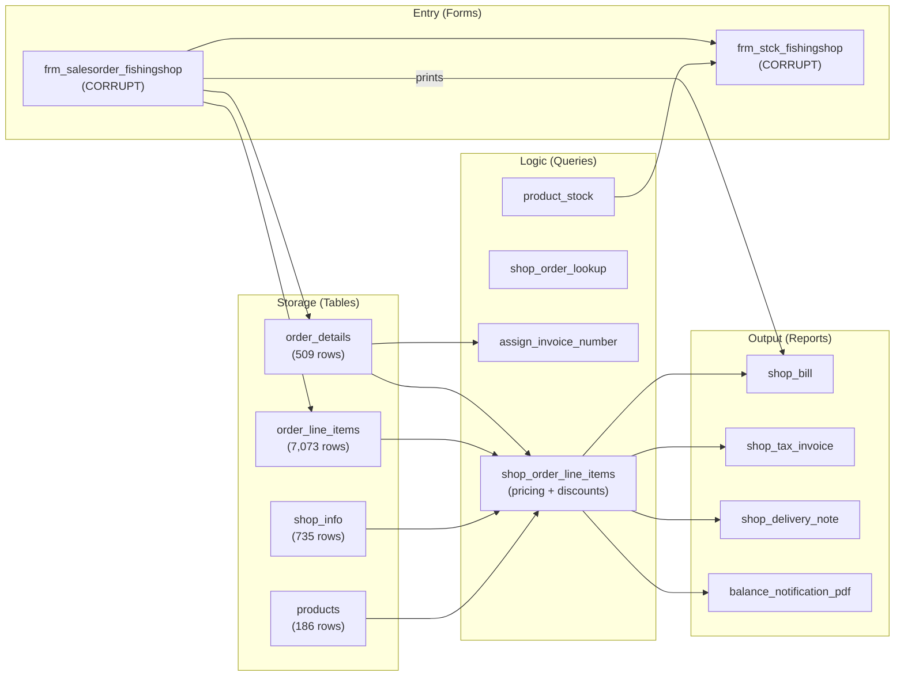

#### Retail Order Flow

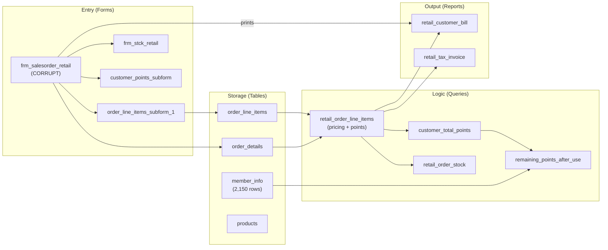

---

## Inventory Domain

### Tables

#### receipt_headers (หัวใบรับเข้า)

Goods receipt document headers -- one record per batch of products received.

| English Name | Thai Name | Data Type | Size | Nullable | Notes |
|---|---|---|---|---|---|
| receipt_number | เลขที่ใบรับเข้า | Long Integer (AutoNumber) | 4 bytes | Yes | **Primary Key** |
| monthly_receipt_number | เลขที่ใบรับเข้าของแต่ละเดือน | Long Integer | 4 bytes | Yes | Monthly sequential counter (all 0) |
| yearly_receipt_number | เลขที่ใบรับเข้าของปี | Short Text | 100 chars | Yes | Yearly identifier (unused -- 0% fill) |
| receipt_date | วันที่รับเข้า | Date/Time | 8 bytes | Yes | Date goods were received |
| producer_or_packer | ผู้ผลิต หรือ พนักงานแพ็ค | Short Text | 40 chars | Yes | Producer name or packing staff |
| inspection_staff | พนักงานตรวจเช็ค | Short Text | 20 chars | Yes | Staff who inspected |
| data_entry_staff | พนักงานบันทึกข้อมูล | Short Text | 50 chars | Yes | Staff who entered data |
| data_entry_reviewer | พนักงานตรวจการบันทึกข้อมูล | Short Text | 50 chars | Yes | Staff who reviewed entry |
| additional_details | รายละเอียดเพิ่มเติม | Memo | - | Yes | Supplementary notes |

**Primary Key:** receipt_number (AutoNumber)

**Row Count:** 165 | **Status:** Active | **Avg Fill Rate:** 77%

**Sample Data:**

| receipt_number | receipt_date | producer_or_packer | inspection_staff |
|---|---|---|---|
| 2021 | 2022-10-28 | Khun Tar Thonglueang | Rattanaporn |
| 2022 | 2022-11-04 | Khun Tar Thonglueang | Rattanaporn |

#### receipt_line_items (สินค้าในแต่ละใบรับเข้า)

Individual products within each goods receipt document.

| English Name | Thai Name | Data Type | Size | Nullable | Notes |
|---|---|---|---|---|---|
| ID | ID | Long Integer (AutoNumber) | 4 bytes | Yes | **Primary Key** |
| receipt_number | เลขที่ใบรับเข้า | Long Integer | 4 bytes | Yes | FK to receipt_headers |
| product_name | สินค้า | Short Text | 255 chars | Yes | FK to products |
| quantity_received | จำนวนรับเข้า | Integer | 2 bytes | Yes | Quantity received |
| box_number | หมายเลขกล่อง | Memo | - | Yes | Box/carton identifier (0% fill) |

**Primary Key:** ID (AutoNumber)

**Row Count:** 514 | **Status:** Active | **Avg Fill Rate:** 80%

#### issue_headers (หัวใบเบิก)

Goods issue/withdrawal document headers.

| English Name | Thai Name | Data Type | Size | Nullable | Notes |
|---|---|---|---|---|---|
| issue_number | เลขที่ใบเบิก | Long Integer (AutoNumber) | 4 bytes | Yes | **Primary Key** |
| issue_date | วันที่เบิก | Date/Time | 8 bytes | Yes | Date of goods issue |
| issue_reason | เหตุผลการเบิก | Memo | - | Yes | Reason for withdrawal |
| issuing_staff | พนักงานเบิก | Short Text | 20 chars | Yes | Staff performing the issue |
| inspection_staff | พนักงานตรวจเช็ค | Short Text | 20 chars | Yes | Staff who inspected |
| data_entry_staff | พนักงานบันทึกข้อมูล | Short Text | 50 chars | Yes | Staff who entered data |
| data_entry_reviewer | พนักงานตรวจการบันทึกข้อมูล | Short Text | 50 chars | Yes | Staff who reviewed entry |
| additional_details | รายละเอียดเพิ่มเติม | Memo | - | Yes | Supplementary notes |
| issue_member_number | หมายเลขสมาชิกที่เบิก | Integer | 2 bytes | Yes | Member receiving goods |
| issue_shop_code | รหัสร้านค้าที่เบิก | Short Text | 255 chars | Yes | Shop receiving goods |

**Primary Key:** issue_number (AutoNumber)

**Row Count:** 3,391 | **Status:** Active | **Avg Fill Rate:** 72%

#### issue_line_items (สินค้าในแต่ละใบเบิก)

Individual products within each goods issue document.

| English Name | Thai Name | Data Type | Size | Nullable | Notes |
|---|---|---|---|---|---|
| ID | ID | Long Integer (AutoNumber) | 4 bytes | Yes | **Primary Key** |
| issue_number | เลขที่ใบเบิก | Long Integer | 4 bytes | Yes | FK to issue_headers |
| product_name | สินค้า | Short Text | 255 chars | Yes | FK to products |
| quantity_issued | จำนวนเบิก | Integer | 2 bytes | Yes | Quantity withdrawn |
| notes | หมายเหตุ | Memo | - | Yes | Line item notes |

**Primary Key:** ID (AutoNumber)

**Row Count:** 15,293 | **Status:** Active | **Avg Fill Rate:** 80%

### Queries

#### product_stock (qry สต็อคสินค้า)

- **Type:** SELECT | **Parameterized:** No | **Form Refs:** No
- **Source tables:** products | **Source queries:** total_received_all_products, total_issued_all_products
- **Purpose:** Calculate current stock levels for all products. The core inventory formula:
  - `Stock = Nz(sum_quantity_received, 0) - Nz(sum_quantity, 0) - Nz(sum_quantity_issued, 0)` (F-11)
  - Stock is NEVER stored -- recalculated on every query execution

#### retail_order_stock (qry สต็อคสินค้าในแต่ละออเดอร์ปลีก)

- **Type:** SELECT | **Parameterized:** No | **Form Refs:** No
- **Source queries:** product_stock, retail_order_line_items
- **Purpose:** Stock levels for products in the current retail order -- used by frm_stck_retail subform

#### total_received_all_products (qry จำนวนรับเข้ารวม ของสินค้าทุกตัว)

- **Type:** SELECT | **Parameterized:** No | **Form Refs:** No
- **Source tables:** products, receipt_line_items
- **Purpose:** `SUM(quantity_received)` grouped by product -- feeds into product_stock

#### total_issued_all_products (qry จำนวนเบิกรวม ของสินค้าทุกตัว)

- **Type:** SELECT | **Parameterized:** No | **Form Refs:** No
- **Source tables:** products, issue_line_items
- **Purpose:** `SUM(quantity_issued)` grouped by product -- feeds into product_stock

#### total_sold_per_product (qry จำนวนที่ขายของสินค้าแต่ละตัว)

- **Type:** SELECT | **Parameterized:** No | **Form Refs:** No
- **Source tables:** order_details, order_line_items
- **Purpose:** `SUM(quantity)` grouped by product -- feeds into product_stock

#### receipt_lookup (qry เจาะจงเลขที่ใบรับเข้า)

- **Type:** SELECT | **Parameterized:** No | **Form Refs:** Yes (`goods_receipt_form!receipt_number`)
- **Source tables:** receipt_line_items, receipt_headers
- **Purpose:** Look up a specific goods receipt by receipt number from the current form

#### issue_lookup (qry เจาะจงเลขที่ใบเบิก)

- **Type:** SELECT | **Parameterized:** No | **Form Refs:** Yes (`goods_issue_form!issue_number`)
- **Source tables:** issue_line_items, issue_headers
- **Purpose:** Look up a specific goods issue by issue number from the current form

### Forms

#### goods_receipt_form (frm รับเข้าสินค้า)

- **Data Source:** receipt_headers (header entry)
- **Subforms:** receipt_line_items_subform
- **Navigation:** Opens receipt_lookup query; prints goods_receipt_details report
- **Status:** Not in exported set (inferred from subquery naming)

#### receipt_line_items_subform (สินค้าในแต่ละใบรับเข้า Subform)

- **Data Source:** SELECT from receipt_line_items + products (for unit lookup)
- **Controls:** product_name (ComboBox), quantity_received (TextBox), unit (ComboBox), box_number (TextBox), product_code (TextBox)
- **Navigation:** Embedded in goods_receipt_form

#### goods_issue_form (frm เบิกสินค้า)

- **Data Source:** issue_headers (header entry)
- **Subforms:** issue_line_items_subform
- **Navigation:** Opens issue_lookup query; prints print_goods_issue and related reports
- **Status:** Not in exported set (inferred from subquery naming)

#### issue_line_items_subform (สินค้าในแต่ละใบเบิก Subform)

- **Data Source:** SELECT from issue_line_items + products (for unit lookup)
- **Controls:** product_name (ComboBox), quantity_issued (TextBox), unit (ComboBox), notes (TextBox), delete button (CommandButton)
- **Navigation:** Embedded in goods_issue_form

#### product_stock_form (frm_สต็อคสินค้า)

- **Data Source:** SELECT from product_stock query
- **Controls:** product_code (TextBox), product_name (TextBox), unit (ComboBox), stock level expressions (TextBox x3), sum_quantity (TextBox)
- **Navigation:** Standalone stock display form (15 controls)

#### frm_stck_fishingshop

- **Data Source:** product_stock joined with shop_order_line_items (via subquery SQL)
- **Navigation:** Embedded in frm_salesorder_fishingshop
- **Status:** **[INCOMPLETE - Corrupt VBA, inferred from related components]**
- **Inference Level:** MEDIUM -- subquery SQL shows it displays stock levels for products in the current shop order, joining order_details -> shop_order_line_items -> product_stock, but exact control layout is unknown.

#### qry stck subform2

- **Data Source:** Unknown -- no subquery SQL found
- **Navigation:** Unknown
- **Status:** **[INCOMPLETE - Corrupt VBA, inferred from related components]**
- **Inference Level:** LOW -- no subquery SQL was found for this form. Name suggests it is a stock display subform variant, possibly a secondary view used alongside frm_stck_fishingshop.

### Reports

#### print_goods_issue (ปรินท์ใบเบิกสินค้า)

- **Data Source:** issue_lookup (qry เจาะจงเลขที่ใบเบิก)
- **Key Fields:** product_name (ComboBox), quantity_issued (TextBox), unit (ComboBox)
- **Output Type:** Goods issue print document
- **Related Forms:** Triggered from goods_issue_form

#### view_issue_numbers (rptดูเลขทีใบเบิก)

- **Data Source:** SELECT from issue_headers with member and shop info joins
- **Key Fields:** issue_number, issue_date, issue_member_number, shop_name, line_or_facebook_name
- **Output Type:** Listing of all goods issue documents

#### issue_address_labels (rptทำที่อยู่เบิกสินค้า)

- **Data Source:** SELECT from issue_headers + shop_info + member_info
- **Key Fields:** shop_name, address, shop_phone, holidays, preferred_carrier, first_name, last_name, latest_address, phone_number, issue_number
- **Output Type:** Address labels for goods issue shipments (22 controls)

#### goods_receipt_details (รายละเอียดใบรับเข้าสินค้า)

- **Data Source:** SELECT from receipt_line_items + products (unit lookup)
- **Key Fields:** product_name (ComboBox), quantity_received (TextBox), unit (ComboBox), box_number (TextBox)
- **Output Type:** Goods receipt detail document

### Named Workflows

#### Goods Receipt Flow

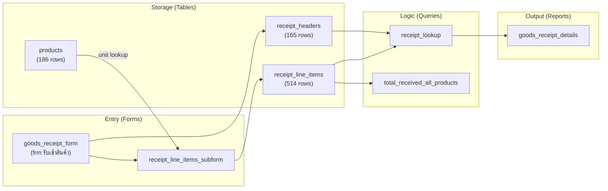

#### Goods Issue Flow

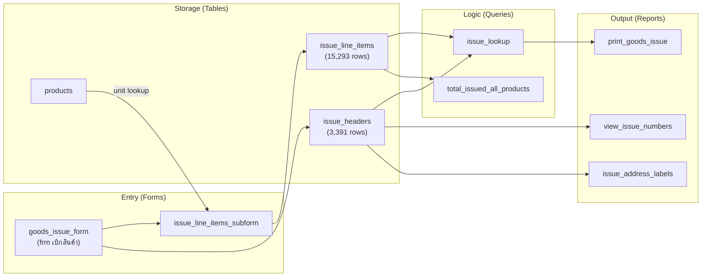

#### Stock Calculation Flow

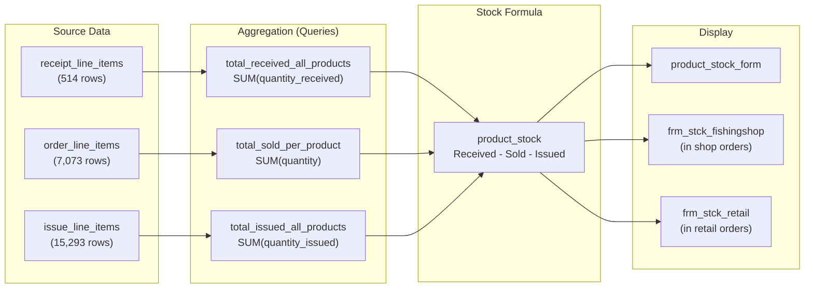

---

## Customers Domain

### Tables

#### shop_info (ข้อมูลร้านค้า)

Shop/wholesale customer master table with comprehensive business information.

| English Name | Thai Name | Data Type | Size | Nullable | Notes |
|---|---|---|---|---|---|
| shop_auto_id | รหัสร้านค้าออโต้ | Long Integer (AutoNumber) | 4 bytes | Yes | Surrogate key |
| shop_code | รหัสร้านค้า | Short Text | 15 chars | Yes | **Primary Key** (e.g., RT789) |
| shop_name | ชื่อร้าน | Short Text | 50 chars | Yes | Shop/store name |
| shop_phone | เบอร์โทรศัพท์ร้านค้า | Short Text | 15 chars | Yes | Primary phone (97% fill) |
| mobile_phone_2 | เบอร์โทรศัพท์2(มือถือ) | Short Text | 20 chars | Yes | Secondary mobile (6% fill) |
| store_phone | เบอร์ร้าน | Short Text | 20 chars | Yes | Landline (2% fill) |
| preferred_contact_channel | ช่องทางติดต่อที่สะดวก | Short Text | 30 chars | Yes | Preferred contact method |
| facebook_name | ชื่อเฟส | Short Text | 50 chars | Yes | Facebook profile (47% fill) |
| facebook_messenger | เฟซบุค แมสเซนเจอร์ | Short Text | 30 chars | Yes | Messenger contact (1% fill) |
| line_name | ชื่อไลน์ | Short Text | 50 chars | Yes | LINE contact (41% fill) |
| holidays | วันหยุด | Short Text | 50 chars | Yes | Closed days for delivery (84% fill) |
| preferred_carrier | ขนส่งที่สะดวก | Short Text | 30 chars | Yes | Preferred shipper (83% fill) |
| address | ที่อยู่ | Short Text | 255 chars | Yes | Shipping address |
| shop_specific_notes | หมายเหตุเฉพาะร้าน | Memo | - | Yes | Shop-specific notes (2% fill) |
| invoice_shop_name | ชื่อร้านสำหรับออกใบกำกับ | Short Text | 255 chars | Yes | Name for tax invoice |
| invoice_address | ที่อยู่สำหรับออกใบกำกับ | Short Text | 255 chars | Yes | Invoice address |
| shop_tax_id | เลขประจำตัวผู้เสียภาษีร้านค้า | Short Text | 255 chars | Yes | Tax ID (7% fill) |
| head_office_branch | สาขาสำนักงานใหญ่ | Short Text | 20 chars | Yes | HQ branch number (1% fill) |
| business_branch | สาขาสถานประกอบการ | Short Text | 20 chars | Yes | Business branch (0% fill) |
| notes | หมายเหตุ | Short Text | 150 chars | Yes | General notes (0% fill) |
| received_large_sticker | ได้สติกเกอร์ใหญ่แล้ว | Yes/No | 1 byte | Yes | Promotional sticker flag |
| record_created_date | วันที่สร้างข้อมูล | Date/Time | 8 bytes | Yes | Record creation timestamp |
| bill_type_preference | เอาบิลอะไร | Short Text | 50 chars | Yes | Bill type preference (99% fill) |
| vat_bill_asked | ถามเรื่องบิลแวทยัง | Short Text | 255 chars | Yes | VAT billing asked flag (97% fill) |
| ship_or_pay_first | ส่งของก่อนหรือโอนเงินก่อน | Short Text | 255 chars | Yes | Payment terms (100% fill) |

**Primary Key:** shop_code (Short Text)

**Row Count:** 735 | **Status:** Active | **Avg Fill Rate:** 61%

**Sample Data:**

| shop_code | shop_name | shop_phone | bill_type_preference | ship_or_pay_first |
|---|---|---|---|---|
| RT809 | Seven Sea Pro Shop (Thailand) Co., Ltd. | 098-294-5666 | tax_invoice | transfer_first_only |
| RT810 | Perm Sin Shop | 088-703-2623 | regular_bill | transfer_first_only |

#### member_info (ข้อมูลสมาชิก)

Retail customer/member master table with loyalty points tracking.

| English Name | Thai Name | Data Type | Size | Nullable | Notes |
|---|---|---|---|---|---|
| member_auto_id | หมายเลขออโต้ | Long Integer (AutoNumber) | 4 bytes | Yes | Surrogate key |
| member_number | หมายเลขสมาชิก | Long Integer | 4 bytes | Yes | Manually assigned member # |
| first_name | ชื่อ | Short Text | 255 chars | Yes | First name (94% fill) |
| last_name | นามสกุล | Short Text | 255 chars | Yes | Last name (93% fill) |
| retail_tax_id | เลขประจำตัวผู้เสียภาษีปลีก | Integer | 2 bytes | Yes | Tax ID (all 0 in data) |
| preferred_contact_channel | ช่องทางติดต่อที่สะดวก | Complex (AutoNumber) | 4 bytes | Yes | Contact preference |
| received_sticker | ได้สติกเกอร์หรือยัง | Yes/No | 1 byte | Yes | Sticker promotion flag |
| total_points | คะแนนรวม | Long Integer | 4 bytes | Yes | Stored total (redundant) |
| phone_number | เบอร์โทรศัพท์ | Short Text | 15 chars | Yes | **Primary Key** |
| line_or_facebook_name | ชื่อไลน์หรือเฟซ | Short Text | 255 chars | Yes | Social contact (49% fill) |
| latest_address | ที่อยู่ล่าสุด | Short Text | 255 chars | Yes | Most recent address (94% fill) |
| manual_bonus_points | คะแนนคีย์มือเพิ่มให้ | Double | 8 bytes | Yes | Staff-added bonus points |
| points_redeemed_1 | คะแนนที่ใช้ครั้งที่1 | Double | 8 bytes | Yes | 1st redemption amount |
| points_redeemed_2 | คะแนนที่ใช้ครั้งที่2 | Double | 8 bytes | Yes | 2nd redemption amount |
| points_redeemed_3 | คะแนนที่ใช้ครั้งที่3 | Double | 8 bytes | Yes | 3rd redemption amount |
| retail_invoice_name | ชื่อออกใบกำกับปลีก | Short Text | 255 chars | Yes | Name for tax invoice |

**Primary Key:** phone_number (Short Text) -- customers identified by phone

**Row Count:** 2,150 | **Status:** Active | **Avg Fill Rate:** 95%

**Sample Data:**

| member_number | first_name | last_name | phone_number | total_points | points_redeemed_1 |
|---|---|---|---|---|---|
| 2128 | Khun Phanu | Hansongkhram | 0829081305 | 0 | 0 |
| 2129 | Khun Panya | Suantako | 0811712777 | 0 | 0 |

#### customer_points_used (คะแนนที่ลูกค้าใช้ไป)

Abandoned points usage table with 5 redemption slots (vs 3 in member_info).

| English Name | Thai Name | Data Type | Size | Nullable | Notes |
|---|---|---|---|---|---|
| member_number | หมายเลขสมาชิก | Integer | 2 bytes | Yes | **Primary Key** |
| manual_bonus_points | คะแนนคีย์มือเพิ่มให้ | Double | 8 bytes | Yes | |
| points_used_1 | คะแนนที่ใช้ครั้งที่ 1 | Double | 8 bytes | Yes | |
| points_used_2 | คะแนนที่ใช้ครั้งที่ 2 | Double | 8 bytes | Yes | |
| points_used_3 | คะแนนที่ใช้ครั้งที่ 3 | Double | 8 bytes | Yes | |
| points_used_4 | คะแนนที่ใช้ครั้งที่ 4 | Double | 8 bytes | Yes | |
| points_used_5 | คะแนนที่ใช้ครั้งที่ 5 | Double | 8 bytes | Yes | |

**Primary Key:** member_number (Integer)

**Row Count:** 0 | **Status:** Likely Abandoned | **Signals:** ZERO_ROWS, NO_RELATIONSHIPS

### Queries

#### customer_total_points (qry คะแนนรวมลูกค้าแต่ละคน)

- **Type:** SELECT | **Parameterized:** No | **Form Refs:** No
- **Source queries:** retail_order_line_items
- **Purpose:** `SUM(points)` grouped by member_number -- total loyalty points per customer from all retail orders

#### remaining_points_after_use (qry คะแนนคงเหลือหลังจากใช้แล้ว)

- **Type:** SELECT | **Parameterized:** No | **Form Refs:** Yes (`frm_salesorder_retail!member_number`)
- **Source tables:** member_info | **Source queries:** customer_total_points
- **Purpose:** Calculate remaining loyalty points:
  - `Remaining = sum_points + manual_bonus_points - points_redeemed_1 - points_redeemed_2 - points_redeemed_3` (F-10)

#### retail_addresses_by_date (qry ที่อยู่เจาะจงโดยวันที่ (ปลีก))

- **Type:** SELECT | **Parameterized:** No | **Form Refs:** No
- **Source tables:** member_info, order_details
- **Purpose:** Retail customer addresses filtered by order number range -- for batch shipping label printing. Uses parameter prompts: `enter_first_order_to_view`, `enter_last_order_to_view`

#### shop_addresses_by_date (qry ที่อยู่เจาะจงโดยวันที่ (ร้านค้า))

- **Type:** SELECT | **Parameterized:** No | **Form Refs:** No
- **Source tables:** member_info, order_details
- **Purpose:** Shop addresses filtered by order number range. Uses parameter prompts: `enter_first_shop_order`, `enter_last_shop_order`

### Forms

#### member_info_form (frmข้อมูลสมาชิก)

- **Data Source:** member_info table
- **Controls:** Inferred from table schema -- member registration fields
- **Navigation:** Standalone form for member data entry
- **Status:** Not exported (not in SaveAsText set -- not corrupt, just not included)

#### remaining_points_form (คะแนนคงเหลือหลังจากใช้แล้ว)

- **Data Source:** SELECT from remaining_points_after_use query
- **Controls:** member_number (Label/TextBox), remaining points expression (TextBox)
- **Navigation:** Standalone form for viewing remaining loyalty points

#### customer_points_subform (qry คะแนนรวมลูกค้าแต่ละคน subform)

- **Data Source:** customer_total_points query
- **Controls:** sum_points (TextBox)
- **Navigation:** Embedded in order detail forms to show real-time points during order entry

#### main_menu (หน้าหลัก)

- **Data Source:** None (navigation-only form)
- **Navigation:** Main application menu -- not exported
- **Status:** Not exported (not in SaveAsText set)

### Reports

#### shop_tracking_notification (ข้อมูลสำหรับแจ้งเลขพัสดุร้านค้า)

- **Data Source:** shop_addresses_by_date query
- **Key Fields:** facebook_name (as shop name display), shop_name, order_channel, line_name
- **Output Type:** Shipping tracking notification for shop orders

#### retail_tracking_notification (ข้อมูลสำหรับแจ้งเลขพัสดุลูกค้าปลีก)

- **Data Source:** retail_addresses_by_date query
- **Key Fields:** line_or_facebook_name, first_name, last_name, order_channel
- **Output Type:** Shipping tracking notification for retail orders

#### print_retail_addresses (ปริ้นท์ที่อยู่ลูกค้าปลีก)

- **Data Source:** retail_addresses_by_date query
- **Key Fields:** first_name, last_name, latest_address, order_number, phone_number
- **Output Type:** Address labels for retail order shipments
- **Subreports:** Embeds order_detail_subreport

#### print_addresses (ปริ้นท์ที่อยู่)

- **Data Source:** Not in exported set
- **Output Type:** General address label printing

### Named Workflows

#### Loyalty Points Flow

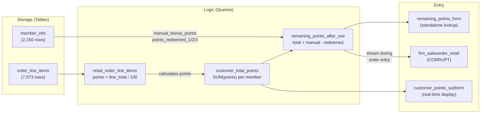

---

## Financial Domain

### Tables

The Financial domain does not have its own dedicated tables. It operates on shared tables from the Orders and Customers domains:

- **order_details** -- order headers with bank/payment fields, invoice numbers, transfer dates
- **shop_info** -- shop tax IDs, invoice names, billing addresses
- **member_info** -- retail tax IDs, invoice names

### Queries

#### shop_transfer_details (qry รายละเอียดการโอนเงินร้านค้า)

- **Type:** SELECT | **Parameterized:** No | **Form Refs:** No
- **Source tables:** member_info | **Source queries:** retail_order_line_items, shop_order_line_items
- **Purpose:** Shop bank transfer details with amounts -- joins both shop and retail pricing queries for comprehensive transfer tracking. Filtered by bank = "kasikorn_bank" or "ship_before_payment" and date range.

#### retail_order_transfer_details (qry รายละเอียดการโอนแต่ละออเดอร์ปลีก)

- **Type:** SELECT | **Parameterized:** No | **Form Refs:** No
- **Source tables:** order_details | **Source queries:** shop_order_line_items
- **Purpose:** Retail order bank transfer details filtered by order number range

#### transfer_datetime_by_invoice (qry วันที่และเวลาโอนเงินเรียงตามใบกำกับ)

- **Type:** SELECT | **Parameterized:** No | **Form Refs:** No
- **Source tables:** order_details
- **Purpose:** Transfer date and time sorted by invoice number -- for reconciliation. Filtered by invoice number range and bank = "kasikorn_bank"

#### assign_invoice_number (qryกำหนดเลขที่inv)

- **Type:** SELECT | **Parameterized:** No | **Form Refs:** No
- **Source tables:** order_details
- **Purpose:** Review and manage invoice number assignments. Filtered by invoice number range. **Risk:** Invoice numbers assigned via query-based counter -- potential race condition with concurrent users.

#### enter_tax_invoice_number (qryใส่เลขที่ใบกำกับ)

- **Type:** SELECT | **Parameterized:** No | **Form Refs:** No
- **Source tables:** member_info, order_details
- **Purpose:** Interface for assigning tax invoice numbers to orders. Filtered by bank type and date range.

#### post_shop_payments (qryลงยอดร้านค้า)

- **Type:** SELECT | **Parameterized:** No | **Form Refs:** No
- **Source tables:** shop_info, order_details
- **Purpose:** Post shop payment records -- shows shops with "ship_before_payment" status for payment reconciliation

### Forms

No dedicated forms exist for the Financial domain. Financial operations (invoice assignment, payment posting) are performed through query datasheets opened directly.

### Reports

#### sales_tax_report (รายงานภาษีขาย)

- **Data Source:** `~sq_rรายงานภาษีขาย` (SELECT from shop_info, member_info with LEFT JOINs to both channel pricing queries)
- **Key Fields:** yearly_invoice_number, sum_pre_vat_after_bill_end_discount, sum_vat, sum_net_total_incl_vat, sum_pre_vat_total, sum_retail_vat, shop_tax_id, retail_invoice_name, invoice_shop_name, business_branch, head_office_branch
- **Output Type:** Sales tax summary report grouped by order

#### sales_tax_verification_by_inv (ตรวจภาษีขายเรียงตามเลขinv)

- **Data Source:** `~sq_rตรวจภาษีขายเรียงตามเลขinv` (same structure as sales_tax_report)
- **Key Fields:** Same as sales_tax_report plus order_number, bank, transfer_date, transfer_time
- **Output Type:** Sales tax verification sorted by invoice number (20 controls)

#### sales_tax_verification (ตรวจภาษีขาย)

- **Data Source:** Not in exported set (inferred from MSysObjects)
- **Output Type:** Sales tax verification document

#### transfer_details (รายละเอียดการโอน)

- **Data Source:** Not in exported set
- **Output Type:** Bank transfer details report

#### transfer_details_per_order (rptรายละเอียดการโอนเงินของแต่ละเลขที่ออเดอร์)

- **Data Source:** SELECT from order_details (order_number, transfer_date, transfer_time)
- **Key Fields:** order_number, transfer_date, transfer_time
- **Output Type:** Bank transfer details per order number

### Named Workflows

#### Payment Tracking Flow

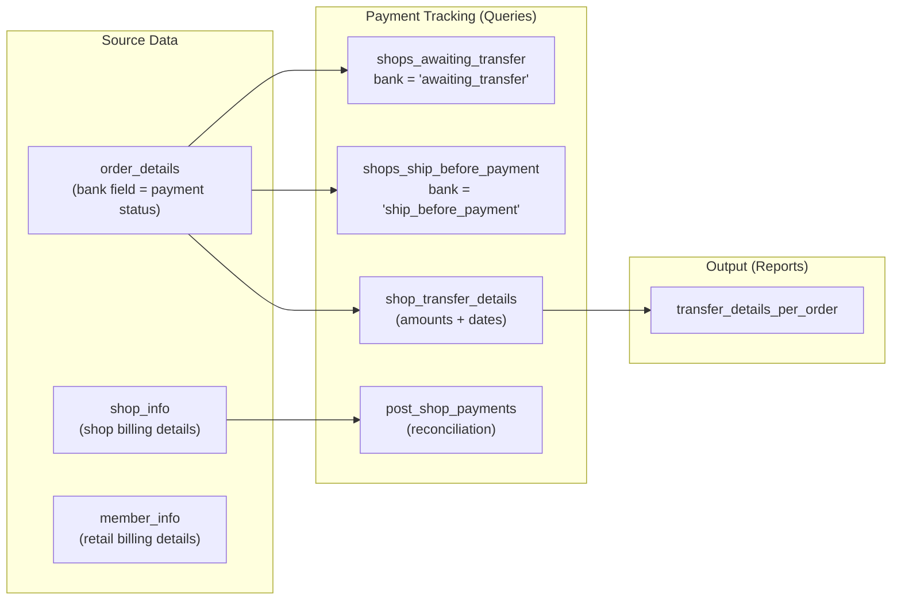

#### Tax Invoice Flow

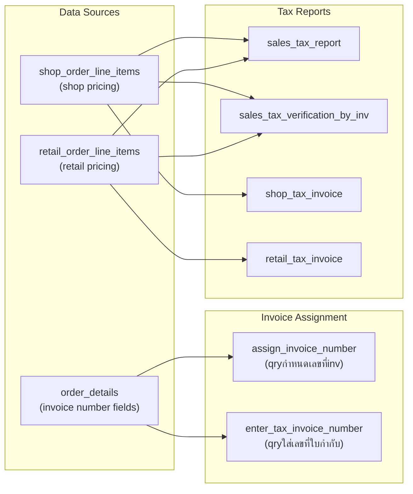

---

## Cross-Reference Maps

### Component Connection Diagram

System-wide view showing how all major component types connect. This complements the per-domain workflows above with a cross-cutting perspective.

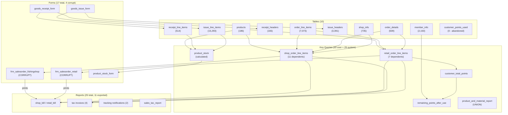

### Table-to-Query Matrix

Shows which tables serve as data sources for which queries. Only user-visible queries shown (33 total).

| Table (English) | shop_order_line_items | retail_order_line_items | product_stock | product_and_material_report | shop_order_lookup | retail_order_lookup | receipt_lookup | issue_lookup | remaining_points_after_use | Other queries |
|---|---|---|---|---|---|---|---|---|---|---|
| products | source | - | source | source | source | - | - | - | - | unit_value_list, total_received, total_issued |
| order_details | - | source | - | source | source | - | - | - | - | 12 queries (sales, transfers, invoicing) |
| order_line_items | source | source | - | source | source | source | - | - | - | best_sellers, product_sales_by_date, combined_multi_order |
| receipt_headers | - | - | - | - | - | - | join | - | - | - |
| receipt_line_items | - | - | - | source | - | - | source | - | - | total_received_all_products |
| issue_headers | - | - | - | - | - | - | - | join | - | - |
| issue_line_items | - | - | - | source | - | - | - | source | - | total_issued_all_products |
| shop_info | source | - | - | - | - | - | - | - | - | post_shop_payments, product_sales_by_date |
| member_info | - | - | - | - | - | source | - | - | source | retail_addresses, shop_addresses, enter_tax_invoice, shop_transfer_details |
| customer_points_used | - | - | - | - | - | - | - | - | - | (no query references -- abandoned) |

### Query-to-Form Matrix

Shows which queries serve as record sources or subform data sources for forms.

| Query (English) | product_stock_form | order_line_items_subform | remaining_points_form | customer_points_subform | receipt_line_items_subform | issue_line_items_subform | order_lookup_by_shop_name | frm_salesorder_fishingshop | frm_salesorder_retail |
|---|---|---|---|---|---|---|---|---|---|
| product_stock | record source | - | - | - | - | - | - | subform source (via frm_stck) | subform source (via frm_stck) |
| retail_order_line_items | - | record source | - | - | - | - | - | - | subform source |
| remaining_points_after_use | - | - | record source | - | - | - | - | - | display |
| customer_total_points | - | - | - | record source | - | - | - | - | - |
| shop_order_line_items | - | - | - | - | - | - | - | subform source | - |
| receipt_lookup | - | - | - | - | - | - | - | - | - |
| issue_lookup | - | - | - | - | - | - | - | - | - |

> **Note:** receipt_lookup and issue_lookup are opened from goods_receipt_form and goods_issue_form respectively, but those parent forms are not in the exported set.

### Query-to-Report Matrix

Shows which queries serve as record sources for reports.

| Query (English) | shop_bill | shop_tax_invoice | shop_delivery_note | balance_notification_pdf | retail_customer_bill | retail_tax_invoice | print_goods_issue | sales_tax_report | sales_tax_verification_by_inv | order_detail_subreport |
|---|---|---|---|---|---|---|---|---|---|---|
| shop_order_line_items | indirect (via ~sq_r) | indirect (via ~sq_r) | indirect (via ~sq_r) | indirect (via ~sq_r) | - | - | - | source (LEFT JOIN) | source (LEFT JOIN) | - |
| retail_order_line_items | - | - | - | - | indirect | indirect | - | source (LEFT JOIN) | source (LEFT JOIN) | - |
| retail_order_lookup | - | - | - | - | - | - | - | - | - | record source |
| issue_lookup | - | - | - | - | - | - | record source | - | - | - |
| retail_addresses_by_date | - | - | - | - | - | - | - | - | - | - |
| shop_addresses_by_date | - | - | - | - | - | - | - | - | - | - |

> **Note:** Most shop reports use `~sq_r*` system subqueries that embed inline SQL selecting from order_details, products, and order_line_items, filtered by `[Forms]![frm_salesorder_fishingshop]![order_number]`. The sales tax reports use LEFT JOINs to both channel pricing queries.

### Form-to-Report Matrix

Shows which forms trigger report generation (based on `[Forms]!` references in report record sources).

| Form (English) | shop_bill | shop_tax_invoice / copy / duplicate | shop_delivery_note | balance_notification_pdf | retail_customer_bill | retail_tax_invoice / copy | print_goods_issue | goods_receipt_details | view_issue_numbers | Tracking notifications |
|---|---|---|---|---|---|---|---|---|---|---|
| frm_salesorder_fishingshop | triggers | triggers | triggers | triggers | - | - | - | - | - | - |
| frm_salesorder_retail | - | - | - | - | triggers | triggers | - | - | - | - |
| goods_issue_form | - | - | - | - | - | - | triggers | - | triggers | - |
| goods_receipt_form | - | - | - | - | - | - | - | triggers | - | - |

> **Note:** Tracking notification reports (shop_tracking_notification, retail_tracking_notification) use parameterized queries with order number range prompts, not `[Forms]!` references, so they are triggered independently.

---

## Risks, Anti-Patterns, and Improvement Opportunities

This section consolidates all risks, anti-patterns, and improvement suggestions identified throughout the assessment. Each item describes what it is, why it matters, and what the rebuild should do differently.

### Data Integrity Risks

**1. All foreign keys use NO_INTEGRITY (grbit=0x00000002)**

All 8 table-to-table relationships have NO_INTEGRITY set, meaning there is no cascade delete, no cascade update, and no restrict on orphan creation. Any child record can reference a non-existent parent. The only relationship with any constraint is shop_info -> order_details which has no integrity at all (UI lookup only, grbit=0).

*Impact:* Orphaned order_line_items could reference deleted orders; issue_line_items could reference deleted products. Data quality depends entirely on the Access forms preventing invalid entries.

*Rebuild recommendation:* Add proper FOREIGN KEY constraints with ON DELETE RESTRICT (or CASCADE where appropriate) on all relationships. Add database-level referential integrity checks.

**2. Stock is calculated, never stored**

Current stock is computed as `Received - Sold - Issued` across 3 sub-queries scanning 23,000+ rows every time. There is no stored balance, no stock snapshot, and no transaction log.

*Impact:* Performance degrades linearly as transaction volume grows. Any bug in the receipt, order, or issue counts silently corrupts all stock readings. No ability to audit stock changes over time.

*Rebuild recommendation:* Maintain a `stock_balance` column on a product_inventory table, updated transactionally. Keep a `stock_transactions` log table for audit trail. Optionally run periodic reconciliation jobs against the calculated value.

**3. Payment status tracked via free-text field**

The `bank` (ธนาคาร) field on order_details is a Short Text(20) field serving double duty as both payment method and payment status. Values include bank names ("kasikorn_bank"), status labels ("awaiting_transfer", "ship_before_payment"), and payment types ("cash").

*Impact:* No enum constraint means typos create silent data quality issues. Query filters use exact string matching -- a misspelled value is invisible to payment tracking queries.

*Rebuild recommendation:* Create a `payment_status` enum/lookup table with defined states (pending, paid, credit, cash). Separate payment method (bank name) from payment status. Add state machine transitions.

**4. Points system uses 3 fixed columns instead of a transaction log**

Loyalty points redemption is tracked in 3 hardcoded columns on member_info (`points_redeemed_1`, `points_redeemed_2`, `points_redeemed_3`), limiting each customer to exactly 3 lifetime redemptions.

*Impact:* Business is constrained to 3 redemptions per customer forever. No audit trail of when redemptions occurred or what they were for. The abandoned `customer_points_used` table (with 5 slots) suggests this limitation was recognized but never resolved.

*Rebuild recommendation:* Replace with a `points_transactions` table recording each earn/redeem event with date, amount, order reference, and running balance. Remove the fixed-column pattern entirely.

### Structural Anti-Patterns

**1. Abandoned table: customer_points_used (0 rows, no relationships)**

This table has 7 columns (5 redemption slots), 0 rows, and no relationships. It appears to be an earlier, more generous attempt at a points redemption log (5 slots vs 3 on member_info) that was never populated.

*Rebuild recommendation:* Exclude from rebuild. Replace the entire fixed-slot pattern with a transaction log.

**2. Dual customer tables with no shared base**

Shop customers (shop_info, 735 rows, 25 columns) and retail customers (member_info, 2,150 rows, 16 columns) are entirely separate tables with no shared customer base. Both have name, address, phone, tax ID fields but with different column sets and naming.

*Impact:* A business that is both a shop and a retail customer exists as two unconnected records. Shared analytics (e.g., total revenue per entity) require manual cross-referencing.

*Rebuild recommendation:* Normalize into a single `customers` table with a `customer_type` enum (shop/retail/both). Move type-specific fields (shop holidays, carrier preference, etc.) to a `customer_details` extension table or JSON column.

**3. Single order table serves both channels**

Both shop and retail orders go into the same `order_details` table, distinguished by which FK is populated: `shop_code` for shops, `phone_number` for retail. There is no explicit channel field.

*Impact:* Channel-specific queries must infer the channel from FK presence. Mixed-channel analytics are straightforward but channel-specific reports need careful filtering.

*Rebuild recommendation:* Add an explicit `order_channel_type` enum column. Consider whether business rules differ enough to warrant separate tables or if the shared approach is correct.

**4. Invoice numbers managed via query-based counter**

The query `assign_invoice_number` determines the next invoice number by querying existing records. With 1-3 concurrent users, this creates a race condition where two users could be assigned the same number.

*Impact:* Duplicate invoice numbers are possible under concurrent access. Tax invoices require unique sequential numbers by Thai law.

*Rebuild recommendation:* Use database-generated sequences (e.g., PostgreSQL SEQUENCE, or an auto-increment with proper locking) for invoice number assignment.

**5. Some queries use [Forms]! parameter references**

10 queries reference form control values directly (e.g., `[Forms]![frm_salesorder_fishingshop]![order_number]`), making them unusable outside their form context.

*Impact:* These queries cannot be called from APIs, scheduled jobs, or test harnesses. They are tightly coupled to the Access form layer.

*Rebuild recommendation:* Replace all `[Forms]!` references with parameterized queries. Pass parameters from the application layer.

### Missing Features / Gaps

**1. 4 corrupt forms -- core data entry path is damaged**

The two main order entry forms (`frm_salesorder_fishingshop`, `frm_salesorder_retail`) and two stock subforms (`frm_stck_fishingshop`, `qry stck subform2`) have corrupt VBA projects and cannot be exported. These are the primary data entry interfaces for the business.

*Impact:* The exact control layout, event handlers, and user flow of the main order forms must be inferred from subquery SQL, table schemas, and report references. HIGH confidence for both order forms; MEDIUM for frm_stck_fishingshop; LOW for qry stck subform2.

*Rebuild recommendation:* Use the inferred behavior documented in this blueprint. Build the new order forms based on the query data flows and report requirements. Validate with the business users during development.

**2. No audit trail**

No `created_at`, `updated_at`, `created_by`, or `modified_by` timestamps exist on any table. Only `shop_info.record_created_date` tracks creation time for shops.

*Rebuild recommendation:* Add `created_at`, `updated_at`, `created_by`, `updated_by` columns to all tables. Use database triggers or ORM hooks for automatic population.

**3. No user authentication or access control**

The database has no user tables, no login mechanism, and no role-based access. All 1-3 users have full access to all data and functions.

*Rebuild recommendation:* Add user authentication, role-based access control (admin, order_entry, inventory, reporting roles), and audit logging of who performed which action.

**4. No backup/export mechanism**

There is no built-in backup, data export, or disaster recovery capability beyond relying on manual file copies of the .accdb file.

*Rebuild recommendation:* Implement automated database backups, point-in-time recovery, and data export capabilities.

### Improvement Opportunities for Rebuild

| # | Current State | Recommended Change | Priority | Effort |
|---|---|---|---|---|
| 1 | Calculated stock (scan 23K+ rows) | Stored balance + transaction log | High | Medium |
| 2 | 3-column points system | points_transactions table | High | Low |
| 3 | Free-text payment status | Enum/lookup table with state machine | High | Low |
| 4 | No referential integrity | Proper FK constraints with cascades | High | Low |
| 5 | No audit timestamps | created_at, updated_at on all tables | High | Low |
| 6 | Dual customer tables | Single customers table with type flag | Medium | Medium |
| 7 | Text-based PK on products | Add numeric surrogate PK | Medium | Low |
| 8 | Phone number as member PK | Add numeric surrogate PK | Medium | Low |
| 9 | Query-based invoice counter | Database sequence with locking | Medium | Low |
| 10 | [Forms]! coupled queries | Parameterized queries/API endpoints | Medium | Medium |
| 11 | No user auth | Auth + RBAC + audit logging | Medium | High |
| 12 | Shop/retail order inference by FK | Explicit channel_type column | Low | Low |

---

## Component-Type Index

Quick-lookup appendix organized by component type.

### All Tables

| English Name | Thai Name | Domain | Rows | Status | Blueprint Section |
|---|---|---|---|---|---|
| products | สินค้า | Products | 186 | Active | [Products Domain > Tables](#products-domain) |
| order_details | รายละเอียดออเดอร์ | Orders | 509 | Active | [Orders Domain > Tables](#orders-domain) |
| order_line_items | สินค้าในแต่ละออเดอร์ | Orders | 7,073 | Active | [Orders Domain > Tables](#orders-domain) |
| receipt_headers | หัวใบรับเข้า | Inventory | 165 | Active | [Inventory Domain > Tables](#inventory-domain) |
| receipt_line_items | สินค้าในแต่ละใบรับเข้า | Inventory | 514 | Active | [Inventory Domain > Tables](#inventory-domain) |
| issue_headers | หัวใบเบิก | Inventory | 3,391 | Active | [Inventory Domain > Tables](#inventory-domain) |
| issue_line_items | สินค้าในแต่ละใบเบิก | Inventory | 15,293 | Active | [Inventory Domain > Tables](#inventory-domain) |
| shop_info | ข้อมูลร้านค้า | Customers | 735 | Active | [Customers Domain > Tables](#customers-domain) |
| member_info | ข้อมูลสมาชิก | Customers | 2,150 | Active | [Customers Domain > Tables](#customers-domain) |
| customer_points_used | คะแนนที่ลูกค้าใช้ไป | Customers | 0 | Abandoned | [Customers Domain > Tables](#customers-domain) |

### All Queries (User)

| English Name | Thai Name | Type | Domain | Blueprint Section |
|---|---|---|---|---|
| unit_value_list | "ซอง";"ตัว";"เม็ด" | SELECT | Products | [Products Domain > Queries](#products-domain) |
| product_and_material_report | qryรายงานสินค้าและวัตุดิบ | UNION | Products | [Products Domain > Queries](#products-domain) |
| shop_order_line_items | qry สินค้าในแต่ละออเดอร์ร้านค้า | SELECT | Orders | [Orders Domain > Queries](#orders-domain) |
| retail_order_line_items | qry สินค้าในแต่ละออเดอร์ปลีก | SELECT | Orders | [Orders Domain > Queries](#orders-domain) |
| shop_order_lookup | qry เจาะจงหมายเลขออเดอร์ร้านค้า | SELECT | Orders | [Orders Domain > Queries](#orders-domain) |
| retail_order_lookup | qry เจาะจงหมายเลขออเดอร์ปลีก | SELECT | Orders | [Orders Domain > Queries](#orders-domain) |
| shop_sales_totals | qry ยอดขายร้านค้า | SELECT | Orders | [Orders Domain > Queries](#orders-domain) |
| retail_sales_totals | qry ยอดขายลูกค้าปลีก | SELECT | Orders | [Orders Domain > Queries](#orders-domain) |
| shops_awaiting_transfer | qry_ร้านค้ารอโอน | SELECT | Orders | [Orders Domain > Queries](#orders-domain) |
| shops_ship_before_payment | qry_ร้านค้าส่งของให้ก่อน | SELECT | Orders | [Orders Domain > Queries](#orders-domain) |
| best_sellers_last_3_months | qry_สินค้าที่ขายดีย้อนหลัง 3 เดือน | SELECT | Orders | [Orders Domain > Queries](#orders-domain) |
| shop_purchase_totals_per_vendor | qry ดูยอดซื้อร้านค้าแต่ละเจ้า | SELECT | Orders | [Orders Domain > Queries](#orders-domain) |
| shop_annual_purchase_totals | qry ยอดซื้อร้านค้าทั้งปี | SELECT | Orders | [Orders Domain > Queries](#orders-domain) |
| shop_payment_amounts | qryยอดเงินร้านค้า | SELECT | Orders | [Orders Domain > Queries](#orders-domain) |
| combined_multi_order_quantities | ดูจำนวนรวมสินค้าที่สั่งหลายออเดอร์รวมกัน | SELECT | Orders | [Orders Domain > Queries](#orders-domain) |
| product_sales_by_date | จำนวนที่ขายของสินค้าแต่ละตัว(ระบุวันที่) | SELECT | Orders | [Orders Domain > Queries](#orders-domain) |
| product_stock | qry สต็อคสินค้า | SELECT | Inventory | [Inventory Domain > Queries](#inventory-domain) |
| retail_order_stock | qry สต็อคสินค้าในแต่ละออเดอร์ปลีก | SELECT | Inventory | [Inventory Domain > Queries](#inventory-domain) |
| total_received_all_products | qry จำนวนรับเข้ารวม ของสินค้าทุกตัว | SELECT | Inventory | [Inventory Domain > Queries](#inventory-domain) |
| total_issued_all_products | qry จำนวนเบิกรวม ของสินค้าทุกตัว | SELECT | Inventory | [Inventory Domain > Queries](#inventory-domain) |
| total_sold_per_product | qry จำนวนที่ขายของสินค้าแต่ละตัว | SELECT | Inventory | [Inventory Domain > Queries](#inventory-domain) |
| receipt_lookup | qry เจาะจงเลขที่ใบรับเข้า | SELECT | Inventory | [Inventory Domain > Queries](#inventory-domain) |
| issue_lookup | qry เจาะจงเลขที่ใบเบิก | SELECT | Inventory | [Inventory Domain > Queries](#inventory-domain) |
| customer_total_points | qry คะแนนรวมลูกค้าแต่ละคน | SELECT | Customers | [Customers Domain > Queries](#customers-domain) |
| remaining_points_after_use | qry คะแนนคงเหลือหลังจากใช้แล้ว | SELECT | Customers | [Customers Domain > Queries](#customers-domain) |
| retail_addresses_by_date | qry ที่อยู่เจาะจงโดยวันที่ (ปลีก) | SELECT | Customers | [Customers Domain > Queries](#customers-domain) |
| shop_addresses_by_date | qry ที่อยู่เจาะจงโดยวันที่ (ร้านค้า) | SELECT | Customers | [Customers Domain > Queries](#customers-domain) |
| shop_transfer_details | qry รายละเอียดการโอนเงินร้านค้า | SELECT | Financial | [Financial Domain > Queries](#financial-domain) |
| retail_order_transfer_details | qry รายละเอียดการโอนแต่ละออเดอร์ปลีก | SELECT | Financial | [Financial Domain > Queries](#financial-domain) |
| transfer_datetime_by_invoice | qry วันที่และเวลาโอนเงินเรียงตามใบกำกับ | SELECT | Financial | [Financial Domain > Queries](#financial-domain) |
| assign_invoice_number | qryกำหนดเลขที่inv | SELECT | Financial | [Financial Domain > Queries](#financial-domain) |
| enter_tax_invoice_number | qryใส่เลขที่ใบกำกับ | SELECT | Financial | [Financial Domain > Queries](#financial-domain) |
| post_shop_payments | qryลงยอดร้านค้า | SELECT | Financial | [Financial Domain > Queries](#financial-domain) |

### All Queries (System/Hidden)

| Name | Type | Parent Object | Purpose |
|---|---|---|---|
| ~sq_cfrm เบิกสินค้า~sq_cสินค้าในแต่ละใบเบิก Subform | sq_c (subform) | goods_issue_form | Subform data: issue line items with product unit lookup |
| ~sq_cfrm รับเข้าสินค้า~sq_cสินค้าในแต่ละใบรับเข้า Subform | sq_c (subform) | goods_receipt_form | Subform data: receipt line items with product unit lookup |
| ~sq_cfrm_salesorder_fishingshop~sq_cfrm_stck_fishingshop | sq_c (subform) | frm_salesorder_fishingshop | Stock display: shop order products with current stock levels |
| ~sq_cfrm_salesorder_retail~sq_cfrm_stck_retail | sq_c (subform) | frm_salesorder_retail | Stock display: retail order products with current stock levels |
| ~sq_cfrm_salesorder_retail~sq_cqry สินค้าในแต่ละออเดอร์ Subform1 | sq_c (subform) | frm_salesorder_retail | Line items: retail order products filtered by current order |
| ~sq_cqry สินค้าในแต่ละออเดอร์ Subform~sq_cสินค้า | sq_c (subform) | order_line_items_subform | Product lookup combo for order line items |
| ~sq_cรายละเอียดออเดอร์~sq_cqry คะแนนรวมลูกค้าแต่ละคน subform | sq_c (subform) | order_details form | Points display subform embedded in order details |
| ~sq_cรายละเอียดออเดอร์1~sq_cChild24 | sq_c (subform) | order_details form variant | Child subform (unknown purpose) |
| ~sq_dCopy of ใบกำกับภาษีร้านค้า~sq_dสินค้า | sq_d (lookup) | shop_tax_invoice_duplicate | Product name lookup in tax invoice copy |
| ~sq_dpdf แจ้งยอด~sq_dสินค้า | sq_d (lookup) | balance_notification_pdf | Product name lookup in balance notification |
| ~sq_dqry เจาะจงหมายเลขออเดอร์ subreport~sq_dสินค้า | sq_d (lookup) | order_detail_subreport | Product name lookup in order subreport |
| ~sq_dบิลร้านค้า~sq_dสินค้า | sq_d (lookup) | shop_bill | Product name lookup in shop bill |
| ~sq_dบิลร้านค้า1~sq_dสินค้า | sq_d (lookup) | shop_bill variant | Product name lookup in shop bill variant |
| ~sq_dบิลร้านค้า3~sq_dสินค้า | sq_d (lookup) | shop_bill variant | Product name lookup in shop bill variant |
| ~sq_dบิลลูกค้าปลีก~sq_dคะแนนคงเหลือหลังจากใช้แล้ว | sq_d (lookup) | retail_customer_bill | Points remaining lookup in retail bill |
| ~sq_dบิลลูกค้าปลีก~sq_dสินค้า | sq_d (lookup) | retail_customer_bill | Product name lookup in retail bill |
| ~sq_dใบกำกับภาษีร้านค้า(สำเนา)~sq_dสินค้า | sq_d (lookup) | shop_tax_invoice_copy | Product name lookup in tax invoice copy |
| ~sq_dใบกำกับภาษีลูกค้าปลีก(สำเนา)~sq_dสินค้า | sq_d (lookup) | retail_tax_invoice_copy | Product name lookup in retail tax invoice copy |
| ~sq_dใบกำกับภาษีลูกค้าปลีก~sq_dคะแนนคงเหลือหลังจากใช้แล้ว | sq_d (lookup) | retail_tax_invoice | Points remaining lookup in retail tax invoice |
| ~sq_dใบกำกับภาษีลูกค้าปลีก~sq_dสินค้า | sq_d (lookup) | retail_tax_invoice | Product name lookup in retail tax invoice |
| ~sq_dใบส่งของร้านค้า~sq_dสินค้า | sq_d (lookup) | shop_delivery_note | Product name lookup in delivery note |
| ~sq_dปรินท์ใบเบิกสินค้า~sq_dสินค้า | sq_d (lookup) | print_goods_issue | Product name lookup in goods issue print |
| ~sq_rCopy of ใบกำกับภาษีร้านค้า | sq_r (report) | shop_tax_invoice_duplicate | Record source: order + product data for tax invoice duplicate |
| ~sq_rpdf แจ้งยอด | sq_r (report) | balance_notification_pdf | Record source: order + product data for balance notification |
| ~sq_rตรวจภาษีขายเรียงตามเลขinv | sq_r (report) | sales_tax_verification_by_inv | Record source: shop + member info for tax verification |
| ~sq_rบิลร้านค้า | sq_r (report) | shop_bill | Record source: order + product data for shop bill |
| ~sq_rใบกำกับภาษีร้านค้า(สำเนา) | sq_r (report) | shop_tax_invoice_copy | Record source: order + product data for tax invoice copy |
| ~sq_rใบส่งของร้านค้า | sq_r (report) | shop_delivery_note | Record source: order + product data for delivery note |
| ~sq_rรายงานภาษีขาย | sq_r (report) | sales_tax_report | Record source: shop + member info for sales tax report |

### All Forms

| English Name | Thai Name | Domain | Status | Blueprint Section |
|---|---|---|---|---|
| frm_salesorder_fishingshop | frm_salesorder_fishingshop | Orders | Corrupt | [Orders Domain > Forms](#orders-domain) |
| frm_salesorder_retail | frm_salesorder_retail | Orders | Corrupt | [Orders Domain > Forms](#orders-domain) |
| order_line_items_subform | qry สินค้าในแต่ละออเดอร์ Subform | Orders | Exported | [Orders Domain > Forms](#orders-domain) |
| shop_order_line_items_subform | qry สินค้าในแต่ละออเดอร์ร้านค้า subform | Orders | Not exported | [Orders Domain > Forms](#orders-domain) |
| order_line_items_subform_1 | qry สินค้าในแต่ละออเดอร์ Subform1 | Orders | Not exported | [Orders Domain > Forms](#orders-domain) |
| order_lookup_by_shop_name | หาเลขที่ออเดอร์ถ้ารู้ชื่อร้าน | Orders | Exported | [Orders Domain > Forms](#orders-domain) |
| goods_receipt_form | frm รับเข้าสินค้า | Inventory | Not exported | [Inventory Domain > Forms](#inventory-domain) |
| receipt_line_items_subform | สินค้าในแต่ละใบรับเข้า Subform | Inventory | Exported | [Inventory Domain > Forms](#inventory-domain) |
| goods_issue_form | frm เบิกสินค้า | Inventory | Not exported | [Inventory Domain > Forms](#inventory-domain) |
| issue_line_items_subform | สินค้าในแต่ละใบเบิก Subform | Inventory | Exported | [Inventory Domain > Forms](#inventory-domain) |
| product_stock_form | frm_สต็อคสินค้า | Inventory | Exported | [Inventory Domain > Forms](#inventory-domain) |
| frm_stck_fishingshop | frm_stck_fishingshop | Inventory | Corrupt | [Inventory Domain > Forms](#inventory-domain) |
| qry stck subform2 | qry stck subform2 | Inventory | Corrupt | [Inventory Domain > Forms](#inventory-domain) |
| member_info_form | frmข้อมูลสมาชิก | Customers | Not exported | [Customers Domain > Forms](#customers-domain) |
| remaining_points_form | คะแนนคงเหลือหลังจากใช้แล้ว | Customers | Exported | [Customers Domain > Forms](#customers-domain) |
| customer_points_subform | qry คะแนนรวมลูกค้าแต่ละคน subform | Customers | Exported | [Customers Domain > Forms](#customers-domain) |
| main_menu | หน้าหลัก | Customers | Not exported | [Customers Domain > Forms](#customers-domain) |

### All Reports

| English Name | Thai Name | Domain | Status | Blueprint Section |
|---|---|---|---|---|
| shop_bill | บิลร้านค้า | Orders | Not exported (record source exported as ~sq_r) | [Orders Domain > Reports](#orders-domain) |
| retail_customer_bill | บิลลูกค้าปลีก | Orders | Not exported | [Orders Domain > Reports](#orders-domain) |
| shop_tax_invoice | ใบกำกับภาษีร้านค้า | Orders | Not exported (record source exported as ~sq_r) | [Orders Domain > Reports](#orders-domain) |
| shop_tax_invoice_copy | ใบกำกับภาษีร้านค้า(สำเนา) | Orders | Not exported (record source exported as ~sq_r) | [Orders Domain > Reports](#orders-domain) |
| shop_tax_invoice_duplicate | Copy of ใบกำกับภาษีร้านค้า | Orders | Not exported (record source exported as ~sq_r) | [Orders Domain > Reports](#orders-domain) |
| retail_tax_invoice | ใบกำกับภาษีลูกค้าปลีก | Orders | Not exported | [Orders Domain > Reports](#orders-domain) |
| retail_tax_invoice_copy | ใบกำกับภาษีลูกค้าปลีก(สำเนา) | Orders | Not exported | [Orders Domain > Reports](#orders-domain) |
| shop_delivery_note | ใบส่งของร้านค้า | Orders | Not exported (record source exported as ~sq_r) | [Orders Domain > Reports](#orders-domain) |
| shop_packing_list | ใบจัดสินค้าร้านค้า | Orders | Not exported | [Orders Domain > Reports](#orders-domain) |
| shop_bill_verification | ใบตรวจบิลร้านค้า | Orders | Not exported | [Orders Domain > Reports](#orders-domain) |
| balance_notification_pdf | pdf แจ้งยอด | Orders | Not exported (record source exported as ~sq_r) | [Orders Domain > Reports](#orders-domain) |
| order_detail_subreport | qry เจาะจงหมายเลขออเดอร์ subreport | Orders | Exported | [Orders Domain > Reports](#orders-domain) |
| print_goods_issue | ปรินท์ใบเบิกสินค้า | Inventory | Exported | [Inventory Domain > Reports](#inventory-domain) |
| view_issue_numbers | rptดูเลขทีใบเบิก | Inventory | Exported | [Inventory Domain > Reports](#inventory-domain) |
| issue_address_labels | rptทำที่อยู่เบิกสินค้า | Inventory | Exported | [Inventory Domain > Reports](#inventory-domain) |
| goods_receipt_details | รายละเอียดใบรับเข้าสินค้า | Inventory | Exported | [Inventory Domain > Reports](#inventory-domain) |
| shop_tracking_notification | ข้อมูลสำหรับแจ้งเลขพัสดุร้านค้า | Customers | Exported | [Customers Domain > Reports](#customers-domain) |
| retail_tracking_notification | ข้อมูลสำหรับแจ้งเลขพัสดุลูกค้าปลีก | Customers | Exported | [Customers Domain > Reports](#customers-domain) |
| print_retail_addresses | ปริ้นท์ที่อยู่ลูกค้าปลีก | Customers | Exported | [Customers Domain > Reports](#customers-domain) |
| print_addresses | ปริ้นท์ที่อยู่ | Customers | Not exported | [Customers Domain > Reports](#customers-domain) |
| sales_tax_report | รายงานภาษีขาย | Financial | Exported (record source exported as ~sq_r) | [Financial Domain > Reports](#financial-domain) |
| sales_tax_verification | ตรวจภาษีขาย | Financial | Not exported | [Financial Domain > Reports](#financial-domain) |
| sales_tax_verification_by_inv | ตรวจภาษีขายเรียงตามเลขinv | Financial | Exported (record source exported as ~sq_r) | [Financial Domain > Reports](#financial-domain) |
| transfer_details | รายละเอียดการโอน | Financial | Not exported | [Financial Domain > Reports](#financial-domain) |
| transfer_details_per_order | rptรายละเอียดการโอนเงินของแต่ละเลขที่ออเดอร์ | Financial | Exported | [Financial Domain > Reports](#financial-domain) |
